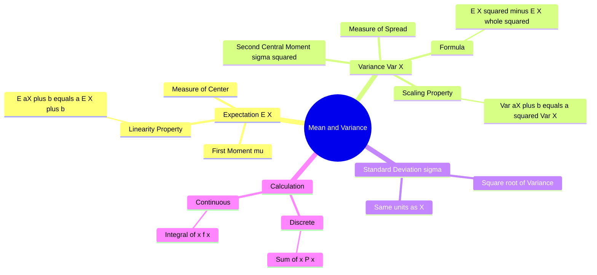

---
tags:
  - mathematics
  - probability
  - statistics
  - gate
  - moments
aliases:
  - Expected Value
  - Expectation
  - First and Second Moments
  - Standard Deviation
subject: "[[Mathematics]]"
parent: "Probability and Statistics"
confidence: 10
---

---
### Mean and Variance
#statistics/moments #probability

> **Mean** and **Variance** are the two most fundamental parameters describing a probability distribution. In engineering terms, if the probability density function were a physical mass, the Mean would be the **Center of Gravity**, and the Variance would be the **Moment of Inertia** about that center.

#### The Mean (Expected Value)
#expected-value #mean

The **Mean**, denoted by $\mu$ or $E[X]$, represents the central tendency or the weighted average of the random variable. It is the **First Moment** about the origin.

**Formulas:**
*   **Discrete RV:**
    $$\boxed{\quad \mu = E[X] = \sum_{i} x_i P(X=x_i) \quad}$$
*   **Continuous RV:**
    $$\boxed{\quad \mu = E[X] = \int_{-\infty}^{\infty} x \cdot f_X(x) \, dx \quad}$$

**Properties of Expectation (Linearity):**
Expectation is a linear operator. For constants $a$ and $b$:
1.  **Scaling and Shifting:**
    $$\boxed{\quad E[aX + b] = a E[X] + b \quad}$$
2.  **Sum of Variables:**
    $$E[X + Y] = E[X] + E[Y]$$
    *(This holds true whether $X$ and $Y$ are independent or not).*

---
#### The Variance
#variance #dispersion

The **Variance**, denoted by $\sigma^2$ or $\text{Var}(X)$, measures the spread, dispersion, or "scatter" of the data around the mean. It is the **Second Central Moment**.

**Definition:**
$$\text{Var}(X) = E[(X - \mu)^2]$$

**Computational Formula (The "GATE Formula"):**
Calculating $(X-\mu)^2$ is tedious. The standard shortcut is:
$$\boxed{\quad \text{Var}(X) = E[X^2] - (E[X])^2 \quad}$$
*   Where $E[X^2]$ is the mean of the squares (Second Moment about origin).

**Properties of Variance:**
1.  **Scaling and Shifting:**
    $$\boxed{\quad \text{Var}(aX + b) = a^2 \text{Var}(X) \quad}$$
    *   *Note:* Adding a constant $b$ merely shifts the distribution; it does not change the spread. Multiplying by $a$ scales the spread by $a^2$.
2.  **Sum of Variables:**
    $$\text{Var}(X \pm Y) = \text{Var}(X) + \text{Var}(Y) \pm 2\text{Cov}(X, Y)$$
    *   **If Independent:** $\text{Cov}(X, Y) = 0$, so $\text{Var}(X \pm Y) = \text{Var}(X) + \text{Var}(Y)$.

---
#### Standard Deviation ($\sigma$)
#standard-deviation

Variance has units of $X^2$ (e.g., $meters^2$), which is physically hard to interpret. The **Standard Deviation** returns the measure to the original units.
$$\boxed{\quad \sigma_X = \sqrt{\text{Var}(X)} \quad}$$

---
#### Summary of Common Distributions (Cheatsheet)
#gate/formulas

| Distribution | Mean ($E[X]$) | Variance ($\text{Var}(X)$) |
| :--- | :--- | :--- |
| **Bernoulli** ($p$) | $p$ | $p(1-p)$ |
| **Binomial** ($n, p$) | $np$ | $np(1-p)$ |
| **Poisson** ($\lambda$) | $\lambda$ | $\lambda$ |
| **Uniform Discrete** ($1 \dots n$) | $(n+1)/2$ | $(n^2-1)/12$ |
| **Uniform Continuous** ($a, b$) | $(a+b)/2$ | $(b-a)^2/12$ |
| **Exponential** ($\lambda e^{-\lambda x}$) | $1/\lambda$ | $1/\lambda^2$ |
| **Normal** ($\mu, \sigma^2$) | $\mu$ | $\sigma^2$ |

---
### Related Concepts
#topic/related-concepts

> [[Covariance]] (Generalization of variance to two variables)

[[Random Variables]]
[[Expected Value]] (Detailed properties)
[[Chebyshev's Inequality]] (Relates mean and variance to probability bounds)
[[Moment Generating Function]] (Method to find moments)
[[Skewness and Kurtosis]] (3rd and 4th Moments)
