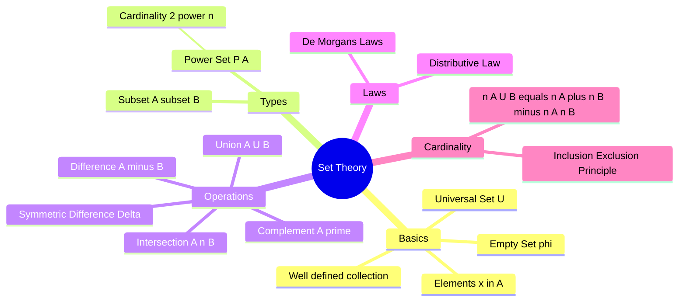

---
tags:
  - mathematics
  - probability
  - discrete-math
  - gate
  - foundations
created: 2026-03-18
aliases:
  - Algebra of Sets
  - Venn Diagrams
  - Inclusion-Exclusion Principle
subject: "[[Mathematics]]"
parent: Probability and Statistics
confidence: 10
---
###### Mind Map

---
### Set Theory
#mathematics/set-theory #foundational-math

> **Set Theory** is the mathematical logic that studies sets, which are well-defined collections of objects. It forms the fundamental basis for **Probability**, **Logic**, and **Relations**. In GATE, Set Theory concepts are primarily tested through Probability problems and Venn Diagram-based logical reasoning.

#### Fundamental Definitions
#set-theory/definitions

*   **Set:** A well-defined collection of distinct objects. Denoted by capital letters (e.g., $A, B$).
*   **Element:** Objects inside the set. $x \in A$ means $x$ belongs to set $A$.
*   **Empty (Null) Set ($\emptyset$ or $\{\}$):** A set containing no elements.
*   **Universal Set ($U$ or $\Omega$):** The set containing all objects under consideration (analogous to **Sample Space** in probability).
*   **Subset ($A \subseteq B$):** Every element of $A$ is also an element of $B$.
    *   Total number of subsets of a set with $n$ elements is **$2^n$**.
*   **Power Set ($P(A)$):** The set of all subsets of $A$.
    *   Cardinality: $|P(A)| = 2^n$.

---
#### Set Operations
#set-theory/operations

Let $A$ and $B$ be subsets of a universal set $U$.

1.  **Union ($A \cup B$):** Elements in $A$ **OR** in $B$ (or both).
    $$A \cup B = \{x \mid x \in A \lor x \in B\}$$
2.  **Intersection ($A \cap B$):** Elements in both $A$ **AND** $B$.
    $$A \cap B = \{x \mid x \in A \land x \in B\}$$
    *   **Disjoint Sets:** If $A \cap B = \emptyset$.
3.  **Difference ($A - B$ or $A \setminus B$):** Elements in $A$ but **NOT** in $B$.
    $$A - B = A \cap B'$$
4.  **Complement ($A'$ or $A^c$):** Elements in $U$ but **NOT** in $A$.
    $$A' = U - A$$
5.  **Symmetric Difference ($A \Delta B$ or $A \oplus B$):** Elements in $A$ or $B$, but **not both** (XOR operation).
    $$A \Delta B = (A - B) \cup (B - A) = (A \cup B) - (A \cap B)$$

---
#### Algebra of Sets (Laws)
#set-theory/laws

These laws are identical to the laws of **Boolean Algebra** (switching circuits).

1.  **Idempotent Laws:**
    *   $A \cup A = A$
    *   $A \cap A = A$
2.  **Commutative Laws:**
    *   $A \cup B = B \cup A$
    *   $A \cap B = B \cap A$
3.  **Associative Laws:**
    *   $A \cup (B \cup C) = (A \cup B) \cup C$
    *   $A \cap (B \cap C) = (A \cap B) \cap C$
4.  **Distributive Laws:**
    *   $A \cup (B \cap C) = (A \cup B) \cap (A \cup C)$
    *   $A \cap (B \cup C) = (A \cap B) \cup (A \cap C)$
5.  **De Morgan's Laws (Crucial for Probability):**
    *   The complement of the union is the intersection of complements:
        $$\boxed{\quad (A \cup B)' = A' \cap B' \quad}$$
    *   The complement of the intersection is the union of complements:
        $$\boxed{\quad (A \cap B)' = A' \cup B' \quad}$$

---
#### Cardinality and Inclusion-Exclusion Principle
#set-theory/cardinality

The **Cardinality**, denoted by $n(A)$ or $|A|$, is the number of elements in a finite set $A$.

**For Two Sets:**
$$\boxed{\quad n(A \cup B) = n(A) + n(B) - n(A \cap B) \quad}$$
*   This prevents double counting the intersection area.

**For Three Sets:**
$$n(A \cup B \cup C) = n(A) + n(B) + n(C) - n(A \cap B) - n(B \cap C) - n(C \cap A) + n(A \cap B \cap C)$$

**Probability Analog:**
Replacing $n(A)$ with $P(A)$, these formulas become the **Addition Theorems on Probability**.

---
### Related Concepts
#topic/related-concepts

> [[Axioms of Probability|Probability Axioms]] (Direct application of Set Theory)

[[Conditional Probability]] ($P(A|B) = P(A \cap B) / P(B)$)
[[Random Variables]] (Mapping from Sets to Real Numbers)
[[Boolean Algebra and Logic Gates|Boolean Algebra]] (Digital Logic equivalent of Set Theory)
[[Relations and Functions]]

