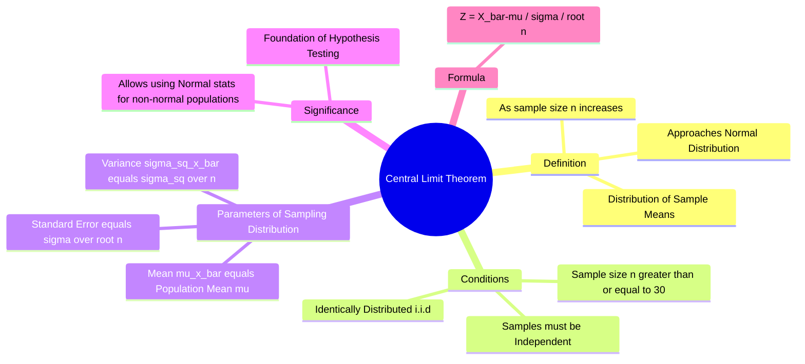

---
tags:
  - mathematics
  - probability
  - statistics
  - gate
  - sampling-theory
aliases:
  - CLT
  - Sampling Distribution of the Mean
subject: "[[Mathematics]]"
parent:
  - Probability and Statistics
---
### Central Limit Theorem (CLT)
#probability/theorems #statistics #clt

> The **Central Limit Theorem (CLT)** states that given a sufficiently large sample size from a population with a finite level of variance, the mean of all samples from the same population will be approximately equal to the mean of the population. Furthermore, all the samples will follow an approximate **[[Normal Distribution]]** pattern, with all variances being approximately equal to the variance of the population divided by each sample's size.

**Crucial Implication:** The population itself *does not* need to be normally distributed for the CLT to hold. Even if the population is uniform, binomial, or skewed, the **sampling distribution of the mean** becomes normal as $n$ increases.

---
#### 1. Mathematical Statement
#clt/statement

Let $X_1, X_2, \dots, X_n$ be a random sample of size $n$ taken from a population (any distribution) with mean $\mu$ and variance $\sigma^2$. Let $\bar{X}$ be the sample mean:
$$\bar{X} = \frac{X_1 + X_2 + \dots + X_n}{n}$$

As $n \to \infty$, the distribution of the random variable $\bar{X}$ approaches a **[[Normal Distribution]]** with:
1.  **Mean:** $\mu_{\bar{X}} = \mu$
2.  **Variance:** $\sigma_{\bar{X}}^2 = \frac{\sigma^2}{n}$

Symbolically:
$$\boxed{\quad \bar{X} \sim N\left(\mu, \frac{\sigma^2}{n}\right) \quad \text{as } n \to \infty \quad}$$

#### 2. Standard Error of the Mean
#statistics/standard-error

The standard deviation of the sampling distribution of the sample mean is called the **Standard Error (SE)**. It quantifies how much the sample mean $\bar{X}$ is expected to fluctuate from the true population mean $\mu$.

$$\boxed{\quad SE = \sigma_{\bar{X}} = \frac{\sigma}{\sqrt{n}} \quad}$$

*   **Insight:** As the sample size $n$ increases, the standard error decreases. The distribution becomes narrower (more peaked) around the true mean $\mu$, meaning larger samples provide more accurate estimates.

#### 3. Standardization (Z-Score Calculation)
#statistics/z-score

To solve problems involving probabilities of sample means, we convert the distribution to the **Standard Normal Distribution** ($Z \sim N(0, 1)$).

The transformation formula is:

$$\boxed{\quad Z = \frac{\bar{X} - \mu}{\sigma / \sqrt{n}} \quad}$$

Where:
*   $\bar{X}$ = Sample Mean
*   $\mu$ = Population Mean
*   $\sigma$ = Population Standard Deviation
*   $n$ = Sample Size

#### 4. Conditions and Rule of Thumb
#clt/conditions

For the approximation to be valid:
1.  **Independence:** Sampled observations must be independent (Random Sampling).
2.  **Sample Size:**
    *   If the population is already Normal, CLT holds for any $n$.
    *   If the population is **non-Normal**, a general rule of thumb for engineering applications is:
        $$\boxed{\quad n \ge 30 \quad}$$

---
#### Example Application

**Problem:**
The lifetime of a bulb has a mean of 1000 hours and a standard deviation of 200 hours. Find the probability that a random sample of 100 bulbs has a mean lifetime greater than 1030 hours.

**Solution:**
*   $\mu = 1000$, $\sigma = 200$, $n = 100$.
*   We need $P(\bar{X} > 1030)$.
*   Calculate Standard Error: $\sigma_{\bar{X}} = 200 / \sqrt{100} = 20$.
*   Calculate Z-score:
    $$Z = \frac{1030 - 1000}{20} = \frac{30}{20} = 1.5$$
*   Using Z-table: $P(Z > 1.5) = 1 - P(Z < 1.5) = 1 - 0.9332 = 0.0668$.

---
### Related Concepts
#topic/related-concepts

> [[Normal Distribution]] (The destination of CLT)

[[Sampling Theory]]
[[Law of Large Numbers]] (Related limit theorem: Sample mean converges to population mean)
[[Hypothesis Testing]] (Relies on CLT for calculating p-values)
[[Confidence Intervals]]
[[Chebyshev's Inequality]] (Boundaries for distributions where n is small or distribution is unknown)