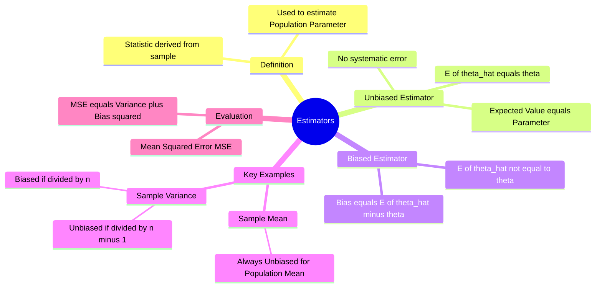

---
tags:
  - mathematics
  - statistics
  - estimation
  - sampling-theory
  - gate
aliases:
  - Point Estimation
  - Unbiased Estimator
  - Bias in Statistics
subject: "[[Mathematics]]"
parent: "Sampling Theory"
confidence: 10
formula:
---
### Estimators (Biased and Unbiased)
#statistics/estimation #sampling-theory

> In statistical inference, an **Estimator** is a rule or formula (a statistic) applied to sample data to estimate an unknown population parameter (like the mean $\mu$ or variance $\sigma^2$). A fundamental property of a good estimator is whether it is **Biased** or **Unbiased**.

---
#### Definitions
#estimators/definitions

Let $\theta$ be an unknown population parameter (a fixed constant).
Let $\hat{\theta}$ be an estimator of $\theta$ (a random variable derived from the sample).

**A. Unbiased Estimator:**
An estimator is said to be unbiased if the expected value (mean) of the sampling distribution of the statistic is equal to the true population parameter.
$$\boxed{\quad E[\hat{\theta}] = \theta \quad}$$
*   **Interpretation:** On average, the estimator hits the "bullseye." It does not consistently overestimate or underestimate the parameter.

**B. Biased Estimator:**
An estimator is biased if its expected value differs from the true parameter.
$$\boxed{\quad E[\hat{\theta}] \neq \theta \quad}$$

**C. Bias:**
The amount of bias is defined as:
$$\boxed{\quad \text{Bias}(\hat{\theta}) = E[\hat{\theta}] - \theta \quad}$$
*   **Positive Bias:** Overestimation.
*   **Negative Bias:** Underestimation.
*   **Asymptotic Unbiasedness:** If $\lim_{n \to \infty} Bias(\hat{\theta}) = 0$, the estimator is asymptotically unbiased (e.g., sample variance divided by $n$).

---
#### Important Examples
#estimators/examples #gate/high-yield

This distinction is a frequent GATE topic, specifically regarding Variance.

**1. Sample Mean ($\bar{X}$):**
The sample mean is an **Unbiased Estimator** of the population mean $\mu$.
$$E[\bar{X}] = E\left[\frac{1}{n}\sum X_i\right] = \frac{1}{n}\sum E[X_i] = \frac{1}{n}(n\mu) = \mu$$

**2. Sample Variance ($S^2$):**
There are two common formulas for sample variance.

*   **The Biased Estimator ($S_n^2$):**
    $$S_n^2 = \frac{1}{n} \sum_{i=1}^n (X_i - \bar{X})^2$$
    Expectation: $E[S_n^2] = \frac{n-1}{n} \sigma^2$.
    Since $E \neq \sigma^2$, it is **Biased** (it consistently underestimates the population variance).

*   **The Unbiased Estimator ($S^2$):**
    To correct the bias, we divide by the degrees of freedom ($n-1$) instead of $n$.
    $$S^2 = \frac{1}{n-1} \sum_{i=1}^n (X_i - \bar{X})^2$$
    Expectation: $E[S^2] = \sigma^2$.
    This is the **Unbiased** estimator for population variance.

**3. Sample Proportion ($\hat{p}$):**
The sample proportion is an **Unbiased Estimator** of the population proportion $p$.
$$E[\hat{p}] = p$$

---
#### Mean Squared Error (MSE)
#statistics/mse

While unbiasedness is desirable, it is not the only criterion. We often want an estimator that is close to the true value, which involves minimizing variance. The MSE combines both bias and variance.

$$\text{MSE}(\hat{\theta}) = E[(\hat{\theta} - \theta)^2]$$

Relationship derivation:
$$\boxed{\quad \text{MSE}(\hat{\theta}) = \text{Var}(\hat{\theta}) + [\text{Bias}(\hat{\theta})]^2 \quad}$$

*   For an **Unbiased Estimator**, Bias = 0, so $\text{MSE} = \text{Variance}$.
*   **Minimum Variance Unbiased Estimator (MVUE):** An estimator that is unbiased and has the lowest possible variance among all unbiased estimators.

---
### Related Concepts
#topic/related-concepts

> [[Central Limit Theorem]] (Describes the distribution of the estimator $\bar{X}$)

[[Sampling Theory]]
[[Maximum Likelihood Estimation]] (MLEs are often biased but consistent)
[[Consistency of Estimators]] (Behavior as $n \to \infty$)
[[Efficiency of Estimators]] (Comparing Variances)
[[Chi-Square Distribution]] (Distribution related to Sample Variance)
