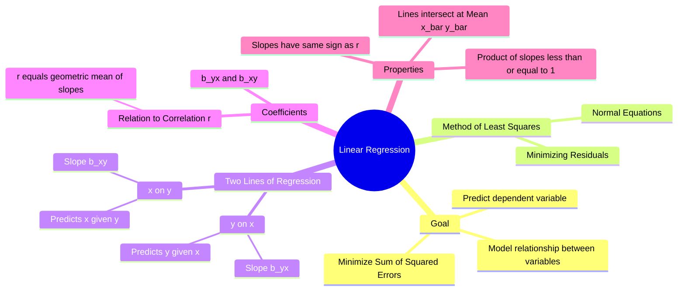

---
tags:
  - mathematics
  - statistics
  - numerical-methods
  - curve-fitting
  - gate
aliases:
  - Least Squares Method
  - Line of Best Fit
  - Regression Analysis
subject: "[[Mathematics]]"
parent:
  - Probability and Statistics
created: 2026-07-13
---
### Linear Regression
#statistics/regression #curve-fitting

> **Linear Regression** is a statistical method for modeling the relationship between a dependent variable ($y$) and one or more independent variables ($x$). In the context of GATE, we primarily deal with **Simple Linear Regression** (fitting a straight line) using the **Method of Least Squares**, which minimizes the sum of the squares of the vertical deviations (residuals) between the observed data and the fitted line.

---
#### The Two Lines of Regression
#regression/lines

Unlike standard algebra where a line is unique, in statistics, we differentiate between predicting $y$ and predicting $x$.

**A. Regression Line of $y$ on $x$:**
Used to estimate/predict $y$ for a given value of $x$. Minimizes errors in the $y$-direction.
$$\boxed{\quad y - \bar{y} = b_{yx} (x - \bar{x}) \quad}$$

**B. Regression Line of $x$ on $y$:**
Used to estimate/predict $x$ for a given value of $y$. Minimizes errors in the $x$-direction.
$$\boxed{\quad x - \bar{x} = b_{xy} (y - \bar{y}) \quad}$$

Where:
*   $(\bar{x}, \bar{y})$ is the centroid (mean) of the data. **Both lines always pass through $(\bar{x}, \bar{y})$.**
*   $b_{yx}$ and $b_{xy}$ are the **Regression Coefficients**.

---
#### Regression Coefficients
#regression/coefficients

These coefficients represent the slope of the respective regression lines. They are related to the Correlation Coefficient ($r$), Covariance, and Standard Deviations ($\sigma_x, \sigma_y$).

**1. Regression Coefficient of $y$ on $x$ ($b_{yx}$):**
$$\boxed{\quad b_{yx} = \frac{\text{Cov}(x,y)}{\sigma_x^2} = r \frac{\sigma_y}{\sigma_x} \quad}$$
*   This corresponds to the slope $m$ in the equation $y = mx + c$.

**2. Regression Coefficient of $x$ on $y$ ($b_{xy}$):**
$$\boxed{\quad b_{xy} = \frac{\text{Cov}(x,y)}{\sigma_y^2} = r \frac{\sigma_x}{\sigma_y} \quad}$$
*   This corresponds to $1/m$ if we were rewriting $y=mx+c$, but statistically, it is distinct.

**Calculation Formula (from raw data):**
$$b_{yx} = \frac{n \sum xy - \sum x \sum y}{n \sum x^2 - (\sum x)^2}$$
$$b_{xy} = \frac{n \sum xy - \sum x \sum y}{n \sum y^2 - (\sum y)^2}$$

> [!warning] Basis of Regression Coefficients
> Regression coefficients are fundamentally obtained by the [[#Method of Least Squares (Normal Equations)|least squares method]]; their expressions in terms of covariance, standard deviation, and correlation are algebraic simplifications of the least-squares solution.

---
#### Properties of Regression Coefficients
#regression/properties

1.  **Relation to Correlation Coefficient:**
    The correlation coefficient $r$ is the **Geometric Mean** of the two regression coefficients.
    $$\boxed{\quad r = \pm \sqrt{b_{yx} \cdot b_{xy}} \quad}$$
    *   **Sign Convention:** The sign of $r$ is the same as the sign of $b_{yx}$ and $b_{xy}$. (If both slopes are negative, $r$ is negative).
2.  **Magnitude Limit:**
    Since $-1 \le r \le 1$, the product of the coefficients cannot exceed 1.
    $$b_{yx} \cdot b_{xy} \le 1$$
    *(It is possible for one slope to be > 1, but the other must then be < 1).*
3.  **Arithmetic Mean Property:**
    The arithmetic mean of the regression coefficients is greater than or equal to the correlation coefficient.
    $$\frac{b_{yx} + b_{xy}}{2} \ge |r|$$
4.  **Angle between Regression Lines:**
    If $\theta$ is the acute angle between the two lines:
    $$\tan \theta = \frac{1 - r^2}{|r|} \left( \frac{\sigma_x \sigma_y}{\sigma_x^2 + \sigma_y^2} \right)$$
    *   If $r = \pm 1$ (Perfect correlation), $\theta = 0$ (Lines coincide).
    *   If $r = 0$ (No correlation), $\theta = 90^\circ$ (Lines are perpendicular, parallel to axes).

---
#### Method of Least Squares (Normal Equations)
#numerical-methods/curve-fitting

To fit a straight line $y = a + bx$ to a set of $n$ points $(x_i, y_i)$, we solve the system of **Normal Equations** to find parameters $a$ and $b$:

1.  Sum of $y$:
    $$\boxed{\quad \sum y = na + b \sum x \quad}$$
2.  Sum of $xy$ (multiply eq 1 by x):
    $$\boxed{\quad \sum xy = a \sum x + b \sum x^2 \quad}$$

This method is also used in **Numerical Methods** for curve fitting.

---

> [!warning]- Linear Regression — Matrix Least Squares (Unifying View)
> **All regression coefficients originate from the Least Squares principle.**
> Covariance, variance, and correlation appear naturally when the LS solution is simplified.
> 
> ---
> ##### Model (Linear Regression)
> We model the data as
> $$\mathbf{y} = \mathbf{X}\boldsymbol{\beta} + \boldsymbol{\varepsilon}$$
> 
> where  
> - $\mathbf{y} \in \mathbb{R}^{n\times 1}$ : observed output vector  
> - $\mathbf{X} \in \mathbb{R}^{n\times 2}$ : design matrix  
> $$\mathbf{X} = \begin{bmatrix} x_1 & 1\\ x_2 & 1\\ \vdots & \vdots\\ x_n & 1 \end{bmatrix} $$
> - $\boldsymbol{\beta} = \begin{bmatrix} m \\ c \end{bmatrix}$ : unknown slope and intercept  
> - $\boldsymbol{\varepsilon}$ : error (residual) vector  
> 
> ---
> ##### Least Squares Principle (Foundation)
> Least squares chooses $\boldsymbol{\beta}$ to minimize:
> $$\|\mathbf{y} - \mathbf{X}\boldsymbol{\beta}\|^2$$
> 
> This gives the **normal equations**:
> $$\mathbf{X}^\mathsf{T}(\mathbf{y} - \mathbf{X}\boldsymbol{\beta}) = 0$$
> 
> ---
> ##### Master Least Squares Solution (ONE Equation)
> $$\boxed{\boldsymbol{\beta}=(\mathbf{X}^\mathsf{T}\mathbf{X})^{-1}\mathbf{X}^\mathsf{T}\mathbf{y}}$$
> 
> This single equation generates:
> - regression line
> - regression coefficients
> - statistical interpretations
> 
> ---
> ##### Explicit Expansion
> $$\mathbf{X}^\mathsf{T}\mathbf{X} = \begin{bmatrix} \sum x^2 & \sum x\\ \sum x & n \end{bmatrix}, \quad \mathbf{X}^\mathsf{T}\mathbf{y} = \begin{bmatrix} \sum xy\\ \sum y \end{bmatrix}$$
> 
> Solving yields the slope:
> $$m = b_{yx} = \frac{\sum (x-\bar{x})(y-\bar{y})} {\sum (x-\bar{x})^2} $$
> 
> ---
> ##### Connection to Covariance and Variance
> Using statistical identities:
> $$ \sum (x-\bar{x})(y-\bar{y}) = n\,\mathrm{Cov}(x,y)$$
> $$\sum (x-\bar{x})^2 = n\,\sigma_x^2$$
> 
> So: $$\boxed{b_{yx} = \frac{\mathrm{Cov}(x,y)}{\sigma_x^2}}$$
> 
> ---
> ##### Connection to Correlation Coefficient
> Since $$ r = \frac{\mathrm{Cov}(x,y)}{\sigma_x\sigma_y}$$
> 
> we get:
> $$\boxed{ b_{yx} = r\,\frac{\sigma_y}{\sigma_x}, \quad b_{xy} = r\,\frac{\sigma_x}{\sigma_y}}$$
> 
> These are **algebraic forms of the same LS solution**, not independent definitions.
> 
> ---
> ##### Geometric Interpretation (Key Insight)
> - Columns of $\mathbf{X}$ span a subspace
> - Least squares finds the **orthogonal projection** of $\mathbf{y}$ onto this subspace
> - Residual vector is orthogonal:
> $$\mathbf{X}^\mathsf{T}\boldsymbol{\varepsilon} = 0$$
> 
> Thus:
> - covariance = inner product
> - variance = squared length
> - regression = optimal projection
> 
> ---
> ##### Directionality of Regression
> - $b_{yx}$: minimizes **vertical** squared errors (predict $y$ from $x$)
> - $b_{xy}$: minimizes **horizontal** squared errors (predict $x$ from $y$)
> 
> Both arise from the **same LS machinery**, with different dependent variables.
> 
> ---
> ##### One-Line Summary (Exam Gold)
> Regression coefficients are fundamentally obtained from the least squares matrix solution; covariance, variance, and correlation are simplified expressions of this solution.

---
### Related Concepts
#topic/related-concepts

> [[Correlation Coefficient]] (Measures the strength of the linear relationship)

[[Covariance]] (Measure of joint variability)
[[Mean, Median, Mode]]
[[Standard Deviation and Variance]]
[[Fitting of Curves (Numerical Methods)]] (Extension to parabolic/exponential fitting)
[[Maxima and Minima (Single Variable)]] (Used to derive the Normal Equations)
