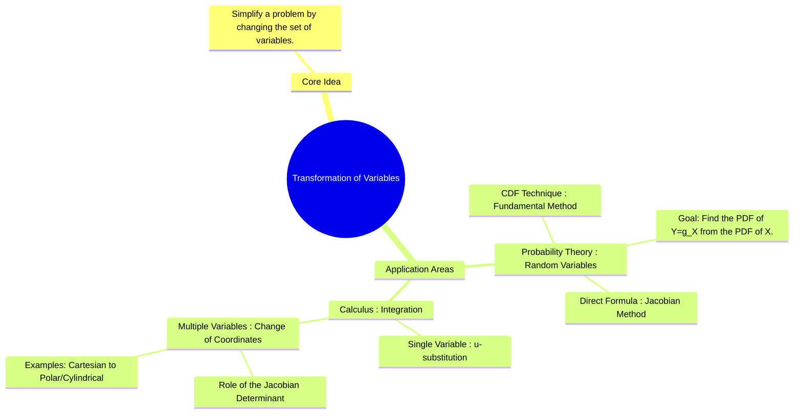

---
tags:
  - probability
  - calculus
  - integration
  - random-variables
  - jacobian
  - engineering-math
created: 2025-09-08
aliases:
  - Change of Variables
  - Jacobian Method
  - Transformation of a Single Random Variable
  - Transformation in Multiple Integrals (Change of Variables)
  - "Example : Cartesian to Polar Coordinates"
subject: "[[Mathematics]]"
parent:
  - Probability and Statistics
formula:
  - "Transformation of Variables (The CDF Technique (Most reliable) where f → PDF & F → CDF) : $$f_Y(y) = \\frac{d}{dy}F_Y(y) = \\frac{d}{dy}F_X(g^{-1}(y))$$"
  - "Transformation of Variables (The Direct Formula (Jacobian Method for 1D) for strictly monotonic functions g(X) and f → PDF) : $$f_Y(y) = f_X(x) \\left| \\frac{dx}{dy} \\right| \\quad \\text{where } x = g^{-1}(y)$$"
---
### Transformation of Variables
#transformation-of-variables #change-of-variables #jacobian

> Transformation of variables is a powerful mathematical technique used to simplify the analysis of functions and integrals by changing the variables of interest. This method is fundamental in two key areas for GATE:
> 1. **Probability Theory**: To find the probability distribution of a new random variable that is a function of another random variable.
> 2. **Integral Calculus**: To simplify the evaluation of multiple integrals by changing the coordinate system (e.g., Cartesian to polar).

---
#### Transformation of a Single Random Variable
#random-variables #pdf-transformation

This is a very common problem type. Given a random variable $X$ with a known [[probability density function (PDF)]] $f_X(x)$, we want to find the PDF of a new random variable $Y = g(X)$, denoted by $f_Y(y)$.

##### Method 1: The CDF Technique (Most reliable)

This method is fundamental and always works.
1. Find the [[Cumulative Distribution Function (CDF)]] of Y: $F_Y(y) = P(Y \le y)$.
2. Substitute $Y=g(X)$: $F_Y(y) = P(g(X) \le y)$.
3. Solve the inequality for $X$. This step requires care. If $g(X)$ is a monotonically increasing function, then $g(X) \le y \implies X \le g^{-1}(y)$.
4. Express this probability in terms of the CDF of X: $F_Y(y) = P(X \le g^{-1}(y)) = F_X(g^{-1}(y))$.
5. Differentiate the CDF of Y with respect to y to get the PDF of Y:
    $$\boxed{\quad f_Y(y) = \frac{d}{dy}F_Y(y) = \frac{d}{dy}F_X(g^{-1}(y)) \quad}$$

> See [[ee_2025#^q36]]

---
##### Method 2: The Direct Formula (Jacobian Method for 1D)

For a strictly monotonic (either always increasing or always decreasing) function $g(X)$, a direct formula can be used. It is derived from the CDF technique using the chain rule.
$$\boxed{\quad f_Y(y) = f_X(x) \left| \frac{dx}{dy} \right| \quad \text{where } x = g^{-1}(y) \quad}$$
The term $|\frac{dx}{dy}|$ is the **Jacobian** of the one-dimensional transformation. The absolute value is crucial because PDFs must be non-negative.
###### Example

Let $X$ be a uniform random variable in $[0, 1]$, so $f_X(x) = 1$ for $0 \le x \le 1$. Let $Y = -2\ln(X)$. Find $f_Y(y)$.
1. Find the relationship: $y = -2\ln(x) \implies \ln(x) = -y/2 \implies x = e^{-y/2}$.
2. Find the Jacobian: $\frac{dx}{dy} = -\frac{1}{2}e^{-y/2}$.
3. Determine the new range:
    * When $x \to 0$, $y \to \infty$.
    * When $x = 1$, $y = -2\ln(1) = 0$.
    * So, the range for $y$ is $[0, \infty)$.
4. Apply the formula:
    $$\begin{align}
    f_Y(y) &= f_X(x) \left| \frac{dx}{dy} \right| = 1 \cdot \left| -\frac{1}{2}e^{-y/2} \right| \\
     &= \frac{1}{2}e^{-y/2} \quad \text{for } y \ge 0
    \end{align}
    $$

This is the PDF of an exponential distribution with parameter $\lambda = 1/2$.

> [!warning] Note
> Jacobian-based transformation applies to **continuous variables only**. Discrete variables use **direct probability mapping**, not change of variables.

---

#### Transformation in Multiple Integrals (Change of Variables)
#multiple-integrals #jacobian-determinant

When evaluating a [[Double Integrals|double]] or [[Triple Integrals|triple integral]], changing the coordinate system can greatly simplify the integrand or the limits of integration. This requires a scaling factor to relate the differential areas or volumes, which is given by the **Jacobian determinant**.

For a 2D transformation from $(x,y)$ to $(u,v)$ where $x = g(u,v)$ and $y=h(u,v)$, the differential area changes as:
$$dx\,dy = |J| \,du\,dv$$
The Jacobian determinant $J$ is given by:
$$\boxed{\quad J = \frac{\partial(x,y)}{\partial(u,v)} = \det \begin{pmatrix}
\frac{\partial x}{\partial u} & \frac{\partial x}{\partial v} \\
\frac{\partial y}{\partial u} & \frac{\partial y}{\partial v}
\end{pmatrix} = \frac{\partial x}{\partial u}\frac{\partial y}{\partial v} - \frac{\partial x}{\partial v}\frac{\partial y}{\partial u} \quad}$$
The integration formula becomes:
$$\iint_R f(x,y) \,dx\,dy = \iint_S f(g(u,v), h(u,v)) |J| \,du\,dv$$

##### Example : Cartesian to Polar Coordinates

This is the most common transformation in multiple integrals.
* Transformation: $x = r\cos\theta$ and $y=r\sin\theta$.
* Jacobian Determinant:
    $$ J = \det \begin{pmatrix}
    \frac{\partial x}{\partial r} & \frac{\partial x}{\partial \theta} \\
    \frac{\partial y}{\partial r} & \frac{\partial y}{\partial \theta}
    \end{pmatrix} = \det \begin{pmatrix}
    \cos\theta & -r\sin\theta \\
    \sin\theta & r\cos\theta
    \end{pmatrix} $$
    $$ J = (r\cos^2\theta) - (-r\sin^2\theta) = r(\cos^2\theta + \sin^2\theta) = r $$
* Result: The differential area element in polar coordinates is:
    $$\boxed{\quad dx\,dy = r \,dr\,d\theta \quad}$$

---
### Related Concepts
#related-concepts

> [[Discrete Random Variables]]
> [[Continuous Random Variables]]

[[Cumulative Distribution Function (CDF)]]
[[Probability Density Function (PDF)]]
[[Spherical Coordinate System]] (for transformations in 3D)

