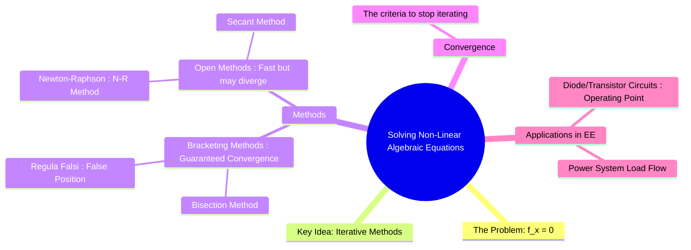

---
tags:
  - numerical-methods
  - non-linear-equations
  - root-finding
  - engineering-math
created: 2025-09-15
aliases:
  - Root Finding
  - Non-Linear Equations
  - Newton-Raphson Method
  - Secant Method
  - Bisection Method
subject: "[[Mathematics]]"
parent: "[[Numerical Methods]]"
---
### Solving Non-Linear Algebraic Equations
#root-finding #numerical-methods

> A non-linear algebraic equation is any equation that can be written in the form $f(x)=0$, where $f(x)$ is not a linear function (e.g., it contains powers of $x$, trigonometric, exponential, or logarithmic terms). Unlike [[Solving Linear Algebraic Equations|linear equations]], there is no general formula to solve them directly. Instead, we rely on **iterative numerical methods** to find an approximate value of the root. These methods are essential for solving practical engineering problems, such as finding the operating point of a diode circuit.

---
#### 1. Bisection Method
#bisection-method #bracketing-method 

The bisection method is the simplest and most reliable root-finding algorithm. It is a bracketing method, meaning it requires two initial guesses that bracket the root.

*   **Concept**: Based on the [[Intermediate Value Theorem]], if a continuous function $f(x)$ has opposite signs at two points, $f(a)$ and $f(b)$, then there must be at least one root in the interval $[a,b]$. The method repeatedly bisects this interval.
*   **Algorithm**:
    1.  Choose an interval $[a, b]$ such that $f(a) \cdot f(b) < 0$.
    2.  Calculate the midpoint: $c = \frac{a+b}{2}$.
    3.  If $f(a) \cdot f(c) < 0$, the new interval is $[a, c]$. Otherwise, the new interval is $[c, b]$.
    4.  Repeat step 2 until the interval is sufficiently small.
*   **Properties**:
    *   **Guaranteed convergence**: Always finds a root if the initial bracket is valid.
    *   **Slow**: Convergence is linear and relatively slow.

---
#### 2. Newton-Raphson (N-R) Method
#newton-raphson-method #open-method

The Newton-Raphson method is the most widely used root-finding algorithm in engineering due to its fast convergence. It is an open method, requiring only one initial guess.

*   **Concept**: Starting from an initial guess $x_n$, the method uses the tangent line to the curve $f(x)$ at that point to find the next, better approximation of the root, $x_{n+1}$. It is derived from the first-order [[Taylor series]] expansion.
*   **Iteration Formula**:
    $$\boxed{\quad x_{n+1} = x_n - \frac{f(x_n)}{f'(x_n)} \quad}$$
*   **Properties**:
    *   **Fast Convergence**: Convergence is quadratic, which is very fast if the initial guess is close to the root.
    *   **Requires Derivative**: An analytical expression for the derivative $f'(x)$ is needed.
    *   **May Diverge**: If the initial guess is poor, or if $f'(x_n) \approx 0$ near a root, the method can fail to converge or diverge.

> [!related]
> [[Newton-Raphson Method for Load Flow]]

---
#### 3. Secant Method
#secant-method

The Secant method is a modification of the Newton-Raphson method that does not require the explicit calculation of the derivative.

*   **Concept**: It approximates the derivative $f'(x_n)$ in the N-R formula with a finite difference using the previous two iterates, effectively using a "secant" line instead of a tangent line.
    $$ f'(x_n) \approx \frac{f(x_n) - f(x_{n-1})}{x_n - x_{n-1}} $$
*   **Iteration Formula**:
    $$\boxed{\quad x_{n+1} = x_n - f(x_n) \frac{x_n - x_{n-1}}{f(x_n) - f(x_{n-1})} \quad}$$
*   **Properties**:
    *   **Fast**: Convergence is super-linear (faster than Bisection, slower than N-R).
    *   **No Derivative Needed**: Its main advantage over the N-R method.
    *   **Requires two initial guesses**.

> [!important] Order of Convergence — Secant Method
> The secant method converges **superlinearly** with order  
> $$p=\frac{1+\sqrt{5}}{2}\approx 1.618,$$  
> which lies between bisection ($p=1$) and Newton–Raphson ($p=2$).

---
#### Applications in Electrical Engineering
#applications/non-linear-algebraic-equation 

*   **Diode/Transistor Circuits**: The current-voltage relationship of a diode is given by the non-linear Shockley equation, $I_D = I_S(e^{V_D/(\eta V_T)} - 1)$. When analyzing a simple circuit with a voltage source, resistor, and diode, KVL gives an equation like $V_{in} - I_D R - V_D = 0$. Substituting the Shockley equation results in a transcendental equation for the diode voltage $V_D$, which must be solved numerically using methods like Newton-Raphson to find the circuit's operating point (Q-point).
*   **Power System Load Flow**: Load flow analysis, which determines the voltage, current, and power flow in a power grid, requires solving a large system of coupled non-linear algebraic equations. The Newton-Raphson method is the industry-standard algorithm for this task.

---
### Related Concepts
#numerical-methods/related-concepts

> [[Numerical Methods]]

[[Solving Linear Algebraic Equations]]
[[Taylor Series]] (The theoretical basis for the Newton-Raphson method)
[[Electric Circuits]]
[[Power System]]