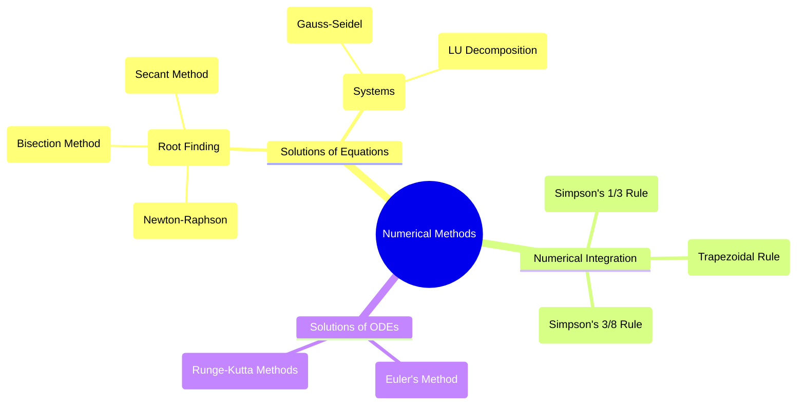

---
tags:
  - mathematics
  - numerical-methods
  - root-finding
  - integration
  - differential-equations
aliases:
  - Numerical Methods
  - Numerical Analysis
created: 2025-09-12
subject: "[[Mathematics]]"
parent: "[[Mathematics]]"
---
### Numerical Methods
#numerical-methods #approximation

> **Numerical Methods** are techniques used to find approximate numerical solutions to mathematical problems that are difficult or impossible to solve analytically. These methods are essential in engineering for solving complex problems involving root finding, integration, and differential equations.

---
#### Solutions of Non-linear Algebraic Equations (Root Finding)
#root-finding

The objective is to find the root $x$ of an equation $f(x)=0$.

##### Newton-Raphson Method
#newton-raphson-method

> [!refer]
> [[Solving Non-Linear Algebraic Equations|Newton-Raphson Method]]

This is an iterative method that uses the tangent line at the current guess to approximate the root. It is the most important root-finding method for GATE.
The iterative formula is derived from the Taylor series expansion:
$$\boxed{\quad x_{n+1} = x_n - \frac{f(x_n)}{f'(x_n)} \quad}$$
*   **Convergence**: It has quadratic convergence (very fast) if the initial guess is close to the actual root.
*   **Limitations**: It may fail to converge if the initial guess is poor, or if the derivative $f'(x_n)$ is close to zero.

---
#### Numerical Integration (Quadrature)
#numerical-integration

These methods are used to approximate the value of a definite integral $I = \int_a^b f(x) dx$, where the interval $[a, b]$ is divided into $n$ subintervals of equal width $h = (b-a)/n$.

##### Trapezoidal Rule
#trapezoidal-rule

> [!refer]
> [[Trapezoidal Rule]]

This rule approximates the area under the curve using a series of trapezoids. It is based on a first-order (linear) approximation of $f(x)$.
The formula for $n$ intervals is:
$$\boxed{\quad I \approx \frac{h}{2} \left[ y_0 + y_n + 2(y_1 + y_2 + \dots + y_{n-1}) \right] \quad}$$
where $y_k = f(x_k)$.

---
##### Simpson's 1/3 Rule
#simpsons-rule

> [!refer]
> [[Simpson's Rule]]

This rule uses a second-order (quadratic) polynomial to approximate the function, making it more accurate than the trapezoidal rule.
*   **Condition**: The number of intervals, $n$, must be **even**.
The formula is:
$$\boxed{\quad I \approx \frac{h}{3} \left[ y_0 + y_n + 4(y_1 + y_3 + \dots) + 2(y_2 + y_4 + \dots) \right] \quad}$$
*   The term with coefficient 4 is the sum of ordinates at **odd** positions.
*   The term with coefficient 2 is the sum of ordinates at **even** positions.

---
#### Solutions of Ordinary Differential Equations (ODEs)
#numerical-odes

These methods are used to solve initial value problems of the form $\frac{dy}{dx} = f(x, y)$ with a given initial condition $y(x_0) = y_0$. The goal is to find the value of $y$ at a subsequent point $x_1 = x_0 + h$.

##### Euler's Method
#eulers-method

> [!refer]
> [[Euler's Method]]

This is the simplest numerical method for solving ODEs. It uses the tangent at the starting point to estimate the next point.
The iterative formula is:
$$\boxed{\quad y_{n+1} = y_n + h f(x_n, y_n) \quad}$$
It is a first-order method and is generally not very accurate due to large truncation error.

---
##### Runge-Kutta Methods
#runge-kutta-methods

> [!refer]
> [[Runge-Kutta Methods]]

This is a family of more accurate iterative methods. The **Fourth-Order Runge-Kutta (RK4)** method is the most commonly used and is very accurate.
To find $y(x_0+h)$ from $y(x_0)$, we calculate:
$$\begin{align}
k_1 &= h f(x_n, y_n) \\
k_2 &= h f(x_n + h/2, y_n + k_1/2) \\
k_3 &= h f(x_n + h/2, y_n + k_2/2) \\
k_4 &= h f(x_n + h, y_n + k_3)
\end{align}$$
The next value is a weighted average of these slopes:
$$\boxed{\quad y_{n+1} = y_n + \frac{1}{6}(k_1 + 2k_2 + 2k_3 + k_4) \quad}$$

---
### Related Concepts
#related-concepts

> [[Calculus - Differential Equations]] (The analytical counterparts to these methods)
> [[Linear Algebra]] (Used for solving systems of linear equations)
> [[Calculus - Integration]]

[[Interpolation]]
Error Analysis
