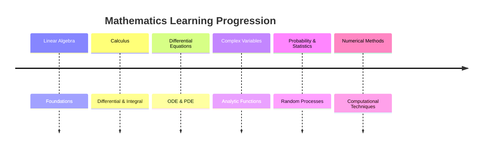

---
tags:
  - syllabus
  - mathematics
  - gate
  - moc
syllabus: mathematics
---

### Mathematics

> [!info]
> This Map of Content (MOC) follows the recommended learning progression for GATE Electrical Engineering Mathematics.
>
> Learn each section sequentially. Every topic links to its detailed note.

---

### 1. [[Linear Algebra]]

> Foundation of Engineering Mathematics.

#### 1. Basics of Linear Algebra

- [[Vector Space Definition and Properties]]
- [[Subspaces]]
- [[Span of a Set of Vectors]]
- [[Linear Independence and Dependence of Vectors]]
- [[Basis and Dimension of a Vector Space]]
- [[Norm of a Vector]]
- [[Inner Product Space]]
- [[Orthogonality]]
- [[Orthonormal Basis]]
- [[Gram-Schmidt Orthonormalization Process]]
- [[Linear Transformation]]
- [[Rank and Nullity of a Linear Transformation]]
- [[Rank-Nullity Theorem]]
- [[Fundamental Subspaces of a Matrix]]

---

#### 2. Matrix Algebra

##### 1. Matrix Fundamentals

- [[Matrix Operations]]
- [[Types of Matrix]]
- [[Unitary Matrices]]
- [[Adjoint of a Matrix]]
- [[Minors and Cofactors]]
- [[Determinant of a Matrix]]
- [[Inverse of a Matrix]]
- [[Properties of Transpose and Inverse]]
- [[Rank of a Matrix]]

##### 2. Matrix Types

- [[Symmetric Matrices]]
- [[Skew-Symmetric Matrices]]
- [[Hermitian Matrices]]
- [[Skew-Hermitian Matrices]]
- [[Orthogonal Matrices]]
- [[Nilpotent Matrices]]
- [[Block Matrices]]

##### 3. Matrix Decompositions

- [[LU Decomposition]]
- [[Cholesky Decomposition]]

##### 4. Matrix Applications

- [[Matrix Representation of a Linear Transformation]]
- [[Quadratic Forms]]
- [[Rotation Matrix]]

---

#### 3. Systems of Linear Equations

- [[System of Linear Equations]]
- [[Consistency of Linear Equations]]
- [[Homogeneous System of Linear Equations]]
- [[Non-Homogeneous System of Linear Equations]]
- [[Gaussian Elimination Method]]
- [[Cramer's Rule]]
- [[Solving Systems of Linear Equations]]
- [[Theory of Equations]]
- [[Roots of Polynomials]]

---

#### 4. Eigenvalues & Eigenvectors

- [[Eigenvalues and Eigenvectors]]
- [[Characteristic Polynomial and Equation]]
- [[Calculating Eigenvalues and Eigenvectors]]
- [[Properties of Eigenvalues and Eigenvectors]]
- [[Diagonalization of a Matrix]]
- [[Minimal Polynomial]]
- [[Cayley-Hamilton Theorem]]
- [[Eigenspaces and Multiplicity]]
- [[Geometric Interpretation of Eigenvectors]]

---

### 2. [[Calculus]]

#### 1. Functions of a Single Variable

- [[Limits, Continuity, and Differentiability]]
- [[Intermediate Value Theorem]]
- [[Mean Value Theorems]]
- [[Indeterminate Forms (L'Hôpital's Rule)]]

---

#### 2. Differential Calculus

- [[Concavity and Convexity]]
- [[Monotonicity]]

---

#### 3. Integral Calculus

- [[Fundamental Theorem of Calculus]]
- [[By-Parts Integration]]
- [[Definite and Improper Integrals]]
- [[Evaluation of Definite Integrals]]
- [[Evaluation of Improper Integrals]]
- [[Area in Polar Coordinates]]

---

#### 4. Functions of Several Variables

- [[Partial Derivatives]]
- [[Total Derivative]]
- [[Limits and Continuity of Multivariable Functions]]
- [[Hessian Matrix]]
- [[Maxima and Minima (Single Variable)]]
- [[Maxima and Minima (Multivariable)]]
- [[Lagrange Multipliers]]
- [[Method of Lagrange Multipliers]]
- [[Saddle Points]]

---

#### 5. Multiple Integrals

- [[Double Integrals]]
- [[Triple Integrals]]
- [[Applications of Multiple Integrals (Area, Volume)]]

---

#### 6. Vector Calculus

- [[Vector Fields]]
- [[Vector Analysis and Coordinate Systems]]
- [[Gradient]]
- [[Divergence]]
- [[Curl]]
- [[Vector Differential Operators]]
- [[Directional Derivatives]]
- [[Equation of a Plane]]
- [[Normal Vector]]
- [[Line Integrals]]
- [[Surface Integrals]]
- [[Volume Integrals]]
- [[Green's Theorem]]
- [[Stokes' Theorem]]
- [[Gauss's Divergence Theorem]]
- [[Vector Identities]]

---

#### 7. Fourier Series

- [[Fourier Series]]
- [[Dirichlet's Conditions]]
- [[Euler's Formulae for Fourier Coefficients]]
- [[Fourier Series Representation of Periodic Functions]]

---

#### 8. Supplementary Topics

- [[Fourier Transforms]]
- [[Fourier Transform Standard Pairs Table]]
- [[Linearization]]

---

### 3. [[Differential Equations]]

#### 1. First-Order Equations

- [[First-Order Differential Equations]]
- [[Existence and Uniqueness Theorem for ODEs]]
- [[Solving First-Order Linear ODEs]]
- [[Solving First-Order Non-Linear ODEs]]

---

#### 2. Linear ODEs

- [[Second-Order Differential Equations]]
- [[Linear Homogeneous ODEs with Constant Coefficients]]
- [[Linear Non-Homogeneous ODEs with Constant Coefficients]]
- [[Cauchy-Euler Equation]]
- [[Method of Variation of Parameters]]

---

#### 3. Initial & Boundary Value Problems

- [[Initial Value Problems (IVP)]]
- [[Boundary Value Problems (BVP)]]

---

#### 4. Partial Differential Equations

- [[Formation of PDEs]]
- [[Laplace's Equation]]
- [[The Heat Equation]]
- [[The Wave Equation]]
- [[Method of Separation of Variables]]
- [[Common PDEs in Engineering (Heat, Wave, Laplace)]]

---

### 4. Complex Variables

#### 1. Complex Numbers

- [[Algebra of Complex Numbers]]
- [[Functions of a Complex Variable]]
- [[Mapping of Contours]]

---

#### 2. Analytic Functions

- [[Limits, Continuity, and Differentiability of Complex Functions]]
- [[Cauchy-Riemann Equations]]
- [[Analytic Functions]]

---

#### 3. Complex Integration

- [[Contour Integration]]
- [[Cauchy's Integral Theorem]]
- [[Cauchy's Integral Formula]]

---

#### 4. Series & Residues

- [[Taylor Series]]
- [[Laurent Series]]
- [[Singularities of a Complex Function]]
- [[Poles and Zeros]]
- [[Residues]]
- [[Residue Theorem]]

---

#### 5. Applications

- [[Solving Real Integrals using Residue Theorem]]

---

### 5. Probability & Statistics

#### 1. Basic Probability

- [[Set Theory]]
- [[Axioms of Probability]]
- [[Conditional Probability]]
- [[Bayes' Theorem]]

---

#### 2. Descriptive Statistics

- [[Mean, Median, Mode]]
- [[Standard Deviation and Variance]]

---

#### 3. Random Variables

- [[Random Variables]]
- [[Discrete Random Variables]]
- [[Continuous Random Variables]]
- [[Probability Mass Function (PMF)]]
- [[Probability Density Function (PDF)]]
- [[Cumulative Distribution Function (CDF)]]

---

#### 4. Probability Distributions

- [[Bernoulli Distribution]]
- [[Binomial Distribution]]
- [[Poisson Distribution]]
- [[Geometric Distribution]]
- [[Exponential Distribution]]
- [[Normal Distribution]]
- [[Discrete Uniform Distribution]]
- [[Continuous Uniform Distribution]]

---

#### 5. Sampling

- [[Concept of Sampling]]

---

#### 6. Supplementary Topics

- [[Expected Value]]
- [[Mean and Variance]]
- [[Covariance]]
- [[Correlation Coefficient]]
- [[Law of Total Probability]]
- [[Transformation of Variables]]
- [[Central Limit Theorem]]
- [[Estimators (Biased and Unbiased)]]
- [[Linear Regression]]
- [[Combinatorics]]

---

### 6. [[Numerical Methods]]

#### 1. Solutions of Equations

- [[Solving Linear Algebraic Equations]]
- [[Solving Non-Linear Algebraic Equations]]

---

#### 2. Numerical Integration

- [[Trapezoidal Rule]]
- [[Simpson's Rule]]

---

#### 3. Numerical Solutions of ODEs

- [[Euler's Method]]
- [[Runge-Kutta Methods]]

---

### 7. Reference

#### 1. Subject Overview

- [[Linear Algebra]]
- [[Calculus]]
- [[Differential Equations]]
- [[Numerical Methods]]

#### 2. Reference Tables

- [[Trigonometric Identities]]
- [[Laplace Transform Standard Pairs Table]]

---
