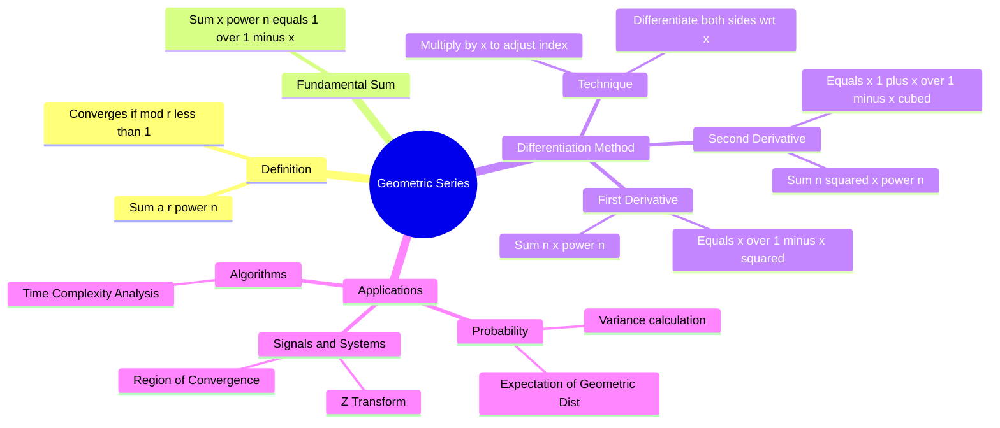

---
tags:
  - mathematics
  - calculus
  - series
  - gate
  - algebra
aliases:
  - Infinite Geometric Series
  - Power Series Differentiation
  - Arithmetico-Geometric Series
created: 2026-07-13
subject: "[[Mathematics]]"
parent:
  - Series
---
### Geometric Series and its Derivatives
#calculus/series #algebra

> The **Geometric Series** is the foundation of power series analysis. While the basic sum formula is well known, **differentiating the series** term-by-term allows us to evaluate complex sums involving $n, n^2, n^3$ in the numerator (Arithmetic-Geometric series). This technique is a powerful shortcut for GATE problems in Calculus, Probability (Expectation/Variance), and Z-Transforms.

---

#### The Fundamental Geometric Series
#series/definition

Consider the infinite geometric series with first term $1$ and common ratio $x$.
$$S = 1 + x + x^2 + x^3 + \dots = \sum_{n=0}^{\infty} x^n$$

**Convergence Condition:**
The series converges if and only if **$|x| < 1$**.

**Sum Formula:**
$$\boxed{\quad \sum_{n=0}^{\infty} x^n = \frac{1}{1-x} \quad}$$

---
#### First Derivative (The $\sum n x^n$ Form)
#series/derivatives

To find the sum of the form $\sum n x^n$, we differentiate the fundamental identity with respect to $x$.

**Step 1: Differentiate**
$$\frac{d}{dx} \left( \sum_{n=0}^{\infty} x^n \right) = \frac{d}{dx} \left( \frac{1}{1-x} \right)$$
$$\sum_{n=1}^{\infty} n x^{n-1} = \frac{1}{(1-x)^2}$$
*(Note: The $n=0$ term vanishes upon differentiation).*

**Step 2: Multiply by $x$**
To match the standard index $n x^n$, multiply both sides by $x$:
$$x \sum_{n=1}^{\infty} n x^{n-1} = \frac{x}{(1-x)^2}$$

$$\boxed{\quad \sum_{n=0}^{\infty} n x^n = \frac{x}{(1-x)^2} \quad}$$
*   *Application:* This formula is directly used to find the Mean of a Geometric Distribution or time complexity of certain recursive algorithms.

---
#### Second Derivative (The $\sum n^2 x^n$ Form)
#series/second-derivative

To find sums involving $n^2$, we differentiate the result of Step 1 again.

**Step 1: Differentiate $\sum n x^{n-1}$**
$$\frac{d}{dx} \left( \sum_{n=1}^{\infty} n x^{n-1} \right) = \frac{d}{dx} \left( (1-x)^{-2} \right)$$
$$\sum_{n=2}^{\infty} n(n-1) x^{n-2} = \frac{2}{(1-x)^3}$$

**Step 2: Multiply by $x^2$**
$$\sum_{n=0}^{\infty} (n^2 - n) x^n = \frac{2x^2}{(1-x)^3}$$

**Step 3: Solve for $\sum n^2 x^n$**
Using Linearity: $\sum n^2 x^n - \sum n x^n = \frac{2x^2}{(1-x)^3}$
$$\sum_{n=0}^{\infty} n^2 x^n = \frac{2x^2}{(1-x)^3} + \underbrace{\frac{x}{(1-x)^2}}_{\text{from 1st deriv}}$$

Simplifying:
$$\boxed{\quad \sum_{n=0}^{\infty} n^2 x^n = \frac{x(1+x)}{(1-x)^3} \quad}$$

---
#### Summary of Key Formulas (for $|x|<1$)

| Series Form | Sum Function |
| :--- | :--- |
| $\sum_{n=0}^{\infty} x^n$ | $\frac{1}{1-x}$ |
| $\sum_{n=1}^{\infty} n x^{n-1}$ | $\frac{1}{(1-x)^2}$ |
| $\sum_{n=0}^{\infty} n x^n$ | $\frac{x}{(1-x)^2}$ |
| $\sum_{n=0}^{\infty} n^2 x^n$ | $\frac{x(1+x)}{(1-x)^3}$ |

---
#### Example Applications
#gate/examples

**Example 1: Pure Calculus**
Evaluate the sum: $S = \frac{1}{2} + \frac{2}{4} + \frac{3}{8} + \frac{4}{16} + \dots$
**Solution:**
Rewrite as: $S = \sum_{n=1}^{\infty} n \left(\frac{1}{2}\right)^n$.
This matches $\sum n x^n$ with $x = 0.5$.
Using formula:
$$S = \frac{0.5}{(1 - 0.5)^2} = \frac{0.5}{0.25} = 2$$

**Example 2: Probability (Geometric Distribution)**
Find the Expected Value $E[X]$ if $P(X=k) = q^{k-1}p$ for $k=1, 2, \dots$
**Solution:**
$E[X] = \sum_{k=1}^{\infty} k \cdot P(X=k) = \sum_{k=1}^{\infty} k q^{k-1} p$
Factor out constant $p$:
$E[X] = p \sum_{k=1}^{\infty} k q^{k-1}$
Using the derivative formula $\sum n x^{n-1} = \frac{1}{(1-x)^2}$ with $x=q$:
$$E[X] = p \cdot \frac{1}{(1-q)^2}$$
Since $1-q = p$:
$$E[X] = p \cdot \frac{1}{p^2} = \boxed{\frac{1}{p}}$$

---
#### Finite Geometric Series
Sometimes (e.g., in Z-transform of a window), we need the finite sum.
$$\sum_{k=0}^{N-1} x^k = \frac{1 - x^N}{1 - x}$$
*   **Derivative:** $\sum_{k=0}^{N-1} k x^{k-1} = \frac{d}{dx} \left( \frac{1 - x^N}{1 - x} \right)$
    *(Use Quotient Rule).*

---
### Related Concepts
#topic/related-concepts

> [[Taylor Series]] (Geometric series is the Maclaurin series of $(1-x)^{-1}$)

[[The Z-Transform|Z-Transforms]] (Definition involves $\sum x[n] z^{-n}$, a geometric series)
[[Geometric Distribution]] (Direct application of these formulas)
[[Binomial Theorem]] (Generalization for negative/fractional powers $(1-x)^{-n}$)
[[Convergence of Series]]
