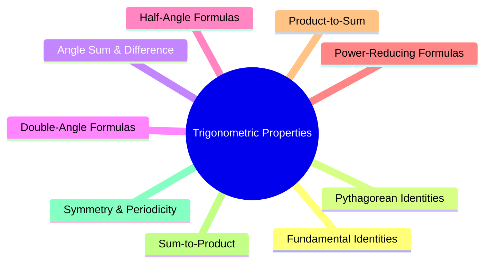

---
tags:
  - mathematics
  - trigonometry
  - foundational-math
  - gate
aliases:
  - TI
  - Trigonometric Properties
  - TP
subject: "[[Mathematics]]"
parent:
  - Trigonometry
confidence: 10
---
### Trigonometric Properties (Identities)
#trigonometry #identities #foundational-math

> Trigonometric properties, also known as trigonometric identities, are equations involving trigonometric functions that are true for every value of the variables for which both sides of the equation are defined. They are fundamental tools for simplifying expressions, solving trigonometric equations, and are essential in calculus, physics, and engineering.

---
#### Fundamental Identities
#trigonometry/fundamental-identities

**Reciprocal Identities:**
$$\csc\theta = \frac{1}{\sin\theta} \qquad \sec\theta = \frac{1}{\cos\theta} \qquad \cot\theta = \frac{1}{\tan\theta}$$

**Quotient Identities:**
$$\tan\theta = \frac{\sin\theta}{\cos\theta} \qquad \cot\theta = \frac{\cos\theta}{\sin\theta}$$

---
#### Pythagorean Identities
#trigonometry/pythagorean-identities

These are derived from the Pythagorean theorem on the unit circle.
$$\boxed{\quad \sin^2\theta + \cos^2\theta = 1 \quad}$$
Dividing by $\cos^2\theta$ and $\sin^2\theta$ respectively gives:
$$1 + \tan^2\theta = \sec^2\theta$$
$$1 + \cot^2\theta = \csc^2\theta$$

---
#### Angle Sum and Difference Identities
#trigonometry/sum-difference-identities

These are crucial for manipulating expressions involving sums or differences of angles.
$$\boxed{\quad \sin(A \pm B) = \sin A \cos B \pm \cos A \sin B \quad}$$
$$\boxed{\quad \cos(A \pm B) = \cos A \cos B \mp \sin A \sin B \quad}$$
$$\tan(A \pm B) = \frac{\tan A \pm \tan B}{1 \mp \tan A \tan B}$$

---
#### Double-Angle Formulas
#trigonometry/double-angle

Derived from the sum identities by setting $A=B$.
$$\boxed{\quad \sin(2A) = 2 \sin A \cos A \quad}$$
$$\begin{align}
\cos(2A) &= \cos^2 A - \sin^2 A \\
 &= 2\cos^2 A - 1 \\
 &= 1 - 2\sin^2 A
\end{align}$$
$$\tan(2A) = \frac{2\tan A}{1-\tan^2 A}$$

---
#### Power-Reducing Formulas
#trigonometry/power-reducing

Derived by rearranging the $\cos(2A)$ identities. Extremely useful for integration in calculus.
$$\sin^2 A = \frac{1 - \cos(2A)}{2}$$
$$\cos^2 A = \frac{1 + \cos(2A)}{2}$$

---
#### Half-Angle Formulas
#trigonometry/half-angle

Derived from the power-reducing formulas.
$$\sin\left(\frac{A}{2}\right) = \pm\sqrt{\frac{1-\cos A}{2}}$$
$$\cos\left(\frac{A}{2}\right) = \pm\sqrt{\frac{1+\cos A}{2}}$$
The sign ($\pm$) depends on the quadrant in which the angle $A/2$ lies.

---
#### Product-to-Sum Formulas

#trigonometry/product-to-sum

$$\sin A \cos B = \frac{1}{2}[\sin(A+B) + \sin(A-B)]$$
$$\cos A \cos B = \frac{1}{2}[\cos(A+B) + \cos(A-B)]$$
$$\sin A \sin B = \frac{1}{2}[\cos(A-B) - \cos(A+B)]$$
^ptosformula

---
#### Sum-to-Product Formulas
#trigonometry/sum-to-product

$$\sin A + \sin B = 2\sin\left(\frac{A+B}{2}\right)\cos\left(\frac{A-B}{2}\right)$$
$$\sin A - \sin B = 2\cos\left(\frac{A+B}{2}\right)\sin\left(\frac{A-B}{2}\right)$$
$$\cos A + \cos B = 2\cos\left(\frac{A+B}{2}\right)\cos\left(\frac{A-B}{2}\right)$$
$$\cos A - \cos B = -2\sin\left(\frac{A+B}{2}\right)\sin\left(\frac{A-B}{2}\right)$$

---
#### Symmetry and Periodicity
#trigonometry/symmetry-periodicity

##### Even-Odd Properties
- $\cos(-x) = \cos(x)$ (**Even** function)
- $\sin(-x) = -\sin(x)$ (**Odd** function)
- $\tan(-x) = -\tan(x)$ (**Odd** function)

##### Periodicity

- $\sin(x+2\pi) = \sin(x)$ and $\cos(x+2\pi) = \cos(x)$ (Period is $2\pi$)
- $\tan(x+\pi) = \tan(x)$ (Period is $\pi$)

---
### Related Concepts
#topic/related-concepts

> [[Euler's Formulae for Fourier Coefficients|Euler's Formulas]]

[[Algebra of Complex Numbers|Complex Numbers]]
[[Phasors and Impedance Concept|Phasor Analysis]]
[[Fourier Series]]
