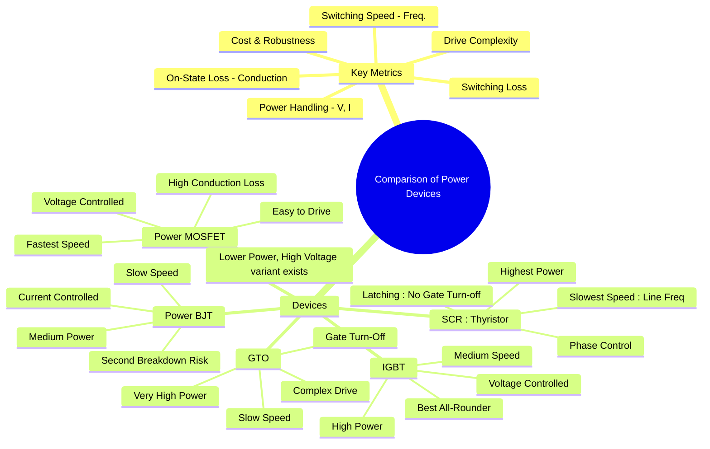

---
tags:
  - power-electronics
  - semiconductor-devices
  - power-systems
  - gate-exam
created: 2025-10-15
aliases:
  - Device Comparison
  - Power Device Characteristics
  - Power Semiconductor Devices
subject: "[[Power Electronics]]"
parent:
  - Power Semiconductor Devices
modified: 2026-08-04T09:23:58
---
### Comparison of Power Semiconductor Devices
#power-devices #device-selection #switching-characteristics

> The selection of a power semiconductor device is a critical design choice in power electronics, ==governed by a trade-off between power handling capability, switching speed, losses, and control complexity==. ==No single device is optimal for all applications==; understanding their relative strengths and weaknesses is essential for designing efficient converters, inverters, and drives.

---

#### Key Comparison Parameters
#device-comparison

*   **Power Handling**: The ability to block high voltage in the OFF state and conduct high current in the ON state.
*   **Switching Speed**: The maximum frequency at which the device can be efficiently turned on and off. This is limited by turn-on ($t_{on}$) and turn-off ($t_{off}$) times.
*   **Conduction Loss**: Power dissipated during the ON state, determined by the on-state voltage drop ($V_{on}$) or on-state resistance ($R_{on}$). $P_{cond} = V_{on} \times I_{on}$ or $P_{cond} = I_{on}^2 \times R_{on}$.
*   **Switching Loss**: Power dissipated during the transition between ON and OFF states. It is proportional to the switching frequency.
*   **Drive Requirements**: The complexity and power needed for the control circuit (gate or base) to operate the switch.

---
#### Summary Comparison Table

| Device           | Symbol / Type    |               Diagram                | Control Type              | Voltage / Current Rating | Switching Freq. | On-State Loss | Drive Complexity                                     |
| ---------------- | ---------------- | :----------------------------------: | ------------------------- | ------------------------ | --------------- | ------------- | ---------------------------------------------------- |
| **SCR**          | Latching         | ![[scr.png]] | Gate Pulse (Turn-On Only) | Very High / Very High    | < 500 Hz        | Very Low      | Simple (Turn-On), requires circuit for Turn-Off      |
| **GTO**          | Fully Controlled | ![[GTO symbol.png]] | Gate Pulse (On/Off)       | Very High / Very High    | < 2 kHz         | Low-Medium    | Complex, High Negative Current for Turn-Off          |
| **Power BJT**    | Fully Controlled | ![[power bjt symbol.png]] | Base Current ($I_B$)      | High / High              | < 10 kHz        | Low           | Complex, High Power, Storage Time slows turn-off     |
| **IGBT**         | Fully Controlled | ![[IGBT symbol.png]] | Gate Voltage ($V_{GE}$)   | Very High / High         | 2 kHz - 50 kHz  | Low           | Simple, Low Power, Slower than MOSFET (current tail) |
| **Power MOSFET** | Fully Controlled | ![[power mosfet symbol.png]] | Gate Voltage ($V_{GS}$)   | Medium / Medium          | > 100 kHz       | High          | Simple, Very Low Power, Fastest Switching            |

---
#### Power Handling vs. Switching Frequency
#power-vs-frequency

A fundamental trade-off exists between a device's power handling capability and its maximum switching frequency. This relationship is a key factor in device selection.

*   **High Power, Low Frequency**: Devices with P-N junctions that utilize minority carrier injection (like SCR, GTO, BJT, IGBT) exhibit **conductivity modulation**. This drastically reduces their on-state resistance and allows for very high current densities and low conduction losses. However, the time required to remove these minority carriers during turn-off (storage time) makes them inherently slow.
    *   **Domain**: SCR, GTO, high-power IGBTs.
*   **Low Power, High Frequency**: Devices that are purely **majority carrier devices** (like MOSFETs) do not have storage time and can switch extremely fast. However, without conductivity modulation, their on-state resistance ($R_{DS(on)}$) increases significantly with their voltage rating, leading to high conduction losses at high power levels.
    *   **Domain**: Power MOSFETs.
*   **The Bridge**: The **IGBT** was developed to bridge this gap. It uses a MOSFET input for easy voltage control and fast turn-on, while its BJT-like output structure provides conductivity modulation for low on-state losses and high power handling. Its speed is limited by the recombination of minority carriers at turn-off (current tail).

*Conceptual plot showing the application domains of various power devices.*

---
#### Detailed Comparison Points
#device-tradeoffs

##### Controllability
*   **Latching Devices (SCR, TRIAC)**: Once turned on, the gate loses control. They turn off only when the anode current falls below the holding current (current commutation). This is suitable for line-frequency (50/60 Hz) phase control but not for high-frequency PWM applications.
*   **Fully Controlled Devices (BJT, MOSFET, IGBT, GTO)**: Can be turned on and off at will via the control terminal. This is essential for choppers, inverters, and SMPS.

##### Drive Circuit
*   **Current Controlled (BJT)**: Requires a continuous, high base current to stay ON, resulting in a complex, power-hungry drive circuit.
*   **Voltage Controlled (MOSFET, IGBT)**: The gate is electrically isolated, requiring almost zero steady-state current. The drive only needs to supply transient current to charge/discharge the gate capacitance. This results in simple, low-power drive circuits.
*   **GTO Drive**: A special case requiring a strong positive pulse to turn on and an even stronger, short-duration negative current pulse to turn off.

##### Parallel Operation
*   **Power MOSFETs** have a positive temperature coefficient of resistance ($R_{DS(on)}$ increases with temperature). If one device in a parallel bank starts to take more current, it heats up, its resistance increases, and current is naturally diverted to the other devices. This makes them inherently stable and easy to parallel.
*   **Power BJTs & IGBTs** have a negative temperature coefficient of on-state voltage ($V_{CE(sat)}$ decreases with temperature). If one device takes more current, it heats up, its on-state voltage drops, and it draws even more current. This can lead to **thermal runaway** and requires careful matching and external balancing (e.g., emitter resistors) for parallel operation.

---
### Related Concepts
#power-devices/related-concepts

> [[Silicon Controlled Rectifier (SCR)]]

[[Power BJT, Power MOSFET, and IGBT]]
[[Gate Turn-Off Thyristor (GTO) and TRIAC]]
[[Gate Drive Circuits for MOSFET and IGBT]]
[[Thyristor Commutation Techniques]]
