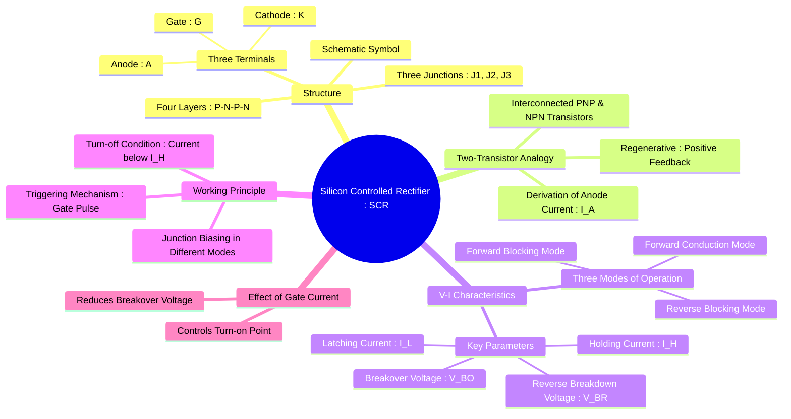

---
tags:
  - power-electronics
  - semiconductor-devices
  - thyristor
created: 2025-10-15
aliases:
  - SCR
  - Silicon Controlled Rectifier
  - Thyristor
  - "SCR : V-I Characteristics"
  - SCR Structure
subject: "[[Power Electronics]]"
parent: Power Semiconductor Devices
modified: 2026-08-04T10:27:38
---
### Silicon Controlled Rectifier (SCR) Structure and V-I Characteristics
#scr #thyristor #power-switching

> A Silicon Controlled Rectifier (SCR), a member of the **thyristor** family, is a four-layer (P-N-P-N), three-terminal (Anode, Cathode, Gate) semiconductor switching device. It functions as a bistable switch, moving from a non-conducting (OFF) state to a conducting (ON) state. Its main application is controlling large currents and voltages with a small gate signal, making it ideal for power control applications like controlled rectifiers, AC voltage controllers, and motor drives.

---
#### Structure of an SCR
#scr/structure #pnpn-device

The basic structure of an SCR consists of four alternating layers of P-type and N-type semiconductor material, forming a P-N-P-N device. This creates three P-N junctions, labeled J1, J2, and J3.
*   **Anode (A)**: The terminal connected to the outer P-layer.
*   **Cathode (K)**: The terminal connected to the outer N-layer.
*   **Gate (G)**: The terminal connected to the inner P-layer (near the cathode).

The schematic symbol resembles a diode with a third lead for the gate, indicating its control capability.

#### Two-Transistor Analogy
#scr/two-transistor-model #regenerative-action

The P-N-P-N structure of an SCR can be modeled as two interconnected bipolar junction transistors (BJTs): a PNP transistor (Q1) and an NPN transistor (Q2). The collector of each transistor is connected to the base of the other, forming a positive feedback loop.

*   The collector current of Q1 is $I_{C1} = \alpha_1 I_A + I_{CBO1}$
*   The collector current of Q2 is $I_{C2} = \alpha_2 I_K + I_{CBO2}$
*   The total anode current is $I_A = I_{C1} + I_{C2}$.
*   The cathode current is $I_K = I_A + I_g$.

Substituting these relations, we get the expression for the anode current:
$$\begin{align}
I_A &= (\alpha_1 I_A + I_{CBO1}) + (\alpha_2 (I_A + I_g) + I_{CBO2}) \\
I_A(1 - (\alpha_1 + \alpha_2)) &= I_{CBO1} + I_{CBO2} + \alpha_2 I_g
\end{align}$$
$$\boxed{\quad I_A = \frac{I_{CBO1} + I_{CBO2} + \alpha_2 I_g}{1 - (\alpha_1 + \alpha_2)} \quad}$$
**Regenerative Action**: The current gains $\alpha_1$ and $\alpha_2$ are dependent on the current flowing through them. At very low currents (OFF state), $(\alpha_1 + \alpha_2)$ is much less than 1. When a gate current $I_g$ is applied or the anode voltage is increased significantly, the transistor currents increase, causing $\alpha_1$ and $\alpha_2$ to increase. As $(\alpha_1 + \alpha_2)$ approaches 1, the denominator of the equation approaches zero, causing $I_A$ to increase rapidly. This drives both transistors into saturation, turning the SCR ON. This is a regenerative or positive feedback process.

#### V-I Characteristics of an SCR
#scr/vi-characteristics #operating-modes

The V-I characteristic curve illustrates the three distinct modes of operation for an SCR.

1.  **Reverse Blocking Mode**
    *   **Condition**: Anode is negative with respect to the Cathode ($V_{AK} < 0$).
    *   **Behavior**: Junctions J1 and J3 are reverse-biased, while J2 is forward-biased. The device behaves like a reverse-biased diode, allowing only a small leakage current to flow.
    *   **Breakdown**: If the reverse voltage exceeds the **Reverse Breakdown Voltage ($V_{BR}$)**, avalanche breakdown occurs at J1 and J3, leading to a large current flow that can permanently damage the device.

2.  **Forward Blocking Mode**
    *   **Condition**: Anode is positive with respect to the Cathode ($V_{AK} > 0$), with zero gate current ($I_g = 0$).
    *   **Behavior**: Junctions J1 and J3 are forward-biased, but the central junction J2 is reverse-biased. J2 blocks the flow of current, so the device remains in the OFF state. A small forward leakage current flows.
    *   **Turn-on**: If the forward voltage is increased to a value called the **Forward Breakover Voltage ($V_{BO}$)**, avalanche breakdown occurs at junction J2, and the SCR switches to the conduction state.

3.  **Forward Conduction Mode**
    *   **Condition**: The SCR is turned ON, either by exceeding $V_{BO}$ or by applying a gate pulse.
    *   **Behavior**: All three junctions become forward-biased. The device offers a very low impedance path for the current. The voltage drop across the SCR ($V_{AK}$) becomes very small (typically 1V to 2V), and a large anode current, limited by the external load resistance, flows through it.
    *   **Turn-off**: Once conducting, the gate loses control. The SCR can only be turned OFF by reducing the anode current below a minimum value called the **Holding Current ($I_H$)**.

#### Key Latching and Holding Parameters
#latching-current #holding-current

*   **Latching Current ($I_L$)**: The minimum anode current required to maintain the thyristor in the ON state *immediately after* the gate signal has been removed. If the anode current does not rise to this level before the gate pulse ends, the SCR will revert to the forward blocking state.
*   **Holding Current ($I_H$)**: The minimum anode current required to *keep* the thyristor in the ON state. If the anode current falls below this level, the SCR will turn OFF.
*   **Relationship**: The latching current is always greater than the holding current.
    $$\boxed{\quad I_L > I_H \quad}$$
    Typically, $I_L \approx (2 \text{ to } 3) \times I_H$.

#### Effect of Gate Current ($I_g$)
#scr/triggering #gate-control

The primary method of turning on an SCR is by applying a small positive voltage between the gate and cathode, which injects a gate current $I_g$.
*   Injecting a gate current provides the initial charge carriers needed to start the regenerative action.
*   As the gate current increases, the charge required for avalanche breakdown at J2 is achieved at a lower anode-cathode voltage.
*   Therefore, **increasing the gate current reduces the forward breakover voltage ($V_{BO}$)**.
*   A sufficiently large gate current will cause the SCR to turn on at very low values of $V_{AK}$. This allows precise control over the exact moment the device begins to conduct.

---
### Related Concepts
#scr/related-concepts

> [[Thyristor Firing (Triggering) Circuits (R, RC, UJT)]]

[[Thyristor Commutation Techniques]]
[[Static and Dynamic Characteristics of Thyristors (Turn-on and Turn-off)]]
[[Gate Turn-Off Thyristor (GTO) and TRIAC]]
[[Power BJT, Power MOSFET, and IGBT]]
