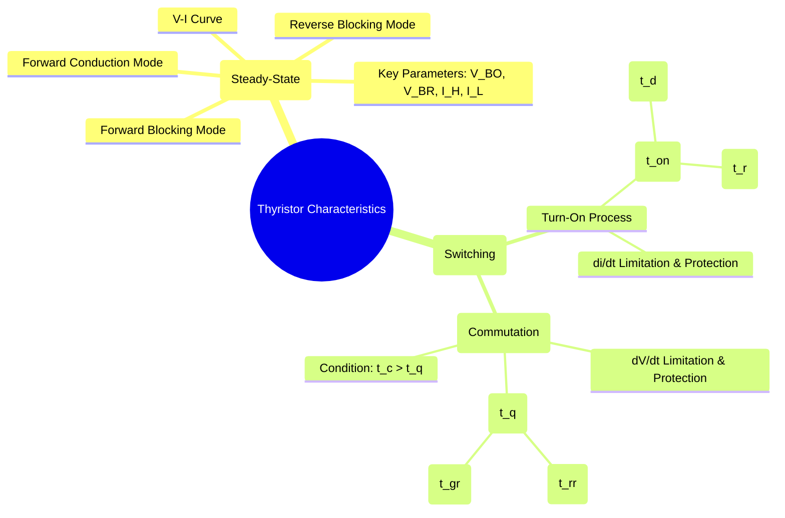

---
tags:
  - power-electronics
  - semiconductor-devices
  - thyristor
  - switching-characteristics
created: 2025-10-15
aliases:
  - Thyristor Switching
  - SCR Switching Characteristics
subject: "[[Power Electronics]]"
parent:
  - Power Semiconductor Devices
modified: 2026-08-04T10:35:34
---
### Static and Dynamic Characteristics of Thyristors
#thyristor-characteristics #switching-transients

> The characteristics of a thyristor (SCR) are categorized into static (steady-state) and dynamic (transient) behaviors. Static characteristics describe the device's V-I relationship in stable ON or OFF states. Dynamic characteristics describe the transient behavior during the switching transitions (turn-on and turn-off), which are critical for determining the device's switching speed and its protection requirements against destructive failure modes.

---
#### Static V-I Characteristics
#static-characteristics #vi-curve

The static characteristics define the thyristor's behavior under DC conditions and are represented by its V-I curve. This curve is divided into three operating modes:
1.  **Reverse Blocking Mode**: Anode is negative w.r.t cathode. The device acts like a reverse-biased diode until the reverse breakdown voltage ($V_{BR}$) is reached.
2.  **Forward Blocking Mode**: Anode is positive w.r.t cathode, but with no gate signal. The device blocks forward voltage like an open switch until the forward breakover voltage ($V_{BO}$) is exceeded.
3.  **Forward Conduction Mode**: The device is ON and conducts current with a small forward voltage drop (1-2 V).

These steady-state behaviors are defined by parameters like Holding Current ($I_H$) and Latching Current ($I_L$).
*(For a detailed V-I curve and explanation, see [[Silicon Controlled Rectifier (SCR)]])*

---
#### Dynamic Characteristics: The Turn-On Process
#turn-on-time #di-dt-effect

The turn-on process is the transition from the forward blocking state to the forward conduction state after a gate pulse is applied. The total time taken for this transition is the **turn-on time ($t_{on}$)**.

$$t_{on} = t_d + t_r$$

*   **Delay Time ($t_d$)**: The time interval between the application of the gate pulse and the point where the anode current rises to 10% of its final value (and anode voltage falls to 90%). This delay is the time required for charge carriers to accumulate and initiate the regenerative process.
*   **Rise Time ($t_r$)**: The time taken for the anode current to rise from 10% to 90% of its final value. During this time, the regenerative action builds up rapidly, conductivity modulation spreads, and the voltage across the device falls from 90% to 10% of its initial value.

##### di/dt Limitation and Protection
#di-dt-protection

During turn-on, conduction begins in a small region near the gate and then spreads across the entire area of the silicon wafer. If the rate of rise of anode current ($di/dt$) is too high, a large current density will be established in this small initial region before conduction has spread. This creates localized "hot spots" which can destroy the thyristor.
*   **Specification**: Every thyristor has a maximum allowable $(di/dt)_{max}$ rating specified in its datasheet.
*   **Protection**: To prevent $di/dt$ failure, a small inductor (a **snubber inductor**) is connected in series with the thyristor. This inductor opposes the rapid change in current.
    $$\boxed{\quad L_{snubber} \ge \frac{V_s}{(di/dt)_{max}} \quad}$$
    where $V_s$ is the source voltage.

---
#### Dynamic Characteristics: The Turn-Off Process (Commutation)
#turn-off-time #dv-dt-effect #commutation

The turn-off process, known as **commutation**, involves reducing the anode current below the holding current ($I_H$) to stop conduction. The device then needs a finite time to regain its forward blocking capability. This is the **turn-off time ($t_q$)**.

For successful commutation, the circuit must provide a reverse bias for a duration, called the **circuit turn-off time ($t_c$)**, that is longer than the device's required turn-off time ($t_q$).
$$\boxed{\quad t_c > t_q \quad}$$

The device turn-off time is composed of two intervals:
$$t_q = t_{rr} + t_{gr}$$
*   **Reverse Recovery Time ($t_{rr}$)**: After the anode current passes through zero, the thyristor conducts in the reverse direction for a short time. This reverse current is needed to sweep out the excess charge carriers from the outer junctions (J1 and J3). $t_{rr}$ is the time until this reverse current peaks and decays.
*   **Gate Recovery Time ($t_{gr}$)**: After the charges from the outer junctions are removed, the central junction (J2) still contains trapped charge carriers. These must be removed through recombination. $t_{gr}$ is the time required for this recombination process to complete so that the junction can block a forward voltage.

##### dV/dt Limitation and Protection
#dv-dt-protection #snubber-circuit

If a forward voltage is reapplied across the thyristor while it is still in the turn-off transient (or at any time in the forward blocking state), the central junction J2 acts like a capacitor ($C_j$). A rapidly rising voltage causes a charging current to flow:
$$i_c = C_j \frac{dv}{dt}$$
If this capacitive charging current is large enough, it can act like a gate current and cause the thyristor to turn on unintentionally. This is called **dV/dt triggering** or false turn-on.
*   **Specification**: Every thyristor has a maximum allowable $(dV/dt)_{max}$ rating.
*   **Protection**: To limit the rate of rise of voltage, a **snubber circuit** is used. The most common snubber is an RC network connected in parallel with the thyristor. The capacitor limits the $dV/dt$, and the resistor dampens the oscillations.

---
### Related Concepts
#thyristor-characteristics/related-concepts

> [[Silicon Controlled Rectifier (SCR)]]

[[Thyristor Commutation Techniques]]
[[Protection of Thyristors - Overvoltage (Snubber Circuit), Overcurrent (Fuses, Crowbar)]]
[[Comparison of Power Semiconductor Devices]]
