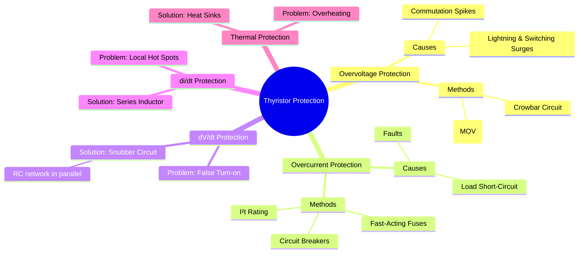

---
tags:
  - power-electronics
  - thyristor
  - protection-circuits
  - snubber-circuit
  - fuses
created: 2025-10-15
aliases:
  - SCR Protection
  - Thyristor Protection
subject: "[[Power Electronics]]"
parent:
  - Power Semiconductor Devices
modified: 2026-08-04T10:19:22
---
### Protection of Thyristors
#thyristor-protection

> Thyristors are robust devices for controlling high power, but they are highly susceptible to damage from operating conditions that exceed their specified ratings. Transient events can easily destroy them. Therefore, comprehensive protection against overvoltage, overcurrent, and excessive switching stresses (high $dV/dt$ and $di/dt$) is a mandatory part of any reliable power electronic circuit design.

---
#### 1. Overvoltage Protection
#overvoltage-protection #varistor #crowbar-circuit

Overvoltage across a thyristor can cause false triggering or permanent damage due to reverse breakdown.
*   **Causes**:
    *   **External**: Lightning strikes and switching surges on the AC power line.
    *   **Internal**: Voltage spikes generated by the switching of inductive circuits within the converter (due to $L \frac{di}{dt}$ effects).

*   **Protection Methods**:
    1.  **Voltage Clamping Devices (Varistors)**: A **Metal Oxide Varistor (MOV)** is connected in parallel with the thyristor (or across the AC input lines). A varistor has a highly non-linear V-I characteristic:
        *   At normal operating voltage, its resistance is very high, and it draws negligible current.
        *   When the voltage exceeds its clamping threshold, its resistance drops to a very low value, diverting the surge current and clamping the voltage across the thyristor to a safe level.
    2.  **Crowbar Circuit**: This is an aggressive overvoltage protection scheme. A secondary "crowbar" thyristor is connected in parallel with the main circuit's DC bus. If a dangerous overvoltage is detected, a control circuit fires the crowbar thyristor. This creates a direct short-circuit across the DC bus, causing a massive current to flow and intentionally blowing a fast-acting fuse or tripping a circuit breaker, thus disconnecting the power source. It protects the sensitive downstream components by sacrificing the fuse.

#### 2. Overcurrent Protection
#overcurrent-protection #fuses #i2t-rating

Overcurrents, typically caused by load short-circuits or faults, can lead to catastrophic failure due to excessive junction temperature. Protection must be extremely fast.

*   **Protection Methods**:
    1.  **Fast-Acting Semiconductor Fuses**: Standard fuses are too slow to protect semiconductor devices. Special high-speed fuses with a very low **$I^2t$ rating** are used.
    2.  **$I^2t$ Rating**: This value represents the thermal energy the device can withstand before being destroyed. For effective protection, the fuse's let-through energy must be less than the device's withstand capability.
        $$\boxed{\quad (I^2t)_{\text{fuse}} < (I^2t)_{\text{device}} \quad}$$
    3.  **Electronic Crowbar Circuit**: As described above, this method converts an overvoltage event into a predictable overcurrent event that is safely handled by a fuse.
    4.  **Circuit Breakers**: Can be used in conjunction with fuses for overall system protection but are generally too slow to protect the thyristor itself from sudden faults.

#### 3. dV/dt Protection: The Snubber Circuit
#dv-dt-protection #snubber-circuit

A high rate of rise of forward voltage ($dV/dt$) across a thyristor, even if below the breakover voltage, can cause spurious (unintended) turn-on due to the charging current of the internal junction capacitance ($i_c = C_j \frac{dv}{dt}$).

*   **Solution: RC Snubber Circuit**:
    *   An RC network (a resistor $R_s$ in series with a capacitor $C_s$) is connected in parallel with the thyristor.
    *   **Capacitor ($C_s$)**: When a fast-rising voltage appears, the capacitor acts as a momentary short circuit, providing an alternative path for the current and limiting the rate of voltage rise across the thyristor.
    *   **Resistor ($R_s$)**: When the thyristor turns ON, the capacitor discharges through it. The resistor limits this discharge current to a safe value, preventing the thyristor from being damaged by a high local $di/dt$. It also helps to damp oscillations.

#### 4. di/dt Protection
#di-dt-protection

If the rate of rise of anode current ($di/dt$) is too high during turn-on, conduction will be concentrated in a small area near the gate before it has time to spread across the entire junction. This localized heating can destroy the device.

*   **Solution: Series Inductor**:
    *   A small inductor ($L_s$), often called a **snubber inductor**, is connected in series with the thyristor.
    *   The inductor opposes any rapid change in current according to the relation $V = L \frac{di}{dt}$. This ensures the current rises gradually, allowing conduction to spread uniformly across the device junction. The required inductance is calculated as:
        $$\boxed{\quad L_s \ge \frac{V_s}{(di/dt)_{max}} \quad}$$
        where $V_s$ is the source voltage and $(di/dt)_{max}$ is the device rating.

---
### Related Concepts
#protection/related-concepts

> [[Static and Dynamic Characteristics of Thyristors (Turn-on and Turn-off)]]

[[Thyristor Commutation Techniques]]
[[Single-Phase Full-Wave Bridge Controlled Rectifier]] (Often requires snubber circuits for protection against commutation spikes)
[[Thermal Design and Heat Sinks]]
