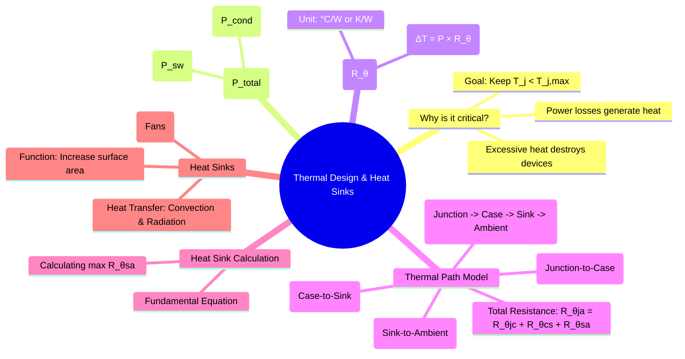

---
tags:
  - power-electronics
  - thermal-management
  - heat-sink
  - reliability
created: 2025-10-15
aliases:
  - Heat Sink Design
  - Thermal Management in Power Electronics
subject: "[[Power Electronics]]"
parent:
  - Power Semiconductor Devices
modified: 2026-08-04T10:38:54
---
### Thermal Design and Heat Sinks
#thermal-management #heat-sink #power-dissipation

> Power semiconductor devices are not ideal switches; they dissipate power in the form of heat during operation. This heat must be effectively removed to maintain the device's junction temperature ($T_j$) below its specified maximum limit ($T_{j,max}$), typically 125°C to 175°C. Inadequate thermal management is a leading cause of device failure. A **heat sink** is a passive component that facilitates this heat removal by increasing the surface area for heat to dissipate into the surrounding environment.

---
#### Power Losses in Power Devices
#power-loss

The total heat ($P_{total}$) that needs to be dissipated is the sum of two primary losses:
1.  **Conduction Loss ($P_{cond}$)**: Power dissipated when the device is in the ON state.
    *   For MOSFETs: $P_{cond} = I_{D(RMS)}^2 \times R_{DS(on)}$
    *   For IGBTs/Diodes: $P_{cond} = V_{CE(sat)} \times I_{C(avg)} + I_{C(RMS)}^2 \times R_{on}$
2.  **Switching Loss ($P_{sw}$)**: Power dissipated during the turn-on and turn-off transitions. It is proportional to the switching frequency ($f_{sw}$).
    *   $P_{sw} = (E_{on} + E_{off}) \times f_{sw}$, where $E_{on}$ and $E_{off}$ are the energy losses per transition.

The total average power dissipation is:
$$\boxed{\quad P_{total} = P_{cond} + P_{sw} \quad}$$
(Blocking state losses are usually negligible).

#### The Concept of Thermal Resistance
#thermal-resistance

The flow of heat from a source to a cooler body can be modeled using an electrical analogy based on Ohm's Law.
*   **Electrical Analogy**: Voltage Difference ($V$) = Current ($I$) × Resistance ($R$)
*   **Thermal Analogy**: Temperature Difference ($\Delta T$) = Power Flow ($P$) × Thermal Resistance ($R_\theta$)

$$\Delta T = T_2 - T_1 = P \times R_{\theta}$$
Where **Thermal Resistance ($R_\theta$)** is a measure of the opposition to heat flow, expressed in **°C/W** or **K/W**. A lower $R_\theta$ indicates a better heat conductor.

#### The Thermal Resistance Path
#thermal-model

Heat generated at the semiconductor junction must travel to the ambient air through several layers, each having its own thermal resistance. These resistances are in series.
1.  **$R_{\theta jc}$ (Junction-to-Case)**: Thermal resistance from the device junction to its outer case. This is an intrinsic property of the device package, specified in the datasheet.
2.  **$R_{\theta cs}$ (Case-to-Sink)**: Thermal resistance of the interface between the device case and the heat sink. This is the resistance of the **Thermal Interface Material (TIM)**, like thermal grease or a thermal pad, used to fill microscopic air gaps.
3.  **$R_{\theta sa}$ (Sink-to-Ambient)**: Thermal resistance of the heat sink itself. This value indicates how effectively the heat sink can transfer heat to the surrounding air. **This is the primary value to be determined in thermal design.**

The total thermal resistance from junction to ambient is the sum of these series components:
$$\boxed{\quad R_{\theta ja} = R_{\theta jc} + R_{\theta cs} + R_{\theta sa} \quad}$$

#### Heat Sink Calculation
#heat-sink-calculation

The primary goal is to select a heat sink that ensures the junction temperature never exceeds its maximum rating, even under worst-case conditions.
The total temperature drop is given by:
$$T_j - T_a = P_{total} \times R_{\theta ja}$$
Substituting the components of $R_{\theta ja}$:
$$T_j - T_a = P_{total} \times (R_{\theta jc} + R_{\theta cs} + R_{\theta sa})$$
To design for a safe margin, we use the maximum allowable junction temperature ($T_{j,max}$) and the maximum expected ambient temperature ($T_{a,max}$). We then rearrange the formula to solve for the maximum allowable thermal resistance of the heat sink, $R_{\theta sa}$:
$$\boxed{\quad R_{\theta sa} \le \frac{T_{j,max} - T_{a,max}}{P_{total}} - R_{\theta jc} - R_{\theta cs} \quad}$$
**How to use this formula**:
1.  Calculate the total power loss, $P_{total}$.
2.  Find $T_{j,max}$ and $R_{\theta jc}$ from the device datasheet.
3.  Find $R_{\theta cs}$ from the thermal interface material datasheet (a typical value is 0.1 - 0.5 °C/W).
4.  Determine the worst-case ambient temperature, $T_{a,max}$.
5.  Calculate the required $R_{\theta sa}$.
6.  Choose a commercial heat sink with a thermal resistance **equal to or lower than** the calculated value.

#### Heat Sink Performance
#heat-sink-performance

*   **Heat Transfer Mechanisms**: Heat sinks primarily dissipate heat through **convection** (transfer to moving air) and **radiation**.
*   **Natural vs. Forced Convection**:
    *   **Natural Convection**: Relies on the natural movement of air as it's heated by the sink. Heat sinks for natural convection are large with widely spaced fins.
    *   **Forced Convection**: Uses a fan to blow air across the heat sink. This dramatically increases the rate of heat transfer and significantly **lowers the effective $R_{\theta sa}$** of the heat sink. A heat sink's datasheet will provide different $R_{\theta sa}$ values for different airflow rates.

---
### Related Concepts
#thermal-design/related-concepts

> [[Comparison of Power Semiconductor Devices]] (Losses vary by device type)

[[Series and Parallel Operation of Thyristors]] (Thermal runaway is a key issue in parallel operation)
[[Power BJT, Power MOSFET, and IGBT]]
