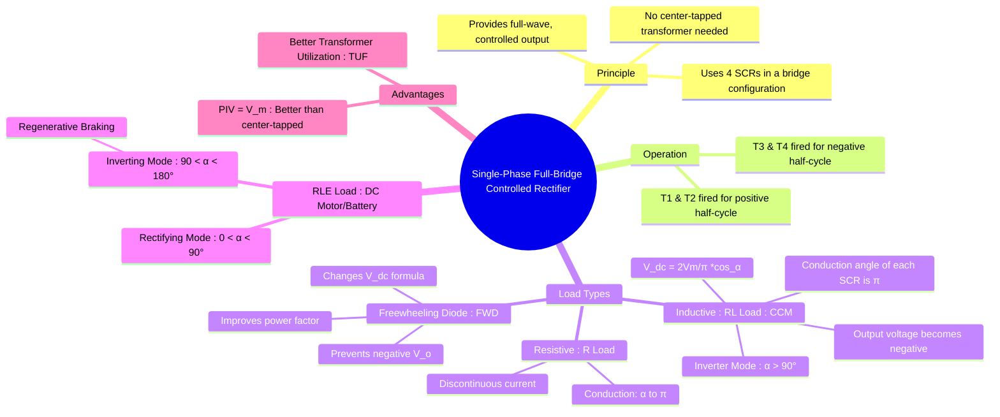

---
tags:
  - power-electronics
  - rectifiers
  - ac-dc-converter
  - bridge-rectifier
created: 2025-10-15
aliases:
  - Full-bridge controlled rectifier
  - Two-pulse bridge converter
  - B-2 converter
  - Single-Phase Full-Bridge Controlled Rectifier (R, RL, RLE loads)
subject: "[[Power Electronics]]"
parent:
  - "[[Phase-Controlled Rectifiers]]"
modified: 2026-08-04T10:28:05
---
### Single-Phase Full-Bridge Controlled Rectifier
#rectifier #phase-control #ac-dc-converter #bridge-rectifier

> The single-phase full-bridge controlled rectifier is the most widely used topology for single-phase <u>AC-to-DC conversion</u>. It <u>employs four thyristors (SCRs)</u> and overcomes the main drawbacks of the [[Single-Phase Full-Wave Center-Tapped Controlled Rectifier|center-tapped]] configuration, namely the high Peak Inverse Voltage (PIV) rating of the SCRs and the poor transformer utilization factor. It <u>can also operate in an inverting mode, allowing for bidirectional power flow (regenerative braking in motor drives)</u>.

> [!warning] Configuration Equivalence
> For numerical problems involving **Average Voltage ($V_{dc}$)** or **[[Performance Metrics|Input Power Factor (PF)]]**, the **[[Single-Phase Full-Wave Center-Tapped Controlled Rectifier|Center-Tapped]]** and **Bridge** full-converters are mathematically equivalent as long as they are 2-pulse systems.
> 
> **BUT:** 
> - If a question mentions **PIV**, the Center-Tapped SCR must block $2V_m$.
> - If a question mentions **Utility/Cost**, the Bridge is superior due to lower PIV and transformer size.

---
#### Circuit Operation
#circuit-operation

The four SCRs are arranged in a bridge. They are triggered in pairs:
* **Positive Half-Cycle ($0 \le \omega t \le \pi$)**: Thyristors T1 and T2 are forward-biased. When they are simultaneously fired at $\omega t = \alpha$, they conduct, connecting the load to the supply.
* **Negative Half-Cycle ($\pi \le \omega t \le 2\pi$)**: Thyristors T3 and T4 are forward-biased. They are fired at $\omega t = \pi + \alpha$, connecting the load to the supply with reversed polarity, thus maintaining a unidirectional current through the load.

---
#### Purely Resistive (R) Load
#rectifier/r-load

* **Operation**: The operation is similar to the center-tapped rectifier with an R-load. T1/T2 conduct from $\alpha$ to $\pi$. At $\pi$, the current falls to zero, and they are naturally commutated. T3/T4 conduct from $\pi+\alpha$ to $2\pi$. The load current is discontinuous for $\alpha > 0$.
* **Average Output Voltage ($V_{dc}$)**: The average voltage is calculated over a half-period ($\pi$).
    $$\boxed{\quad V_{dc} = \frac{V_m}{\pi} (1 + \cos\alpha) \quad}$$

---
#### Resistive-Inductive (RL) Load
#rectifier/rl-load

This is the most common practical scenario. We assume the inductance is large enough for **Continuous Conduction Mode (CCM)**.

##### Continuous Conduction Mode (CCM)
#ccm 

* **Operation**: T1/T2 are fired at $\alpha$. Due to the inductor, the load current does not fall to zero at $\pi$ but continues to flow. At $\pi+\alpha$, T3/T4 are fired. This applies the negative source voltage across T1/T2, which reverse-biases them and forces them to turn off (natural/line commutation). The load current is instantaneously transferred from the T1/T2 pair to the T3/T4 pair. Each thyristor conducts for 180° ($\pi$).
* **Negative Output Voltage**: Between $\pi$ and $\pi+\alpha$, the T1/T2 pair is still conducting while the source voltage is negative. This causes the instantaneous output voltage to be negative during this interval.

##### Waveforms & Equations (CCM)
#ccm 

* **Average Output Voltage ($V_{dc}$)**:
    $$\begin{align}
    V_{dc} &= \frac{1}{\pi} \int_{\alpha}^{\pi+\alpha} V_m \sin(\omega t) d(\omega t) \\
     &= \frac{V_m}{\pi} [-\cos(\omega t)]_{\alpha}^{\pi+\alpha}
    \end{align}$$
    $$\boxed{\quad V_{dc} = \frac{2V_m}{\pi} \cos\alpha \quad}$$
* **Inverter Mode**: For firing angles $0^\circ < \alpha < 90^\circ$, $V_{dc}$ is positive, and the converter acts as a rectifier, delivering power from the AC source to the DC load. For $90^\circ < \alpha < 180^\circ$, $V_{dc}$ becomes negative. If the load also contains a DC source (like a motor's back EMF) that can supply power, the converter can operate as an inverter, feeding power from the DC side back to the AC source.

##### Effect of a Freewheeling Diode (FWD)
#fwd 

> [!warning] Commutation & FWD
> The addition of an FWD shifts the commutation mechanism. 
> - **Without FWD:** SCRs undergo [[Thyristor Commutation Techniques#Natural or Line Commutation|Natural Commutation]] only when the incoming pair (T3, T4) is fired at $\pi + \alpha$.
> - **With FWD:** The SCRs (T1, T2) undergo commutation at $\pi$ because the FWD provides a lower-impedance path, allowing the SCR current to fall below $I_H$. 
> - **Result:** This eliminates the negative voltage area, making $v_o \geq 0$ and $i_o \geq 0$.

A freewheeling diode connected across the load provides an alternative path for the inductor current.
* **Operation**: <u>When the output voltage tries to go negative (at $\omega t=\pi$), the FWD becomes forward-biased and starts conducting. The load current freewheels through the diode, and the SCRs turn off.</u>
* **Effect**: The <u>output voltage is clamped at zero and never becomes negative</u>. This improves the power factor and reduces reactive power demand.
* **Average Output Voltage (with FWD)**: The integration is now from $\alpha$ to $\pi$, as the voltage is zero afterward. The formula becomes identical to the resistive load case.
    $$\boxed{\quad V_{dc} = \frac{V_m}{\pi} (1 + \cos\alpha) \quad}$$

> [!warning] Meaning of “Clamped” in FWD
> In rectifiers, “output voltage is clamped at 0 V” means the [[freewheeling diode]] prevents the load voltage from becoming negative.
> 
> This is different from a classical [[Clipper and Clamper Circuits|clamper circuit]], where a capacitor-diode network shifts the entire waveform by adding a DC level.

---
#### RLE Load (DC Motor/Battery) - Rectifying vs. Inverting
#rectifier/inverter-mode

When the load has a back EMF (E), the converter can operate in two distinct modes, assuming continuous conduction.
* **Rectifying Mode ($0^\circ < \alpha < 90^\circ$)**: $V_{dc}$ is positive. The average power delivered to the load is $P_{dc} = V_{dc} \times I_{dc}$. Since both are positive, power flows from the AC source to the DC load (e.g., motoring in a DC drive).
* **Inverting Mode ($90^\circ < \alpha < 180^\circ$)**: $V_{dc}$ is negative. For power to flow from the DC load back to the AC source, the polarity of the DC source E must be reversed. In a motor drive, this corresponds to **regenerative braking**, where the motor acts as a generator. The negative $V_{dc}$ opposes the (now reversed) back EMF, and power $P_{dc} = V_{dc} \times I_{dc}$ becomes negative, indicating power flow from the DC side to the AC side.

> [!info] Power Partitioning in RLE Loads
> When calculating power for an RLE load, identify the target:
> 1. **Battery/Motor Power ($P_{out}$):** $P = E \times I_{avg}$. Use this if the question asks for power to the "battery," "load EMF," or "useful work".
> 2. **Ohmic Losses ($P_{loss}$):** $P = I_{rms}^2 \times R$. This is heat dissipation.
> 3. **Total Load Power:** Sum of both above. Note: $V_{dc} \times I_{avg}$ only equals total power if $I$ is perfectly constant (ripple-free).

---
#### Numerical Interpretation

> [!caution] Formula Decoding: Full vs. Semi vs. Given
> In many PYQs (Previous Year Questions), the problem may provide a custom $V_o$ formula that doesn't match your standard notes.
> 
> | Topology | Standard Formula ($V_o$) | Key Indicator |
> | :--- | :--- | :--- |
> | **Full Converter** | $\frac{2V_m}{\pi} \cos \alpha$ | 4 SCRs; 2-quadrant operation |
> | **Semi-Converter** | $\frac{V_m}{\pi} (1 + \cos \alpha)$ | 2 SCRs + 2 Diodes; $v_o \ge 0$ |
> | **Custom Question** | $\frac{V_m}{2\pi} (3 + \cos \alpha)$ | *Always prioritize the formula given in the prompt.* |
> 
> **Why the difference?**
> The formula in your recent problem ($V_o = \frac{V_m}{2\pi}(3 + \cos \alpha)$) likely describes a specific asymmetrical bridge or a configuration with a modified firing sequence. **Trust the problem's math over the generic topology name.**

---
#### Advantages over Center-Tapped Rectifier
#rectifier/advantages

1. **Peak Inverse Voltage (PIV)**: At any instant, one pair of SCRs is conducting, placing the full source voltage across the other non-conducting pair. The PIV across any single SCR is the peak of the supply voltage.
    $$\boxed{\quad \text{PIV} = V_m \quad}$$
    This is half the PIV requirement of the center-tapped topology ($2V_m$), allowing the use of lower-voltage, less expensive devices.
2. **No Center-Tapped Transformer**: This simplifies the transformer design, reduces its size and cost, and improves the Transformer Utilization Factor (TUF).

---
### Related Concepts
#rectifier/related-concepts

> [[Single-Phase Full-Wave Center-Tapped Controlled Rectifier]]

[[Dual Converters (Circulating and Non-Circulating Current Modes)]]
[[Performance Metrics]]
[[Effect of Source Inductance (Commutation Overlap)]]
