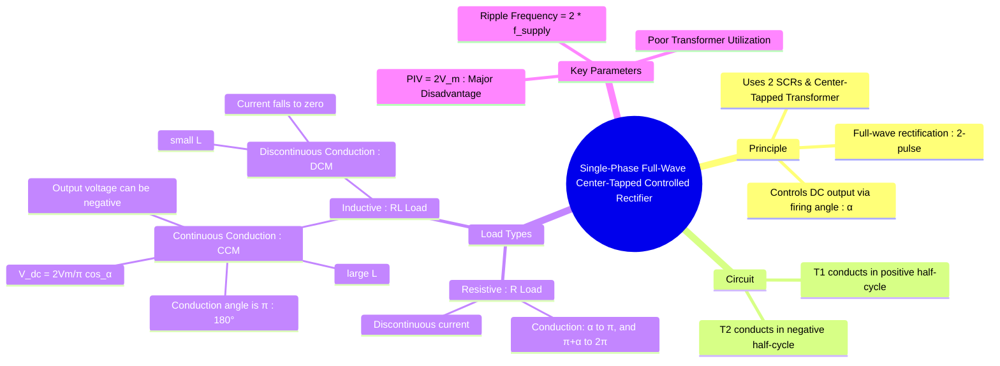

---
tags:
  - power-electronics
  - rectifiers
  - ac-dc-converter
  - phase-control
  - center-tapped
created: 2025-10-15
aliases:
  - Center-tapped controlled rectifier
  - Two-pulse converter
  - M-2 converter
  - Single-Phase Full-Wave Controlled Rectifier (Center-Tapped, R or RL loads)
subject: "[[Power Electronics]]"
parent:
  - "[[Phase-Controlled Rectifiers]]"
modified: 2026-08-04T10:28:20
---
### Single-Phase Full-Wave Controlled Rectifier (Center-Tapped)
#rectifier #phase-control #ac-dc-converter

> The single-phase full-wave center-tapped rectifier, <u>also known as a two-pulse converter</u>, <u>uses two thyristors (SCRs) and a center-tapped transformer</u> to achieve full-wave rectification. It provides better performance than a [[half-wave rectifier]], with higher average output voltage, lower ripple, and higher efficiency. The output voltage is controlled by adjusting the firing angle ($\alpha$) of the two SCRs.

![[Circuit - Single-Phase Center-Tapped Full-Wave Rectifier.png]]
#### Circuit Operation
#circuit-operation 

* The center-tapped transformer provides two secondary voltages, $v_{s1}$ and $v_{s2}$, which are 180° out of phase.
* **Positive Half-Cycle ($0 \le \omega t \le \pi$)**: Thyristor T1 is forward-biased. When a gate pulse is applied at $\omega t = \alpha$, T1 turns on. Load current flows through the upper half of the secondary winding.
* **Negative Half-Cycle ($\pi \le \omega t \le 2\pi$)**: Thyristor T2 is forward-biased. It is triggered at $\omega t = \pi + \alpha$. T2 turns on, and load current flows through the lower half of the secondary winding.
Because there are two current pulses per cycle of the source voltage, the fundamental ripple frequency at the output is $2f_s$.

---
#### Resistive (R) Load
#rectifier/r-load

* **Operation**: T1 conducts from $\alpha$ to $\pi$. At $\omega t = \pi$, the voltage and current through T1 become zero, and it is naturally commutated. Similarly, T2 conducts from $\pi+\alpha$ to $2\pi$. The output current is always positive but discontinuous for any $\alpha > 0$.

##### Waveforms & Equations
* **Average Output Voltage ($V_{dc}$)**:
    $$\begin{align}
    V_{dc} &= \frac{1}{\pi} \int_{\alpha}^{\pi} V_m \sin(\omega t) d(\omega t) \\
     &= \frac{V_m}{\pi} [-\cos(\omega t)]_{\alpha}^{\pi}
    \end{align}$$
    $$\boxed{\quad V_{dc} = \frac{V_m}{\pi} (1 + \cos\alpha) \quad}$$
* **RMS Output Voltage ($V_{rms}$)**:
    $$V_{rms} = \sqrt{\frac{1}{\pi} \int_{\alpha}^{\pi} (V_m \sin(\omega t))^2 d(\omega t)}$$
    $$\boxed{\quad V_{rms} = \frac{V_m}{\sqrt{2}} \sqrt{\frac{1}{\pi} \left( (\pi - \alpha) + \frac{\sin(2\alpha)}{2} \right)} \quad}$$

---
#### Resistive-Inductive (RL) Load
#rectifier/rl-load

With an RL load, the inductor's energy storage affects the conduction period. The analysis depends on whether the load current is continuous or discontinuous.

##### Continuous Conduction Mode (CCM)
This mode occurs when the load inductance is large enough to prevent the load current from ever reaching zero.
* **Operation**: T1 is fired at $\alpha$ and conducts. Due to the inductor, the current in T1 does not fall to zero at $\omega t = \pi$. It continues to conduct until T2 is fired at $\omega t = \pi + \alpha$. The moment T2 turns on, the source voltage $v_{s1}$ becomes negative, which reverse-biases T1 and turns it off (natural commutation). The load current is immediately transferred from T1 to T2. Each thyristor conducts for a full 180° ($\pi$ radians).
* **Negative Voltage**: From $\pi$ to $\pi+\alpha$, T1 is still conducting while the source voltage is negative. This results in a negative portion in the output voltage waveform.

##### Waveforms & Equations (CCM)
* **Average Output Voltage ($V_{dc}$)**: The integration is now over a full conduction period of $\pi$.
    $$\begin{align}
    V_{dc} &= \frac{1}{\pi} \int_{\alpha}^{\pi+\alpha} V_m \sin(\omega t) d(\omega t) \\
     &= \frac{V_m}{\pi} [-\cos(\omega t)]_{\alpha}^{\pi+\alpha} \\
     &= \frac{V_m}{\pi} [-\cos(\pi+\alpha) - (-\cos\alpha)] \\
     &= \frac{V_m}{\pi} [-(-\cos\alpha) + \cos\alpha]
    \end{align}$$
    $$\boxed{\quad V_{dc} = \frac{2V_m}{\pi} \cos\alpha \quad}$$
    Note: For $\alpha > 90°$, $V_{dc}$ becomes negative, and the converter acts as an inverter.

##### Discontinuous Conduction Mode (DCM)
This occurs for smaller inductance values or large firing angles. The current through one thyristor falls to zero before the next one is fired. The expression for $V_{dc}$ is more complex and depends on both $\alpha$ and the extinction angle $\beta$.

---
#### Key Performance Parameters
#rectifier/performance

* **Peak Inverse Voltage (PIV)**: This is a major drawback of this topology. Consider the instant when T1 is conducting. The voltage at the anode of T2 is $-V_m$ (peak of the lower secondary) while its cathode is at $+V_m$ (peak of the upper secondary, assuming negligible drop across T1).
    $$\boxed{\quad \text{PIV} = 2V_m \quad}$$
    The thyristors must be rated to block twice the peak secondary voltage.
* **Transformer Utilization Factor (TUF)**: The TUF is low because each secondary winding only carries current for half the time. This results in a larger, more expensive transformer compared to a bridge rectifier for the same power output.

---
### Related Concepts
#rectifier/related-concepts

> [[Single-Phase Full-Wave Bridge Controlled Rectifier]] (The more common topology that avoids the PIV and TUF issues)

[[Single-Phase Half-Wave Controlled Rectifier]]
[[Performance Metrics]]
[[Power Factor of Rectifiers]]
[[Effect of Source Inductance (Commutation Overlap)]]
