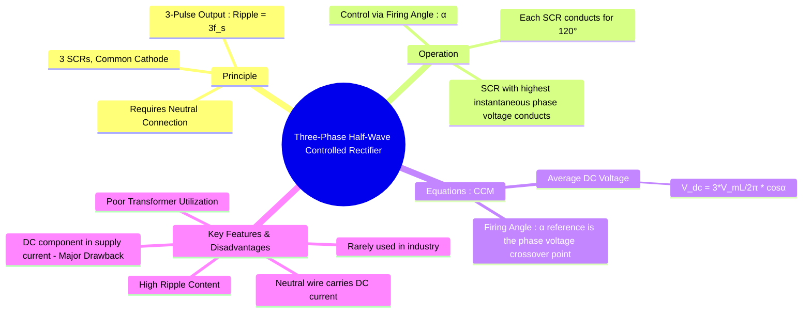

---
tags:
  - power-electronics
  - rectifiers
  - three-phase
  - ac-dc-converter
created: 2025-10-15
aliases:
  - 3-phase half-wave converter
  - 3-pulse converter
  - M-3 converter
subject: "[[Power Electronics]]"
parent:
  - Phase-Controlled Rectifiers (AC-DC Converters)
formula:
  - "Average Output Voltage (Three-Phase Half-Wave Controlled Rectifier) : $$V_{dc} = \\frac{3V_{mL}}{2\\pi}\\cos\\alpha$$"
modified: 2026-08-04T10:40:11
---
### Three-Phase Half-Wave Controlled Rectifier
#rectifier #three-phase #phase-control

> The three-phase half-wave controlled rectifier is the simplest form of a three-phase converter. <u>It uses three thyristors (SCRs), one for each phase, connected to a star (Y) configured source that must have a neutral point.</u> It is a **three-pulse converter** because it produces three output voltage pulses for each cycle of the source voltage. While simple, it has severe drawbacks that limit its practical use, primarily the presence of a DC component in the AC supply currents.

---
#### Circuit Operation
#circuit-operation 

![[Three-phase-half-controlled-bridge-circuit.jpg]]

* **Structure**: Three SCRs (T1, T2, T3) are connected to the three phases (A, B, C). Their cathodes are tied together to form the positive terminal of the DC output, and the source neutral (N) acts as the negative return path.
* **Conduction Principle**: <u>At any instant, the thyristor connected to the phase with the highest positive instantaneous voltage will conduct, provided it receives a gate pulse</u>. The firing of the next SCR in the sequence naturally commutates the previously conducting one (line commutation).
* **Conduction Sequence**: T1 → T2 → T3 → T1...
* **Conduction Period**: Each thyristor conducts for **120°**.
* **Firing Angle ($\alpha$)**: <u>The firing angle is measured from the **crossover point** of the phase voltages, which is the instant a phase voltage becomes the most positive</u> (e.g., for [[Three-Phase Plot.jpg|phase A]], this is at $\omega t = 30^\circ$ or $\pi/6$).

> See [[Three-Phase Plot.jpg|Three-Phase Plot]]

---
#### Waveforms and Equations (Continuous Conduction Mode)
#waveforms #equation #ccm 

Assuming a highly inductive load where the <u>DC load current ($I_d$) is constant and ripple-free.</u>

*   **Operation**: With a firing delay of $\alpha$, T1 is triggered at $\omega t = 30^\circ + \alpha$. It conducts until T2 is triggered at $\omega t = 150^\circ + \alpha$, taking over conduction. Thus, T1 conducts from $(30^\circ+\alpha)$ to $(150^\circ+\alpha)$.

*   **Average Output Voltage ($V_{dc}$)**: <u>The average voltage is calculated over the period of one pulse ($2\pi/3$ or 120°)</u>. Let the phase voltage be $v_{an} = V_{mp} \sin(\omega t)$. The integration is performed when T1 conducts.
    $$\begin{align}
    V_{dc} &= \frac{1}{2\pi/3} \int_{\pi/6+\alpha}^{5\pi/6+\alpha} V_{mp} \sin(\omega t) d(\omega t) \\
    &= \frac{3V_{mp}}{2\pi} [-\cos(\omega t)]_{\pi/6+\alpha}^{5\pi/6+\alpha} \\
    &= \frac{3V_{mp}}{2\pi} \left[-\cos(150^\circ+\alpha) + \cos(30^\circ+\alpha)\right] \\
    &= \frac{3V_{mp}}{2\pi} \left[\cos(30^\circ-\alpha) + \cos(30^\circ+\alpha)\right] \\
    &= \frac{3V_{mp}}{2\pi} [2\cos(30^\circ)\cos\alpha] = \frac{3V_{mp}}{2\pi} [2 \cdot \frac{\sqrt{3}}{2} \cos\alpha] \\
    &= \frac{3\sqrt{3}V_{mp}}{2\pi}\cos\alpha
    \end{align}$$
    Since the peak line voltage $V_{mL} = \sqrt{3}V_{mp}$, the formula is:
    $$\boxed{\quad V_{dc} = \frac{3V_{mL}}{2\pi}\cos\alpha \quad}$$
    The maximum DC voltage occurs at $\alpha=0$, $V_{d0} = \frac{3V_{mL}}{2\pi}$.

##### Special Load Cases

> [!note] RL Load with DC source (battery)
> The load equation becomes:
> $$V_{avg} = V_{converter} + E$$
> The voltage relation is:
> $$V_o = E + I_d R$$

> [!failure] When $V_{avg}$ expression is given
> Do NOT re-derive
> Directly substitute values
> Treat it as final equation

> [!success] Important
> In CCM: $⟨v_L⟩ = 0$ → inductor does not appear in DC equation
> If power is given: $I_d = √(P/R)$

---
#### Key Features and Disadvantages
#rectifier/disadvantages

1.  **DC Component in Supply Current**: This is the <u>most significant disadvantage. Because each phase conducts current only in the positive direction (asymmetrical waveform), the AC line current contains a DC component. This can saturate the core of the supply transformer, leading to overheating, distortion, and inefficiency</u>. Due to this, this converter is **not used in practical high-power applications**.
2.  **Neutral Current**: The neutral wire provides the return path for the load current and must be sized to carry the full DC load current, $I_{d,neutral} = I_d$.
3.  **High Ripple Factor**: The <u>output voltage has a fundamental ripple frequency of $3f_s$</u>. The ripple content is higher than that of a full-bridge (6-pulse) converter, requiring larger filtering components.
4.  **Low Transformer Utilization Factor (TUF)**: The transformer is poorly utilized due to the DC component in its windings.

Due to these severe limitations, the three-phase half-wave rectifier is primarily of academic interest and serves as a building block for understanding more complex converters. The **[[Three-Phase Full-Bridge Controlled Rectifier|three-phase full-bridge converter]]** is the preferred choice in industry.

---
### Related Concepts
#rectifier/related-concepts

> [[Three-Phase Full-Bridge Controlled Rectifier]] (The practical and widely used alternative)

[[Single-Phase Half-Wave Controlled Rectifier]]
[[Performance Metrics]]
[[Effect of Source Inductance (Commutation Overlap)]]
