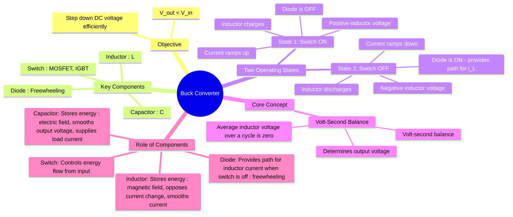

---
tags:
  - power-electronics
  - dc-dc-converters
  - choppers
  - smps
  - buck-converter
created: 2025-10-15
aliases:
  - Step-Down Converter
  - Step-Down Chopper
subject: "[[Power Electronics]]"
parent:
  - DC-DC Converters (Choppers)
modified: 2026-08-04T09:15:07
---
### Buck Converter
#power-electronics #buck-converter #dc-dc-converter #chopper

> The **Buck Converter** is a type of DC-DC [[switched-mode power supply]] (SMPS) that efficiently <u>steps down a higher DC input voltage to a lower DC output voltage</u>. It <u>achieves this by using a switching element (like a MOSFET), an inductor, a diode, and a capacitor to store and transfer energy</u>. The <u>output voltage is controlled by adjusting the **duty cycle** of the switching element</u> using [[Pulse Width Modulation (PWM) Techniques|Pulse Width Modulation (PWM)]].

---

#### Circuit Topology and Key Components
#buck-converter/components

![[Buck Converter.png]]
The basic buck converter circuit consists of four essential components:
1.  **Switch (S):** Typically a MOSFET or IGBT, controlled by a PWM signal. It <u>chops the DC input voltage into a high-frequency pulsating waveform</u>.
2.  **Diode (D):** A [[freewheeling diode]] that provides a path for the inductor current to flow when the switch is OFF.
3.  **Inductor (L):** An energy storage element. It <u>stores energy in its magnetic field when the switch is ON and releases it when the switch is OFF</u>. Its fundamental role is to smooth the current.
4.  **Capacitor (C):** A second energy storage element that <u>filters the pulsating voltage from the inductor/diode junction, providing a smooth DC output voltage</u>.
> Crucially, assuming a constant DC load ($I_o$), the capacitor absorbs the entire AC ripple component of the inductor current: $$i_C = i_L - I_o$$
>
> See [[Buck Converter in Continuous Conduction Mode (CCM)#^1|Capacitor vs. Inductor Current Relationship]]
>
> In steady state, the average capacitor current over one switching cycle is zero: $$\frac{1}{T_s}\int_0^{T_s} i_C(t)\,dt = 0$$ because a capacitor cannot sustain net DC current continuously without its voltage changing indefinitely.

---
#### Principle of Operation
#buck-converter/operation

The operation is analyzed in two distinct states within a single switching period ($T_s$). The <u>analysis assumes the converter is in **Continuous Conduction Mode (CCM)**, meaning the inductor current ($i_L$) never drops to zero</u>.

##### State 1: Switch is ON (Interval $0 < t \le DT_s$)
#switch-on #inductor-charging

*   The switch S is closed, connecting the input voltage source ($V_{in}$) to the inductor.
*   The freewheeling diode D is reverse-biased and acts as an open circuit.
*   The voltage across the inductor ($v_L$) is the difference between the input and output voltages.
    $$v_L = V_{in} - V_o$$
*   This positive voltage causes the inductor current ($i_L$) to ramp up linearly, storing energy in the inductor's magnetic field.
    $$\frac{di_L}{dt} = \frac{V_{in} - V_o}{L}$$
*   The inductor current supplies both the load and charges the output capacitor.

##### State 2: Switch is OFF (Interval $DT_s < t \le T_s$)
#switch-off #inductor-discharging

*   The switch S is opened, disconnecting the input source.
*   The inductor's property of opposing changes in current causes its polarity to reverse. This forward-biases the freewheeling diode D, turning it ON.
*   The diode now provides a continuous path for the inductor current to flow to the load.
*   The voltage across the inductor becomes equal to the negative of the output voltage (assuming an ideal diode).
    $$v_L = -V_o$$
*   This negative voltage causes the inductor current ($i_L$) to ramp down linearly as it releases its stored energy to the load and capacitor.
    $$\frac{di_L}{dt} = \frac{-V_o}{L}$$

---
#### Ripple Behavior
#buck-converter/ripple

> [!success] Ripple Characteristics
>
> In practical Buck converters:
>
> - Inductor current contains triangular ripple.
> - Capacitor voltage contains small output ripple.
> - Increasing inductance reduces current ripple.
> - Increasing capacitance reduces output voltage ripple.
>
> Ripple magnitude depends on:
> - switching frequency,
> - inductance,
> - capacitance,
> - duty cycle,
> - load current.

---
#### Voltage Relationship and Duty Cycle
#duty-cycle #volt-second-balance

For steady-state operation, the average voltage across the inductor over one complete switching cycle must be zero. This is known as the **volt-second balance principle**.

> [!example]- Assumptions Used
> The following derivation assumes:
> - ideal switch and diode,
> - steady-state operation,
> - Continuous Conduction Mode (CCM),
> - negligible output ripple,
> - ideal inductor and capacitor.

$$\frac{1}{T_s} \int_0^{T_s} v_L(t) dt = 0$$
$$\begin{align}
\int_0^{DT_s} (V_{in} - V_o) dt + \int_{DT_s}^{T_s} (-V_o) dt &= 0 \\
(V_{in} - V_o) (DT_s) - V_o (T_s - DT_s) &= 0 \\
(V_{in} - V_o) D - V_o (1 - D) &= 0 \\
V_{in}D - V_o D - V_o + V_o D &= 0 \\
V_{in}D &= V_o
\end{align}$$

This yields the fundamental relationship for an ideal buck converter:
$$\boxed{\quad V_o = D \cdot V_{in} \quad}$$
where $D = \frac{T_{on}}{T_s}$ is the duty cycle of the switch. Since $0 \le D \le 1$, the output voltage is always less than or equal to the input voltage.

---
#### Current Relationship in an Ideal Buck Converter
#buck-converter/current-relationship

Using ideal power balance:

$$V_{in}I_{in} = V_o I_o$$

Substituting:

$$V_o = D V_{in}$$

gives:

$$\boxed{\quad I_{in} = D I_o \quad}$$

> [!success] Key Insight
> A Buck converter:
> - steps down voltage,
> - steps up current capability.
>
> As voltage decreases, current increases proportionally for ideal power transfer.

> [!warning]- Raw Chopper vs Practical Buck Converter
> The relation: $$V_{o(rms)} = \sqrt{D}\,V_{in}$$ applies to a **raw switched waveform** across a resistive load **without ideal LC filtering**.
>
> In a practical Buck Converter operating in CCM with sufficiently large $L$ and $C$: $$V_o \approx V_{o(rms)} \approx D\,V_{in}$$ because the output ripple is very small.
>
> ##### Power Interpretation
>
> For a raw chopper feeding a resistive load: $$P_{total} = \frac{V_{o(rms)}^2}{R} = \frac{DV_{in}^2}{R}$$
>
> For an ideally filtered Buck converter: $$P_o \approx \frac{V_o^2}{R} = \frac{(DV_{in})^2}{R}$$
>
> In PYQs, carefully identify whether the question assumes:
> - raw switched output waveform, or
> - filtered DC output.
> 
> *Note:* In many PYQs, if "Load Power" is asked for a resistive load, both interpretations may be considered correct depending on whether the output is assumed to be filtered or raw.

---
#### Ideal Device Stress
#buck-converter/device-stress

> [!note] Ideal Switch and Diode Stress
>
> In an ideal Buck converter:
>
> **Switch OFF-state voltage stress**
>
> $$V_{switch,max} = V_{in}$$
>
> **Diode reverse voltage stress**
>
> $$V_{D,reverse} = V_{in}$$
>
> These relations are frequently used in:
> - switch rating selection,
> - diode selection,
> - GATE and ESE PYQs.

---
#### Input Resistance and Impedance Transformation
#buck-converter/impedance #reflected-resistance

Even though the Buck converter switches, the DC source sees an average resistance $R_{in}$. Because the Buck converter is a step-down topology, the source "sees" a higher resistance than the actual load.

**Derivation via Power Balance:**
Assuming an ideal converter where $P_{in} = P_{out}$:
$$V_{in} I_{in} = \frac{V_o^2}{R_L}$$

Substituting the ideal voltage gain $V_o = D \cdot V_{in}$:
$$V_{in} I_{in} = \frac{(D \cdot V_{in})^2}{R_L}$$

Solving for the average input resistance $R_{in} = \frac{V_{in}}{I_{in}}$:
$$\boxed{\quad R_{in} = \frac{R_L}{D^2} \quad}$$

> [!success] Key Insight
> * In a **Buck** converter, $R_{in} = R_L / D^2$ (Input resistance is higher than load).
> * In a **Boost** converter, $R_{in} = R_L (1-D)^2$ (Input resistance is lower than load).
> 
> This mathematical symmetry is a direct result of how $D$ affects the voltage and current ratios in each topology.

---
### Related Concepts
#buck-converter/related-concepts

> [[DC-DC Converters (Choppers)]]

[[Buck Converter in Continuous Conduction Mode (CCM)]] 
[[Buck Converter in Discontinuous Conduction Mode (DCM)]]
[[Pulse Width Modulation (PWM) Techniques]]
[[Power BJT, Power MOSFET, and IGBT]]
[[Boost Converter]]
[[Buck-Boost Converter]]
[[Inductor Volt-Second Balance]]
[[MOSFET]]
[[Inductor Ripple Current]] (for buck $\Delta i_L = \frac{(V_{in}-V_o)DT_s}{L} = \frac{V_o(1-D)T_s}{L}$)
[[Time Ratio Control (Constant Frequency, Variable Frequency)#The Duty Cycle (D)|Duty Cycle]]
[[Switching Frequency]]
[[Output Voltage Ripple Calculation]]
[[Buck Converter Waveforms]]
[[Switch Voltage and Current Stress]]
[[Conduction Modes in Power Electronics|Boundary between CCM and DCM]]
[[State Space Averaging]]
[[Synchronous Buck Converter]]