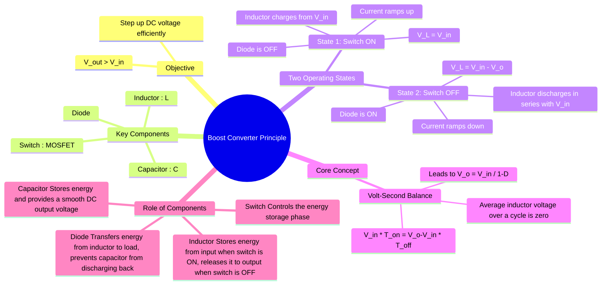

---
tags:
  - power-electronics
  - dc-dc-converters
  - choppers
  - smps
  - boost-converter
created: 2025-10-15
aliases:
  - Step-Up Converter
  - Step-Up Chopper
subject: "[[Power Electronics]]"
parent:
  - DC-DC Converters (Choppers)
modified: 2026-08-04T09:14:20
---
### Boost Converter
#power-electronics #boost-converter #dc-dc-converter #chopper

> The **Boost Converter** is a DC-DC [[switched-mode power supply]] (SMPS) that ==steps up a lower DC input voltage to a higher DC output voltage==. Its ==operation is based on the principle of storing energy in an inductor during one part of the switching cycle and releasing that energy, in series with the input source, to the output during the other part of the cycle==. This makes it crucial for applications like battery-powered devices where a higher voltage is needed, or in Power Factor Correction (PFC) circuits.

---

#### Circuit Topology and Key Components
#boost-converter/components

![[Boost Converter.png]]

The boost converter has a different arrangement than the [[buck converter#Circuit Topology and Key Components|buck converter]]:
1.  **Inductor (L):** Connected in series with the input source. It is the primary energy storage element.
2.  **Switch (S):** Typically a MOSFET, connected in parallel (shunt) with the input source after the inductor.
3.  **Diode (D):** A blocking diode that allows current to flow from the inductor to the output but prevents the output capacitor from discharging back through the switch.
4.  **Capacitor (C):** Connected in parallel with the load to maintain a smooth DC output voltage.

---
#### Principle of Operation
#boost-converter/operation

The operation is analyzed in two states within a single switching period ($T_s$), ==assuming the converter is in **Continuous Conduction Mode (CCM)**, where the inductor current ($i_L$) never drops to zero==.

##### State 1: Switch is ON (Interval $0 < t \le DT_s$)
#switch-on #inductor-charging

*   The switch S is closed. The ==input voltage source ($V_{in}$) is connected directly across the inductor L==.
*   The ==diode D is reverse-biased by the output voltage $V_o$ (which is higher than $V_{in}$), isolating the output stage==.
*   The voltage across the inductor is:
    $$v_L = V_{in}$$
*   This positive voltage causes the inductor current ($i_L$) to ramp up linearly, storing energy in the inductor's magnetic field.
    $$\frac{di_L}{dt} = \frac{V_{in}}{L}$$
*   ==**During this time**, the load is supplied entirely by the energy stored in the output capacitor C.==

##### State 2: Switch is OFF (Interval $DT_s < t \le T_s$)
#switch-off #inductor-discharging

*   The switch S is opened. The inductor's current cannot change instantaneously, so it continues to flow.
*   The current now flows through the inductor, the diode D, the capacitor C, and the load.
*   The inductor's polarity reverses to maintain the current flow. Its voltage now adds to the input source voltage. Applying KVL to the loop: $V_{in} - v_L - V_o = 0$.
*   The voltage across the inductor is:
    $$v_L = V_{in} - V_o$$
*   Since $V_o > V_{in}$, this voltage is negative, causing the inductor current to ramp down as it transfers its stored energy to the output capacitor and the load.
    $$\frac{di_L}{dt} = \frac{V_{in} - V_o}{L}$$

---
#### Voltage Relationship and Duty Cycle
#duty-cycle #volt-second-balance

Applying the **[[Inductor Volt-Second Balance|volt-second balance principle]]**, the average voltage across the inductor over one complete switching cycle must be zero for steady-state operation.
$$\frac{1}{T_s} \int_0^{T_s} v_L(t) dt = 0$$
$$\begin{align}
\int_0^{DT_s} (V_{in}) dt + \int_{DT_s}^{T_s} (V_{in} - V_o) dt &= 0 \\
(V_{in})(DT_s) + (V_{in} - V_o)(T_s - DT_s) &= 0 \\
V_{in}D + (V_{in} - V_o)(1 - D) &= 0 \\
V_{in}D + V_{in} - V_o - V_{in}D + V_oD &= 0 \\
V_{in} - V_o(1-D) &= 0
\end{align}$$
This yields the fundamental relationship for an ideal boost converter:
$$\boxed{\quad V_o = \frac{V_{in}}{1-D} \quad}$$
where $D$ is the duty cycle. Since the denominator $(1-D)$ is always between 0 and 1, the output voltage $V_o$ is always greater than or equal to the input voltage $V_{in}$. As $D \to 1$, the theoretical output voltage approaches infinity.

---
#### Input Resistance and Impedance Transformation
#boost-converter/impedance #reflected-resistance

While a boost converter is a switching circuit, from the perspective of the DC source, it appears as an average resistance $R_{in}$. This is crucial for understanding how the converter "loads" a source (like a battery or solar panel).

**Derivation via Power Balance:**
For an ideal converter, $P_{in} = P_{out}$.
$$V_{in} I_{in} = \frac{V_o^2}{R_L}$$

Substituting the ideal voltage gain $V_o = \frac{V_{in}}{1-D}$:
$$V_{in} I_{in} = \frac{\left( \frac{V_{in}}{1-D} \right)^2}{R_L}$$

Solving for the average input resistance $R_{in} = \frac{V_{in}}{I_{in}}$:
$$\boxed{\quad R_{in} = R_L (1-D)^2 \quad}$$

> [!Hint] Key Insight
>The boost converter acts as an impedance transformer. By varying $D$, we can "match" the load resistance to the source. This is the fundamental principle behind **Maximum Power Point Tracking (MPPT)**.

---
### Related Concepts
#boost-converter/related-concepts

> [[DC-DC Converters (Choppers)]]

[[Boost Converter in Continuous Conduction Mode (CCM)]]
[[Boost Converter in Discontinuous Conduction Mode (DCM)]]
[[Conduction Modes in Power Electronics]]
[[Buck Converter]]
[[Buck-Boost Converter]]
[[Inductor Ripple Current]]
[[Output Voltage Ripple Calculation]]
[[MOSFET]]