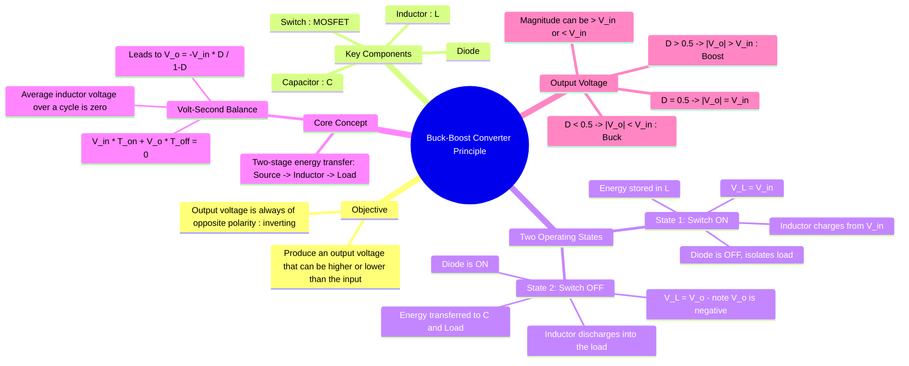

---
tags:
  - power-electronics
  - dc-dc-converters
  - choppers
  - smps
  - buck-boost-converter
created: 2025-10-15
aliases:
  - Buck-Boost Converter
  - Inverting Converter
  - Inductor Current in Buck-Boost Converter
subject: "[[Power Electronics]]"
parent:
  - DC-DC Converters (Choppers)
modified: 2026-08-04T09:15:25
---
### Principle of Operation of a Buck-Boost Converter
#power-electronics #buck-boost-converter #dc-dc-converter #inverting-converter

> The **Buck-Boost Converter** is a type of <u>DC-DC converter that can produce an output voltage magnitude that is either greater than or less than the input voltage</u>. Its defining characteristic is that the <u>output voltage polarity is **inverted** with respect to the input voltage</u>. This is achieved through a two-stage energy transfer process where energy is first stored in an inductor from the input source and then transferred to the output load.

---

#### Circuit Topology and Key Components
#buck-boost-converter/components

![[Buck-Boost Converter.png]]

The canonical buck-boost converter consists of:
1.  **Inductor (L):** The primary energy storage and transfer element.
2.  **Switch (S):** Usually a MOSFET, controls the charging of the inductor.
3.  **Diode (D):** Directs the flow of energy from the inductor to the load.
4.  **Capacitor (C):** Smooths the output voltage and supplies the load when the inductor is charging.

Unlike the [[Buck Converter|buck]] or [[Boost Converter|boost]] topologies, <u>in the buck-boost converter, there is no direct path for energy to flow from the input to the output</u>.

---
#### Principle of Operation
#buck-boost-converter/operation

The operation is analyzed in two states within a single switching period ($T_s$), assuming the converter is in **Continuous Conduction Mode (CCM)**.

##### State 1: Switch is ON (Interval $0 < t \le DT_s$)
#switch-on #inductor-charging

*   The switch S is closed, connecting the input voltage source ($V_{in}$) across the inductor.
*   The diode D is reverse-biased because the output side of the diode is at the positive capacitor voltage ($V_o$ is negative, so the top plate of the capacitor is at ground potential while the bottom is negative), effectively isolating the output stage.
*   The voltage across the inductor is:
    $$v_L = V_{in}$$
*   This positive voltage causes the inductor current ($i_L$) to ramp up linearly, storing energy in the inductor's magnetic field.
    $$\frac{di_L}{dt} = \frac{V_{in}}{L}$$
*   During this phase, the load is supplied entirely by the energy stored in the output capacitor C.

---
##### State 2: Switch is OFF (Interval $DT_s < t \le T_s$)
#switch-off #inductor-discharging

*   The switch S is opened. Due to its stored energy, the inductor's polarity reverses to maintain current flow.
*   The current now flows from the inductor through the load and the capacitor, and then through the now forward-biased diode D back to the inductor.
*   Applying KVL to the output loop, the voltage across the inductor is equal to the output voltage. Since the output voltage is negative with respect to ground, we have:
    $$v_L = V_o$$
*   Since $V_o$ is a negative voltage, the inductor current ramps down linearly as it transfers its stored energy to the output capacitor and the load.
    $$\frac{di_L}{dt} = \frac{V_o}{L}$$

---
#### Voltage Relationship and Duty Cycle
#duty-cycle #volt-second-balance

Applying the **[[Inductor Volt-Second Balance|volt-second balance principle]]** to the inductor over one complete cycle:
$$\frac{1}{T_s} \int_0^{T_s} v_L(t) dt = 0$$
$$\begin{align}
\int_0^{DT_s} (V_{in}) dt + \int_{DT_s}^{T_s} (V_o) dt &= 0 \\
(V_{in})(DT_s) + (V_o)(T_s - DT_s) &= 0 \\
V_{in}D + V_o(1 - D) &= 0 \\
V_o(1-D) &= -V_{in}D
\end{align}$$
This yields the fundamental relationship for an ideal buck-boost converter:
$$\boxed{\quad V_o = -V_{in} \frac{D}{1-D} \quad}$$
* The negative sign confirms the **inverting** nature of the converter.
* If $D < 0.5$, then $\frac{D}{1-D} < 1$, and $|V_o| < V_{in}$ (Buck mode).
* If $D > 0.5$, then $\frac{D}{1-D} > 1$, and $|V_o| > V_{in}$ (Boost mode).
* If $D = 0.5$, then $\frac{D}{1-D} = 1$, and $|V_o| = V_{in}$.

---
#### Input Resistance and Impedance Transformation
#buck-boost-converter/impedance #reflected-resistance

For the Buck-Boost converter, the input resistance reflects the "inverting" nature of the gain. The source sees a resistance that varies based on whether the converter is operating in Buck ($D < 0.5$) or Boost ($D > 0.5$) mode.

**Derivation via Power Balance:**
Assuming an ideal converter where $P_{in} = P_{out}$:
$$V_{in} I_{in} = \frac{V_o^2}{R_L}$$

Substituting the ideal voltage magnitude $|V_o| = V_{in} \frac{D}{1-D}$:
$$V_{in} I_{in} = \frac{\left( V_{in} \frac{D}{1-D} \right)^2}{R_L}$$

Solving for the average input resistance $R_{in} = \frac{V_{in}}{I_{in}}$:
$$\boxed{\quad R_{in} = R_L \left( \frac{1-D}{D} \right)^2 \quad}$$

> [!success] Key Insight
> * If **$D = 0.5$**: $R_{in} = R_L$. The source sees the actual load resistance.
> * If **$D < 0.5$ (Buck mode)**: $R_{in} > R_L$. The source sees a higher resistance (lower current).
> * If **$D > 0.5$ (Boost mode)**: $R_{in} < R_L$. The source sees a lower resistance (higher current).
> 
> This confirms that for a given load, increasing the duty cycle $D$ effectively "reduces" the resistance seen by the source, drawing more power.

> [!warning] Chopper Input Impedance Matrix
> Memorize how the source "sees" the load resistance $R_L$ based on the duty cycle $D$:
> * **Buck:** $R_{in} = \frac{R_L}{D^2}$ (Always steps UP impedance)
> * **Boost:** $R_{in} = R_L(1-D)^2$ (Always steps DOWN impedance)
> * **Buck-Boost:** $R_{in} = R_L(\frac{1-D}{D})^2$ (Can do either, matches exactly at $D=0.5$)

---
#### Current Relationships in Buck-Boost Converter (CCM)

#buck-boost-converter/current #ccm

> [!warning]- CCM current reminder  
> In CCM, **inductor current never reaches zero**.  
> Source, inductor, diode, and load currents are **not equal**.

##### Inductor Current
#buck-boost-converter/input-current 

- Inductor conducts during **both ON and OFF intervals**.
- Current waveform is triangular with non-zero minimum.

---
##### Output (Load) Current
#buck-boost-converter/output-load-current 

- Load is supplied **only during OFF time** (diode conduction).
- Hence: $$\boxed{\quad I_o = (1-D) I_L^{\text{avg}} \quad}$$

> [!note] Conceptual contrast  
> Buck: $I_o = I_L^{\text{avg}}$  
> Buck–Boost: $I_o = (1-D) I_L^{\text{avg}}$

---
##### Input (Source) Current
#buck-boost-converter/input-source-current 

- Source conducts **only during ON time**.
- During ON: $$i_s(t) = i_L(t)$$
- During OFF: $$i_s(t) = 0$$
Average source current:  
$$I_s^{\text{avg}} = D \ I_L^{\text{avg}}$$

---
##### Inductor Current Ripple
#buck-boost-converter/inductor-ripple-current 

$$\Delta I_L = \frac{V_{in}DT_s}{L}$$
Peak and minimum:
$$I_{L,\text{peak}} = I_L^{\text{avg}} + \frac{\Delta I_L}{2}$$
$$  
I_{L,\text{min}} = I_L^{\text{avg}} - \frac{\Delta I_L}{2}  
$$

> [!warning]- Peak source current (GATE-critical)  
> In CCM buck–boost:  
> $$\boxed{I_{s,\text{peak}} = I_{L,\text{peak}}}$$  
> Peak occurs **at the end of ON interval**.

> [!summary] CCM Buck–Boost quick relations  
> $$  
> \begin{aligned}  
> V_o &= -V_{in}\frac{D}{1-D} \\
> I_o &= (1-D) I_L^{\text{avg}} \\
> I_s^{\text{avg}} &= D I_L^{\text{avg}} \\
> I_{s,\text{peak}} &= I_{L,\text{peak}}  
> \end{aligned}  
> $$

---
### Related Concepts
#buck-boost-converter/related-concepts

> [[DC-DC Converters (Choppers)]]

[[Buck Converter]]
[[Boost Converter]]
[[Cuk Converter (Introduction)]]
[[Inductor Volt-Second Balance]]
[[MOSFET]]
[[Inductor Ripple Current]]

