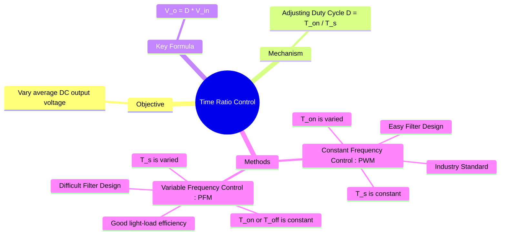

---
tags:
  - power-electronics
  - dc-dc-converters
  - choppers
  - control-strategies
  - pwm
created: 2025-10-15
aliases:
  - Chopper Control Strategies
  - PWM Control
  - Duty Cycle Control
  - Duty Cycle
  - D
subject: "[[Power Electronics]]"
parent:
  - DC-DC Converters (Choppers)
modified: 2026-07-21T15:21:38
---
### Time Ratio Control
#power-electronics #chopper-control #pwm #duty-cycle

> **Time Ratio Control** is the fundamental principle used to regulate the average output voltage of a DC-DC converter (or chopper). It works by rapidly switching a semiconductor device (like a MOSFET or IGBT) ON and OFF, thereby controlling the proportion of time the input voltage is connected to the output. This proportion is known as the **duty cycle**.

---

#### The Duty Cycle (D)
#duty-cycle 

The control is achieved by manipulating the duty cycle, $D$, which is ==the ratio of the switch's ON time ($T_{on}$) to the total switching period ($T_s$)==.
$$D = \frac{T_{on}}{T_s} = T_{on} \cdot f_s$$
For an ideal step-down chopper ([[buck converter]]), the average output voltage is directly proportional to the duty cycle:
$$\boxed{\quad V_o = D \cdot V_{in} \quad}$$
There are two primary methods to vary the duty cycle and thus control the output voltage.

---
#### 1. Constant Frequency Control (Pulse Width Modulation - PWM)
#pwm #constant-frequency

This is the most common and widely used method for controlling DC-DC converters.
*   **Principle:** The total switching period, ==$T_s$, (and thus the switching frequency, $f_s$) is kept constant. The width of the ON-pulse, $T_{on}$, is varied to change the duty cycle==.
*   **Implementation:** It is typically implemented by comparing a DC control voltage ($V_{control}$) with a high-frequency repeating waveform (a carrier signal, usually a sawtooth or triangle wave). The switch is turned ON when $V_{control}$ is greater than the carrier voltage and OFF when it is less.
*   **Advantages:**
    *   **Fixed Switching Frequency:** This is a major advantage. It makes the harmonic frequencies of the converter's input and output waveforms predictable (they occur at integer multiples of $f_s$). This greatly simplifies the design of the input and output filters (L and C).
    *   Provides a good dynamic response to changes in load or input voltage.
*   **Disadvantages:**
    *   Switching losses are relatively constant, which can lead to lower efficiency at very light loads, as the switch continues to operate at the full frequency.

---
#### 2. Variable Frequency Control (Frequency Modulation)
#frequency-modulation #pfm

In this method, the duty cycle is varied by changing the total switching period, $T_s$.
*   **Principle:** Either the ON-time ($T_{on}$) or the OFF-time ($T_{off}$) is kept constant, while the overall period $T_s$ is varied.
    *   **Constant ON-Time:** $T_{on}$ is fixed, and $T_{off}$ is varied.
    *   **Constant OFF-Time:** $T_{off}$ is fixed, and $T_{on}$ is varied.
*   **Advantages:**
    *   Can offer higher efficiency at light loads. As the load decreases, the frequency can be reduced, thereby lowering the switching losses. This is often called "burst mode" or "eco mode" in modern power ICs.
*   **Disadvantages:**
    *   **Variable Switching Frequency:** This is a significant drawback. The harmonic content of the waveforms is spread over a wide and unpredictable frequency range, making filter design very difficult and complex.
    *   Can generate unwanted electromagnetic interference (EMI) across a broad spectrum.
    *   The switching frequency may fall into the audible range at light loads, causing audible noise.

| Feature                 | Constant Frequency (PWM)                | Variable Frequency (Frequency Modulation)       |
| ----------------------- | --------------------------------------- | ----------------------------------------------- |
| **Constant Parameter**  | Switching Period ($T_s$)                | On-Time ($T_{on}$) or Off-Time ($T_{off}$)      |
| **Variable Parameter**  | On-Time ($T_{on}$)                      | Switching Period ($T_s$)                        |
| **Filter Design**       | Simple and predictable                  | Complex and difficult                           |
| **Harmonics**           | Occur at fixed, known frequencies       | Spread across a wide, variable frequency range  |
| **Light-Load Efficiency** | Generally lower                       | Can be higher                                   |
| **Common Use**          | Industry standard for most applications | Niche applications, light-load efficiency modes |

---
### Related Concepts
#control-strategies/related-concepts

> [[DC-DC Converters (Choppers)]]

[[Buck Converter]]
[[Boost Converter]]
[[Power BJT, Power MOSFET, and IGBT]]
[[Control Systems]]