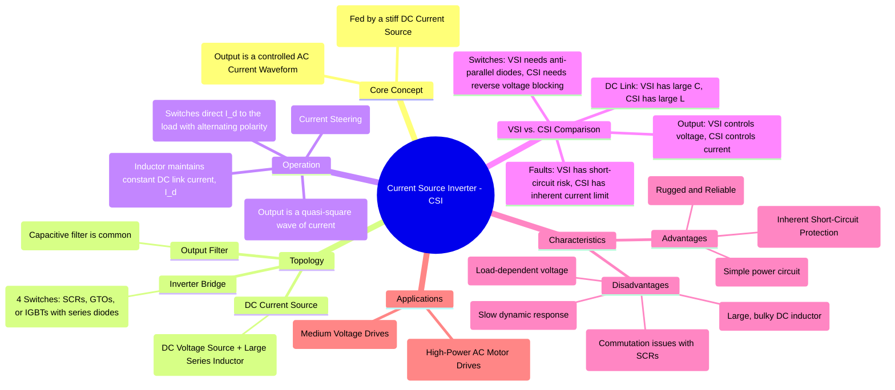

---
tags:
  - power-electronics
  - inverters
  - dc-ac-converters
  - csi
  - current-source-inverter
  - motor-drives
created: 2025-10-15
aliases:
  - CSI
  - Current-Fed Inverter
subject: "[[Power Electronics]]"
parent:
  - DC-AC Converters (Inverters)
modified: 2026-08-04T09:30:25
---
### Current Source Inverters (CSI)
#power-electronics #inverter #csi #current-source-inverter

> A **Current Source Inverter (CSI)**, or current-fed inverter, is a type of inverter that is supplied by a DC source with high impedance, effectively behaving as a DC **current source**. Its primary function is to convert this DC current into a controlled AC current waveform at its output. This is in direct contrast to a Voltage Source Inverter (VSI), which is fed by a stiff DC voltage source.

---

#### Circuit Topology and Principle
#csi/topology

A CSI consists of two main parts:
1.  **DC Current Source:** This is typically realized by connecting a large inductor ($L_d$) in series with a DC voltage source. This inductor maintains a nearly constant, ripple-free DC current ($I_d$) flowing into the inverter bridge, hence the name "current source."
2.  **Inverter Bridge:** This consists of four switches. Traditionally, **thyristors (SCRs)** or **GTOs** are used because they have inherent reverse voltage blocking capability, which is a requirement for CSI switches. If IGBTs or MOSFETs are used, they must be connected in series with a diode to provide this blocking capability.

**Operation Principle - "Current Steering":**
The inverter's job is not to create a current but to **steer** the constant DC current $I_d$ through the load in an alternating pattern.
*   **Positive Half-Cycle:** Switches S1 and S4 are turned ON. The DC current $I_d$ flows through S1, the load, and S4. The output current is $i_o = +I_d$.
*   **Negative Half-Cycle:** Switches S2 and S3 are turned ON. The current $I_d$ flows through S3, the load (in the reverse direction), and S2. The output current is $i_o = -I_d$.

The output is a **quasi-square wave of current**. The output voltage waveform is not directly controlled and is determined by the nature of the load impedance ($v_o(t) = Z_{load} \cdot i_o(t)$). A capacitor is often connected in parallel with the load to help with device commutation and to shape the output voltage into a more sinusoidal waveform.

---
#### Comparison: Current Source Inverter (CSI) vs. Voltage Source Inverter (VSI)
#vsi-vs-csi

This comparison is a very common topic in exams.

| Feature                 | Voltage Source Inverter (VSI)                               | Current Source Inverter (CSI)                                |
| ----------------------- | ----------------------------------------------------------- | ------------------------------------------------------------ |
| **DC Source**           | Stiff DC voltage source (large parallel capacitor)          | Stiff DC current source (large series inductor)              |
| **Output Waveform**     | Controlled AC **voltage** (e.g., square or PWM voltage)     | Controlled AC **current** (e.g., square wave current)        |
| **Output Variable**     | Output current depends on the load impedance.               | Output voltage depends on the load impedance.                |
| **Freewheeling Path**   | Requires anti-parallel diodes across switches.              | Does not require anti-parallel diodes.                       |
| **Switch Requirement**  | Reverse conduction (provided by diode).                     | Must be able to block **reverse voltage**.                   |
| **Fault Protection**    | Susceptible to short-circuit faults (shoot-through).        | **Inherent short-circuit protection** due to the DC inductor.|
| **Dynamic Response**    | Fast, as energy is stored in a capacitor.                   | Slow, due to the large energy-storing DC inductor.           |
| **Common Application**  | General purpose, UPS, low/medium power motor drives.        | High-power, medium-voltage AC motor drives.                  |

---
#### Key Characteristics and Applications
#csi/applications

> [!danger] Exam Trap: The VSI / CSI Duality
> Understand the operational extremes of these two converters:
> * **VSI (Voltage Source Inverter):** The output voltage is independent of the load, but the output current is dictated by the load. **A short circuit at the output is catastrophic** (infinite current).
> * **CSI (Current Source Inverter):** The output current is independent of the load, but the output voltage is dictated by the load. **An open circuit at the output is catastrophic** (infinite voltage spike due to $L \frac{di}{dt}$ from the stiff DC link inductor).

*   **Advantages:**
    *   **Reliability:** The power circuit is simple and robust.
    *   **Inherent Fault Protection:** The DC link inductor naturally limits the rate of rise of current and the peak fault current during a short circuit at the output.
    *   Capable of regeneration (power flow from AC to DC) without extra power components.
*   **Disadvantages:**
    *   **Slow Response:** The large DC inductor prevents rapid changes in current, resulting in poor dynamic performance compared to a VSI.
    *   **Bulky:** The DC inductor is large, heavy, and expensive.
    *   **Load Dependency:** Performance can be unstable at no-load or light-load conditions. CSIs typically require a minimum load to operate correctly.
*   **Applications:**
    *   Due to their robustness and high power capability, CSIs are primarily used in **high-power (megawatt scale) and medium-voltage AC motor drives**, such as for fans, pumps, compressors, and synchronous motor drives.

---
### Related Concepts
#csi/related-concepts

> [[DC-AC Converters (Inverters)]]

[[Single-Phase Full-Bridge Voltage Source Inverter (VSI)]]
[[Silicon Controlled Rectifier (SCR)]]
[[Thyristor Commutation Techniques]]
[[AC Motor Drives]]
