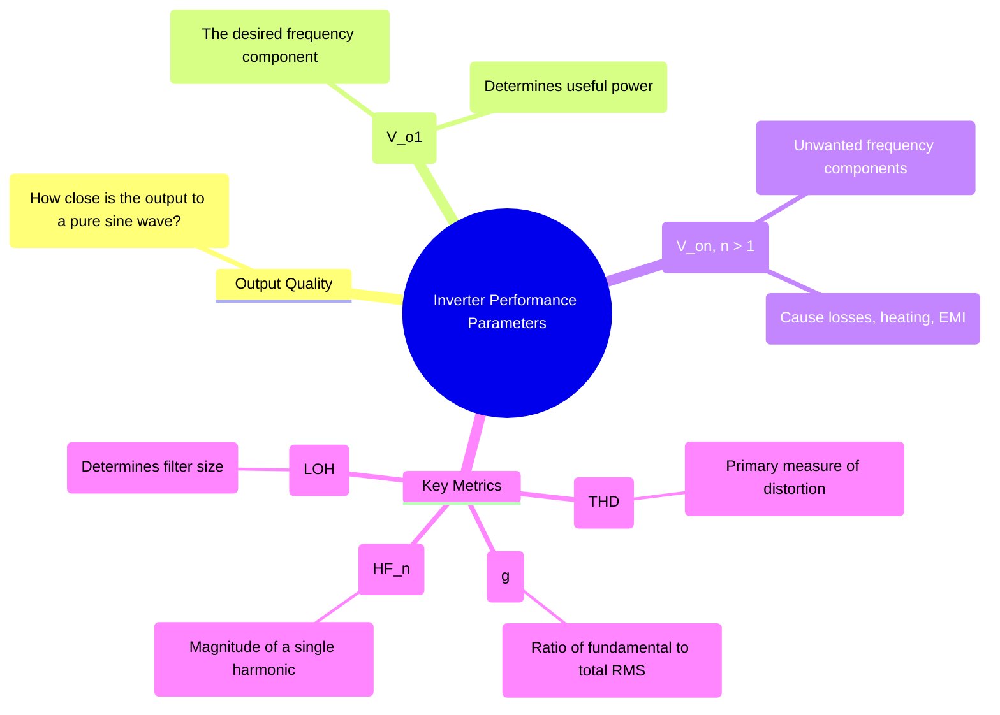

---
tags:
  - power-electronics
  - inverters
  - performance-metrics
  - power-quality
  - thd
created: 2025-10-15
aliases:
  - Inverter Performance Metrics
  - Inverter Power Quality
subject: "[[Power Electronics]]"
parent:
  - DC-AC Converters (Inverters)
modified: 2026-08-04T10:10:31
---
### Performance Parameters of Inverters
#power-electronics #inverter #performance-metrics #power-quality

> The output voltage of a practical inverter is not a perfect sinusoid but a switched waveform containing a fundamental component and a series of unwanted harmonics. Performance parameters are used to quantitatively measure the quality of this output waveform, primarily by assessing its harmonic content. A good inverter should have a low harmonic content, meaning its output is very close to a pure sine wave.

---
#### Total Harmonic Distortion (THD)
#thd #harmonics #distortion

**Total Harmonic Distortion** is the most important figure of merit used to quantify the distortion in a waveform. It is defined as the ratio of the RMS value of the sum of all harmonic components to the RMS value of the fundamental component.
$$\boxed{\quad THD = \frac{\sqrt{\sum_{n=2,3,...}^{\infty} V_{on}^2}}{V_{o1}} \quad}$$
where $V_{o1}$ is the RMS value of the fundamental component, and $V_{on}$ is the RMS value of the n-th harmonic.

Since the total RMS value of the waveform is $V_{o,rms} = \sqrt{\sum_{n=1}^{\infty} V_{on}^2} = \sqrt{V_{o1}^2 + \sum_{n=2}^{\infty} V_{on}^2}$, we can rewrite the THD formula as:
$$\boxed{\quad THD = \frac{\sqrt{V_{o,rms}^2 - V_{o1}^2}}{V_{o1}} \quad}$$
* A lower THD value indicates a cleaner, less distorted output waveform. An ideal sinusoidal waveform has a THD of 0%.

> [!info] Standard Square Wave THD
> For a basic square wave inverter (like an unmodulated half-bridge or full-bridge), the RMS value is $V_{dc}$ (or $V_{dc}/2$) and the fundamental RMS is $\frac{2\sqrt{2}}{\pi}V_{dc}$. 
> Plugging these into the formula yields a constant THD:
> $$\boxed{\quad THD_{square} \approx 48.34\% \quad}$$
> *This incredibly high distortion is exactly why PWM techniques were developed.*

---
#### Distortion Factor (g)
#distortion-factor

The Distortion Factor (g), also known as the fundamental component ratio, measures how much of the total RMS voltage is contributed by the fundamental component.
$$g = \frac{V_{o1}}{V_{o,rms}}$$
There is a direct and important relationship between THD and the Distortion Factor. From the THD formula:
$$\begin{align}
THD^2 &= \frac{V_{o,rms}^2 - V_{o1}^2}{V_{o1}^2} = \frac{V_{o,rms}^2}{V_{o1}^2} - 1 \\
THD^2 &= \frac{1}{g^2} - 1 \\
g^2 &= \frac{1}{1 + THD^2}
\end{align}$$
$$\boxed{\quad g = \frac{1}{\sqrt{1 + THD^2}} \quad}$$
This relationship is frequently used in objective questions.

---
#### Harmonic Factor ($HF_n$)
#harmonic-factor

The Harmonic Factor for the n-th harmonic ($HF_n$) quantifies the distortion caused by a single specific harmonic. It is the ratio of the RMS value of the n-th harmonic to the RMS value of the fundamental component.
$$HF_n = \frac{V_{on}}{V_{o1}}$$
This is useful for meeting specific power quality standards (like IEEE 519) that set limits on the magnitude of individual harmonics.

---
#### Lowest Order Harmonic (LOH)
#lowest-order-harmonic #filter-design

The Lowest Order Harmonic is the harmonic component with the lowest frequency present in the output waveform (other than the fundamental).
*   **Significance:** The LOH determines the difficulty of filtering the output. A low-pass filter is used to remove the harmonics, and its cutoff frequency must be set between the fundamental and the LOH. A larger frequency separation between the fundamental and the LOH makes the filter design easier, smaller, and more efficient.
*   **Example:**
    *   For a **square wave inverter**, the output contains only odd harmonics. The LOH is the **3rd harmonic**.
    *   For an inverter using **Sinusoidal PWM (SPWM)**, the harmonics are clustered around the switching frequency ($f_s$) and its multiples. The LOH is typically around $f_s - 2f_{ref}$ or higher, which is a much higher frequency than the 3rd harmonic. This is a major advantage of PWM, as it allows for much smaller output filters.

---
### Related Concepts
#performance-metrics/related-concepts

> [[Principle of Operation of an Inverter]]

[[Single-Phase Full-Bridge Voltage Source Inverter (VSI)]]
[[Pulse Width Modulation (PWM) Techniques]]
[[Fourier Series]]
[[Power Quality]]