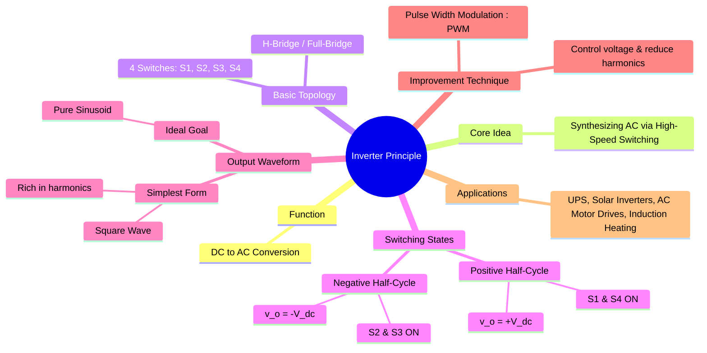

---
tags:
  - power-electronics
  - inverters
  - dc-ac-converters
  - pwm
  - power-conversion
created: 2025-10-15
aliases:
  - Inverter Principle
  - DC-AC Converter
  - Square Wave Mode
subject: "[[Power Electronics]]"
parent:
  - DC-AC Converters (Inverters)
modified: 2026-08-04T10:17:30
---
### Principle of Operation of an Inverter
#power-electronics #inverter #dc-ac-conversion

> An **inverter** is a power electronic device or circuit that converts direct current (DC) to alternating current (AC). Inverters do not *generate* AC power; rather, they are switches that change the DC input into an AC output of a desired frequency and magnitude. The core principle is to synthesize an AC waveform by connecting a DC source to a load with alternating polarity at a high frequency.

![[Inverter Operation (DC-AC).png]]

---
#### Core Principle: Synthesis by Switching
#h-bridge #switching-synthesis

The fundamental building block for most inverters is the **H-Bridge** or **Full-Bridge** configuration. It consists of four switches (typically [[MOSFET|MOSFETs]] or [[IGBT|IGBTs]]) and a DC voltage source. The load is connected between the two legs of the bridge.

By controlling which pair of switches is closed, we can control the polarity of the voltage applied across the load.

---
#### Operation of a Single-Phase Full-Bridge Inverter (Square Wave Mode)
#square-wave-inverter

This is the simplest mode of operation and clearly illustrates the principle. The switches are operated in diagonal pairs.

![[Circuit - Single-Phase Full-Bridge Voltage Source Inverter (VSI).png]]
##### Mode 1: Positive Half-Cycle ($0 < t \le T/2$)
* Switches **S1 and S4 are closed**.
* Switches S2 and S3 are open.
* Current flows from the DC source, through S1, through the load (from left to right), and through S4 to the ground.
* The voltage across the load is **$v_o = +V_{dc}$**.

##### Mode 2: Negative Half-Cycle ($T/2 < t \le T$)
* Switches **S2 and S3 are closed**.
* Switches S1 and S4 are open.
* Current flows from the DC source, through S3, through the load (from right to left), and through S2 to the ground.
* The voltage across the load is **$v_o = -V_{dc}$**.

By alternating between these two modes at a desired frequency $f=1/T$, a square wave AC voltage is produced across the load.
**Crucial Constraint:** Switches in the same leg (e.g., S1 and S2) must never be closed simultaneously, as this would create a direct short circuit across the DC source, a condition known as "shoot-through".

---
#### The Output Waveform and Harmonics
#harmonics #fourier-series

The simple switching method described above produces a **square wave** output. A pure AC waveform is a sinusoid, but a square wave is composed of a fundamental sinusoid at the switching frequency ($f_o$) plus an infinite series of odd harmonics ($3f_o, 5f_o, 7f_o, \dots$).

The [[Fourier Series]] representation of the square wave output is:
$$\boxed{\quad v_o(t) = \sum_{n=1,3,5,...}^{\infty} \frac{4V_{dc}}{n\pi} \sin(n\omega_o t) \quad}$$
* The RMS value of the fundamental component is $V_{o1} = \frac{4V_{dc}}{\sqrt{2}\pi} \approx 0.9 V_{dc}$.
* **Problem:** These harmonics are highly undesirable. They contribute to power loss, cause heating in motors, generate electromagnetic interference (EMI), and can lead to torque pulsations in drives.

---
#### Towards a Better Output: Pulse Width Modulation (PWM)
#pwm-inverter

To create a higher quality, near-sinusoidal output and to control the output voltage magnitude, advanced switching techniques are used. The most common is **Pulse Width Modulation (PWM)**.

* **Principle:** Instead of keeping the switches ON for an entire half-cycle, they are switched ON and OFF multiple times within each half-cycle. The width of these pulses is modulated (varied) according to a sinusoidal reference signal.
* **Result:** This pushes the dominant harmonics to much higher frequencies (around the switching frequency), which can then be easily filtered out by a small L-C filter. It also allows for smooth control of the fundamental voltage amplitude.

---
### Related Concepts
#inverter/related-concepts

> [[DC-AC Converters (Inverters)]]

[[Single-Phase Half-Bridge Voltage Source Inverter (VSI)]]
[[Single-Phase Full-Bridge Voltage Source Inverter (VSI)]]
[[Pulse Width Modulation (PWM) Techniques]]
[[Fourier Series]]
[[AC Motor Drives]]