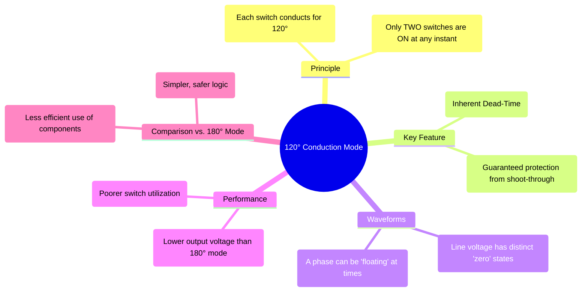

---
tags:
  - power-electronics
  - inverters
  - vsi
  - three-phase
  - conduction-modes
created: 2025-10-15
aliases:
  - 120 Degree Mode
subject: "[[Power Electronics]]"
parent: "[[Three-Phase Voltage Source Inverter (VSI)]]"
modified: 2026-08-04T09:04:50
---

---
### 120-degree Conduction Mode
#power-electronics #inverter #three-phase #conduction-modes

In the **120-degree conduction mode** for a three-phase inverter, each switch conducts for an electrical angle of 120°. A defining characteristic of this mode is that at any given instant, only **two** switches are active (one from the top group and one from the bottom group). This mode is less common than the 180° mode but possesses a key inherent safety feature.

#### Switching States and Waveforms
#switching-sequence #inverter-waveforms

Since each switch is ON for 120°, and there's a 60° phase shift between consecutive switch triggerings, there is a 60° interval in every cycle where both switches in a given leg are OFF. This guarantees that shoot-through cannot occur, eliminating the need for a separate dead-time in the gate drive logic.

The switching sequence results in a line-to-line voltage waveform that includes zero-voltage states.

| Interval      | Switches ON | $v_{AB}$  | $v_{BC}$  | $v_{CA}$  |
| :------------ | :---------- | :-------- | :-------- | :-------- |
| 0°-60°        | S1, S6      | $+V_{dc}$ | $0$       | $-V_{dc}$ |
| 60°-120°      | S1, S2      | $0$       | $-V_{dc}$ | $+V_{dc}$ |
| 120°-180°     | S3, S2      | $-V_{dc}$ | $-V_{dc}$ | $0$       |
| 180°-240°     | S3, S4      | $-V_{dc}$ | $0$       | $+V_{dc}$ |
| 240°-300°     | S4, S5      | $0$       | $+V_{dc}$ | $-V_{dc}$ |
| 300°-360°     | S5, S6      | $+V_{dc}$ | $+V_{dc}$ | $0$       |

The resulting line-to-line voltage waveform (e.g., $v_{AB}$) consists of a 60° pulse of $+V_{dc}$, followed by a 60° interval of $0V$, then a 60° pulse of $-V_{dc}$, and so on.

---
#### Performance Analysis
#performance-metrics #rms-calculation

##### Line-to-Line Voltage
The line voltage waveform has a lower RMS value compared to the 180° mode due to the zero-voltage states.
*   **RMS Value:** The waveform is active for two 60° intervals in every 180° half-cycle.
    $$V_{L,rms} = \left(\frac{1}{\pi} \int_0^{\pi/3} V_{dc}^2 d(\omega t)\right)^{1/2} = \left(\frac{V_{dc}^2}{\pi} \cdot \frac{\pi}{3}\right)^{1/2} = \frac{V_{dc}}{\sqrt{3}} \approx 0.577 V_{dc}$$
*   **Fundamental RMS Value:** From Fourier analysis, the peak value of the fundamental component is $V_{L1,peak} = \frac{2V_{dc}}{\pi}$.
    $$\boxed{\quad V_{L1, rms} = \frac{V_{L1,peak}}{\sqrt{2}} = \frac{\sqrt{2}V_{dc}}{\pi} \approx 0.45 V_{dc} \quad}$$

---
#### Comparison with 180-degree Conduction Mode

| Feature                 | 180° Conduction Mode                            | 120° Conduction Mode                          |
| ----------------------- | ----------------------------------------------- | --------------------------------------------- |
| **Switches ON**         | 3 at any instant                                | 2 at any instant                              |
| **Conduction Period**   | 180° for each switch                            | 120° for each switch                          |
| **Shoot-Through Risk**  | Present; requires dead-time protection          | **None**; inherently protected                |
| **RMS Line Voltage**    | $V_{dc}\sqrt{2/3} \approx 0.816 V_{dc}$          | $V_{dc}/\sqrt{3} \approx 0.577 V_{dc}$         |
| **Fundamental RMS Line**| $(\sqrt{6}/\pi)V_{dc} \approx 0.78 V_{dc}$      | $(\sqrt{2}/\pi)V_{dc} \approx 0.45 V_{dc}$      |
| **Switch Utilization**  | Better; current flows for a longer duration.    | Poorer; switches are idle for longer.         |
| **Common Use**          | Standard for most high-performance applications.| Less common; used where simplicity is key.    |

**Key Takeaway:** The 120° mode sacrifices output voltage and component utilization for the benefit of inherent safety against shoot-through faults.

---
### Related Concepts
#conduction-modes/related-concepts

> [[Three-Phase Voltage Source Inverter (VSI)]]

[[180-degree Conduction Mode]]
[[Performance Parameters of Inverters]]
[[AC Motor Drives]]