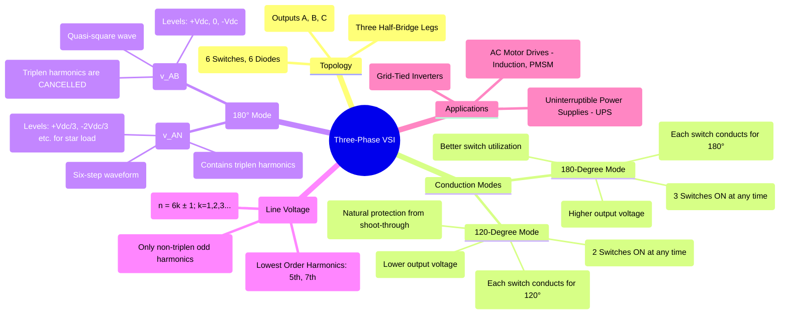

---
tags:
  - power-electronics
  - inverters
  - dc-ac-converters
  - vsi
  - three-phase
  - motor-drives
created: 2025-10-15
aliases:
  - 3-Phase Inverter
  - Six-Step Inverter
subject: "[[Power Electronics]]"
parent:
  - DC-AC Converters (Inverters)
modified: 2026-08-04T10:40:50
---
### Three-Phase Voltage Source Inverter
#power-electronics #inverter #vsi #three-phase #motor-drives

> A **three-phase voltage source inverter** is a power electronic circuit that converts a DC voltage into a three-phase AC voltage of variable magnitude and frequency. It is the most common power converter topology for AC motor drives and grid-connected applications. It is fundamentally composed of three single-phase half-bridge inverter legs, with their outputs (A, B, C) phase-shifted by 120°.

---
#### Circuit Topology
The standard three-phase VSI consists of six switches (S1-S6) and six anti-parallel diodes (D1-D6). The switches are arranged in three vertical legs.
*   **Leg A:** Switches S1 (upper) and S4 (lower)
*   **Leg B:** Switches S3 (upper) and S6 (lower)
*   **Leg C:** Switches S5 (upper) and S2 (lower)
The three output terminals (A, B, C) are taken from the midpoints of each leg. To prevent a short circuit of the DC source (shoot-through), the two switches in the same leg (e.g., S1 and S4) must never be turned ON simultaneously.

---
#### Conduction Modes
There are two primary modes of operation, defined by the duration each switch conducts.

##### 1. 180-Degree Conduction Mode
This is the most common mode of operation.
*   **Principle:** Each switch conducts for an electrical angle of 180°. At any instant in time, **three** switches are ON—one from the top group (S1, S3, S5) and two from the bottom group (S2, S4, S6), or vice versa.
*   **Switching Sequence:** The switches are turned on in the sequence S1 → S2 → S3 → S4 → S5 → S6, with each step lasting 60°.
*   **Waveforms:** This mode produces a six-step line-to-line voltage waveform. The line voltages have levels of $+V_{dc}$, 0, and $-V_{dc}$.
*   **Advantage:** This mode provides the maximum possible output voltage for a given DC link voltage and makes full use of the switch conduction capability.

##### 2. 120-Degree Conduction Mode
*   **Principle:** Each switch conducts for only 120°. At any instant, only **two** switches are ON, one from the top group and one from the bottom group.
*   **Advantage:** There is a 60° interval where neither switch in a leg is conducting. This provides a natural dead-time, guaranteeing that shoot-through cannot occur.
*   **Disadvantage:** The switch utilization is poorer, and the fundamental RMS output voltage is lower ($\sqrt{3}/2$ times) than in the 180° mode. This mode is less common in practice.

---
#### Performance and Harmonic Analysis (180° Mode)

![[180-degree Conduction Mode#Performance Analysis]]

---
### Related Concepts
#three-phase-inverter/related-concepts

> [[Single-Phase Full-Bridge Voltage Source Inverter (VSI)]]

[[Pulse Width Modulation (PWM) Techniques]] (especially Space Vector Modulation (SVM) for 3-phase inverters)
[[Performance Parameters of Inverters]]
[[AC Motor Drives]]