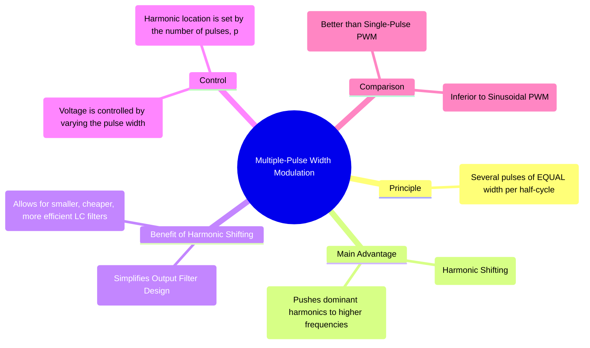

---
tags:
  - power-electronics
  - inverters
  - pwm
  - harmonic-reduction
  - voltage-control
created: 2025-10-15
aliases:
  - Multi-Pulse PWM
  - Uniform PWM
  - UPWM
subject: "[[Power Electronics]]"
parent: "[[Pulse Width Modulation (PWM) Techniques]]"
modified: 2026-08-04T10:04:47
---
### Multiple-Pulse Width Modulation
#multiple-pulse-pwm #harmonic-shifting

**Multiple-Pulse Width Modulation** is an advancement over single-pulse PWM where several pulses of uniform width are generated in each half-cycle of the output voltage. Its primary objective is not necessarily to eliminate specific low-order harmonics but to **shift the dominant harmonic energy to higher frequencies**, which significantly simplifies the design of the output filter.

---
#### Principle of Operation
#pwm/operation

In this technique, a high-frequency carrier wave (typically a sawtooth or triangle) is compared with a square or DC reference signal. This generates a series of pulses with a constant width in each half-cycle.
*   Let **p** be the number of pulses per half-cycle.
*   The frequency of the carrier wave ($f_c$) determines the number of pulses. For a triangular carrier, the number of pulses per half-cycle is given by:
    $$p = \frac{f_c}{2f_r} = \frac{m_f}{2}$$
    where $f_r$ is the frequency of the reference wave (the desired output frequency) and $m_f$ is the frequency modulation index.

The magnitude of the output voltage is controlled by varying the width of all the pulses simultaneously.

---
#### Key Advantage: Harmonic Shifting and Filtering
#filter-design #harmonic-reduction

The single most important benefit of using multiple pulses is the effect it has on the harmonic spectrum of the output voltage.
*   With single-pulse or square-wave operation, the lowest order harmonic (LOH) is low (e.g., 3rd or 5th). An output LC filter must have a cutoff frequency between the fundamental and this low LOH, requiring large, bulky, and expensive components.
*   With multiple-pulse PWM, the low-order harmonics are significantly reduced, and the most prominent harmonics are shifted to become sidebands of the carrier frequency ($f_c$) and its multiples.

$$\boxed{\quad \text{Dominant Harmonics appear around } m_f, 2m_f, 3m_f, \dots \quad}$$
Since the carrier frequency $f_c$ is chosen to be much higher than the fundamental frequency $f_r$, the lowest significant harmonic is now at a very high frequency. This creates a large separation between the fundamental and the unwanted harmonics, allowing for the use of a much smaller, lighter, and more efficient LC low-pass filter.

---
#### Voltage and Harmonic Analysis
#fourier-analysis

The Fourier series for the output waveform becomes more complex, but the general outcome is that the amplitude of low-order harmonics (like the 5th and 7th) is significantly attenuated compared to the single-pulse method.

The RMS value of the fundamental output voltage can still be controlled by varying the pulse width, but the relationship is more complex. The primary benefit remains the improvement in the harmonic profile.

---
#### Comparison with Other PWM Techniques

*   **vs. Single-Pulse PWM:** Multiple-pulse PWM is far superior. It provides better control and a much better harmonic spectrum, leading to a more practical inverter design.
*   **vs. Sinusoidal PWM (SPWM):** SPWM is superior to multiple-pulse PWM. While multiple-pulse PWM *shifts* the harmonics, **SPWM fundamentally shapes the waveform to be sinusoidal**, which drastically *reduces* the magnitude of all low-order harmonics, not just shifts them. The unfiltered THD of an SPWM waveform is significantly lower than that of a multiple-pulse waveform.

---
### Related Concepts
#multiple-pulse-pwm/related-concepts

> [[Pulse Width Modulation (PWM) Techniques]]

[[Single-Pulse Width Modulation]]
[[Sinusoidal Pulse Width Modulation (SPWM)]]
[[Harmonic Reduction Techniques]]
[[Performance Parameters of Inverters]]
[[Filter Design]]