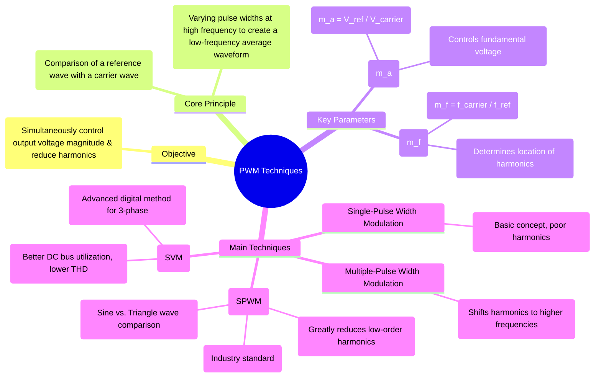

---
tags:
  - power-electronics
  - inverters
  - pwm
  - control-strategies
  - voltage-control
  - harmonic-reduction
created: 2025-10-15
aliases:
  - PWM
  - PWM Control
subject: "[[Power Electronics]]"
parent:
  - DC-AC Converters (Inverters)
modified: 2026-08-04T10:19:45
---
### Pulse Width Modulation (PWM) Techniques
#power-electronics #inverter #pwm #control-strategies

> **Pulse Width Modulation (PWM)** is a powerful internal <u>control technique used in inverters to synthesize a high-quality AC output waveform from a fixed DC input voltage. By rapidly switching the inverter's power devices ON and OFF, PWM allows for simultaneous control of the fundamental output voltage magnitude and a significant reduction in its harmonic content</u>. It is the cornerstone of modern inverter and AC motor drive technology.

---
#### Core Principle
#principle 

![[SPWM plot.png]]
The fundamental idea behind PWM is to create a [[switched waveform]] whose **average value** over a small interval follows a desired low-frequency reference waveform (typically a sinusoid). This is <u>achieved by comparing a high-frequency **carrier signal** (usually a triangular or sawtooth wave) with a low-frequency **modulating signal** or **reference signal** (the desired output, e.g., a sine wave)</u>. The output of the [[comparator]] is used to generate the gate signals for the inverter switches.

> [!warning] Comparator Logic in PWM
> The carrier and reference signals are continuously compared:
>
> $$v_{ref}(t) > v_{carrier}(t) \Rightarrow \text{Upper switch ON}$$
>
> $$v_{ref}(t) < v_{carrier}(t) \Rightarrow \text{Lower switch ON}$$
> For bipolar [[Sinusoidal Pulse Width Modulation (SPWM)|SPWM]]:
>
> $$v_o \in \{+V_{dc},-V_{dc}\}$$
>
> The high-frequency switched waveform has an average value that follows the sinusoidal reference waveform.

---
#### Key PWM Parameters
#pwm/parameters #amplitude-modulation-index #frequency-modulation-index

The performance of a PWM inverter is defined by two key parameters:

1.  **Amplitude Modulation Index ($m_a$)**
    This index controls the amplitude of the fundamental component of the output voltage.
    $$m_a = \frac{\text{Peak amplitude of reference wave } (V_r)}{\text{Peak amplitude of carrier wave } (V_c)}$$
    In the linear region of operation ($m_a \le 1$), the output voltage is directly proportional to $m_a$.

2.  **Frequency Modulation Index ($m_f$)**
    This index determines the frequency location of the dominant harmonics.
    $$m_f = \frac{\text{Frequency of carrier wave } (f_c)}{\text{Frequency of reference wave } (f_r)}$$
    A high value of $m_f$ is desirable as it pushes the harmonics to very high frequencies, making them easy to remove with a small, low-cost filter.

---
#### Major PWM Techniques
#pwm/techniques

##### 1. [[Single-Pulse Width Modulation]]
#single-pulse-width-modulation 

The simplest form of PWM where a single pulse is generated per half-cycle. The width of this pulse is varied to control the output voltage. While it provides voltage control, it does little to improve the harmonic profile.

##### 2. [[Multiple-Pulse Width Modulation]]
#multiple-pulse-width-modulation 

Multiple pulses of equal width are used in each half-cycle. This technique does not eliminate low-order harmonics but successfully shifts the harmonic energy to higher frequencies, centered around the carrier frequency, simplifying the filtering process.

##### 3. [[Sinusoidal Pulse Width Modulation (SPWM)]]
#spwm #sinusoidal-pulse-width-modulation 

This is the most common and effective PWM technique for single-phase and three-phase inverters.
* **Operation:** A sinusoidal reference wave ($v_r$) is compared with a high-frequency triangular carrier wave ($v_c$). The inverter switch is turned on when $v_r > v_c$ and off when $v_r < v_c$.
> [!example] Important
> In <u>bipolar SPWM</u>, the inverter output alternates between $+V_{dc}$ and $-V_{dc}$.
* **Voltage Control:** The RMS value of the fundamental output voltage is controlled by the modulation index $m_a$. For a full-bridge inverter in the linear region ($m_a \le 1$):
    $$\boxed{\quad V_{o1} = \frac{m_a V_{dc}}{\sqrt{2}} \quad}$$
* **Harmonic Content:** SPWM drastically reduces low-order harmonics (3rd, 5th, 7th, etc.). The dominant harmonics are clustered as sidebands around the carrier frequency ($f_c$) and its multiples. For a sufficiently high $m_f$, these are far from the fundamental and easily filtered.

##### 4. [[Space Vector PWM (SVPWM)|Space Vector Modulation (SVM)]] - For Three-Phase Inverters
#svm #space-vector-modulation 

SVM is an advanced digital PWM algorithm optimized for three-phase inverters.
* **Principle:** Instead of comparing three separate sine waves, SVM treats the inverter as a single unit that can produce eight discrete switching states (six active vectors and two zero vectors). It synthesizes a smooth, rotating reference voltage vector by selecting the appropriate switching states and calculating their duty cycles.
* **Advantages over SPWM:**
    * **Higher Voltage Output:** Provides about 15% more maximum fundamental voltage for the same DC bus voltage.
    * **Lower THD:** Generally results in lower harmonic distortion.
    * **Better for Digital Implementation:** It is computationally efficient and well-suited for microprocessor or DSP control.

---
### Related Concepts
#pwm/related-concepts

> [[Voltage Control of Single-Phase Inverters]]

[[Harmonic Reduction Techniques]]
[[Single-Phase Full-Bridge Voltage Source Inverter (VSI)]]
[[Three-Phase Voltage Source Inverter (VSI)]]
[[Performance Parameters of Inverters]]