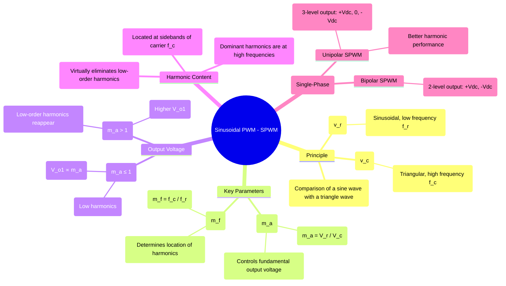

---
tags:
  - power-electronics
  - inverters
  - pwm
  - spwm
  - harmonic-reduction
  - voltage-control
created: 2025-10-15
aliases:
  - SPWM
  - Sinusoidal PWM
subject: "[[Power Electronics]]"
parent: "[[Pulse Width Modulation (PWM) Techniques]]"
modified: 2026-08-04T10:30:23
---
### Sinusoidal Pulse Width Modulation (SPWM)
#spwm #pwm #harmonic-reduction #voltage-control

> **Sinusoidal Pulse Width Modulation (SPWM)** is the industry-standard PWM technique used to generate a high-quality, low-distortion AC output from an inverter. It excels at both controlling the fundamental output voltage and dramatically reducing the low-order harmonic content by shaping the switched waveform to closely approximate a sine wave.

---
#### Principle of Operation
#pwm/operation

![[SPWM plot.png]]

SPWM is an analog technique at its core, based on the comparison of two signals:
1.  **Reference Signal ($v_r$):** A low-frequency sinusoidal waveform at the desired output frequency ($f_r$). Its amplitude ($V_r$) is controllable.
2.  **Carrier Signal ($v_c$):** A high-frequency triangular waveform with a fixed frequency ($f_c$) and a fixed peak amplitude ($V_c$).

The gate signals for the inverter switches are generated by comparing these two signals. For a single inverter leg (e.g., S1 and S4 in a full-bridge):
*   When **$v_r > v_c$**, the upper switch (S1) is turned ON.
*   When **$v_r < v_c$**, the lower switch (S4) is turned ON.

The result is a series of pulses whose widths are modulated—they are wider near the peak of the sine wave and narrower near its zero-crossings. The average value of this pulse train closely follows the sinusoidal reference.

---
#### Key Control Parameters
#modulation-index

1.  **Amplitude Modulation Index ($m_a$)**
    This index controls the peak amplitude and thus the RMS value of the fundamental output voltage.
    $$m_a = \frac{\text{Peak amplitude of reference sine wave } (V_r)}{\text{Peak amplitude of carrier triangle wave } (V_c)}$$

2.  **Frequency Modulation Index ($m_f$)**
    This index determines the location of the dominant harmonics in the output spectrum.
    $$m_f = \frac{\text{Frequency of carrier wave } (f_c)}{\text{Frequency of reference wave } (f_r)}$$
    To ensure waveform symmetry and avoid even harmonics, $m_f$ is typically chosen to be an odd integer.

---
#### Output Voltage and Harmonic Analysis
#voltage-control #harmonic-content

##### Fundamental Output Voltage
In the **linear modulation region** ($m_a \le 1$), the peak amplitude of the fundamental component of the output voltage ($V_{o1,peak}$) is directly proportional to the modulation index. For a single-phase full-bridge inverter:
$$V_{o1,peak} = m_a \cdot V_{dc}$$
The RMS value of the fundamental output voltage is therefore:
$$\boxed{\quad V_{o1} = \frac{m_a V_{dc}}{\sqrt{2}} \quad (\text{for } m_a \le 1) \quad}$$
This provides smooth, linear control of the output voltage by simply varying $m_a$.

##### Harmonic Content
The primary advantage of SPWM is its excellent harmonic profile.
*   Low-order harmonics (3rd, 5th, 7th, etc.) are almost completely eliminated.
*   The dominant harmonics are shifted to high frequencies and appear as sidebands centered around the carrier frequency ($f_c$) and its multiples. For an odd $m_f$, the most significant harmonics occur at frequencies of **$m_f \pm k$** (where k is an even integer) and **$2m_f \pm k$** (where k is an odd integer).

---
#### Modulation Regions

1.  **Linear Modulation ($m_a \le 1$):** This is the normal operating region. The output voltage is linearly proportional to $m_a$, and the harmonic distortion is minimal.
2.  **Overmodulation ($m_a > 1$):** If the reference sine wave's peak exceeds the carrier's peak, the pulses near the peak merge into a single wide pulse (the reference wave is "clipped"). This increases the fundamental voltage beyond the linear range but at the cost of reintroducing low-order harmonics.
3.  **Square-Wave Mode ($m_a \to \infty$):** As $m_a$ becomes very large, the output degenerates into a simple square wave, providing the maximum possible fundamental voltage ($\frac{4V_{dc}}{\pi}$) but with the highest distortion (THD ≈ 48.3%).

---
### Related Concepts
#spwm/related-concepts

> [[Pulse Width Modulation (PWM) Techniques]]

[[Voltage Control of Single-Phase Inverters]]
[[Harmonic Reduction Techniques]]
[[Performance Parameters of Inverters]]
[[Space Vector Modulation (SVM)]]