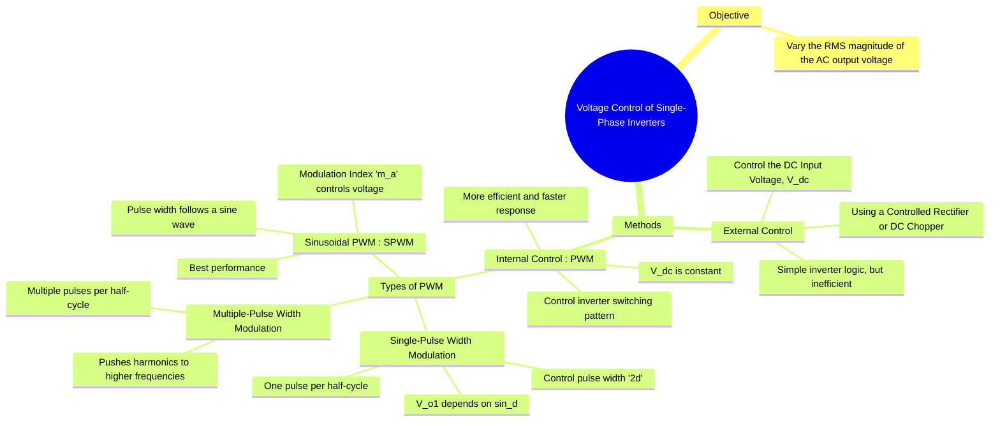

---
tags:
  - power-electronics
  - inverters
  - control-strategies
  - pwm
  - voltage-control
created: 2025-10-15
aliases:
  - Inverter Voltage Control
  - Output Voltage Control of Inverters
subject: "[[Power Electronics]]"
parent:
  - DC-AC Converters (Inverters)
modified: 2026-08-04T10:47:39
---
### Voltage Control of Single-Phase Inverters
#power-electronics #inverter #voltage-control #control-strategies

> The output voltage of a basic square-wave inverter is directly proportional to its DC input voltage ($V_{o,rms} = V_{dc}$ for a full-bridge). However, most applications, like AC motor drives, require a variable AC output voltage. Voltage control techniques are methods used to adjust the RMS magnitude of the inverter's fundamental output voltage. These techniques can be broadly categorized into external and internal control methods.

---
#### 1. External Voltage Control
#external-control

In this method, the inverter itself is operated in a simple square-wave mode, and the magnitude of the **DC input voltage ($V_{dc}$)** is varied to control the AC output voltage.
*   **Method A: Using a Controlled Rectifier:** The AC mains are converted to a variable DC voltage using a phase-controlled rectifier, which then feeds the inverter.
*   **Method B: Using a DC-DC Converter (Chopper):** A fixed DC voltage (from a battery or diode rectifier) is first passed through a DC-DC converter (like a buck or boost chopper) to produce a variable DC voltage for the inverter.
*   **Disadvantages:**
    *   **Two-Stage Conversion:** This leads to lower overall efficiency, increased cost, and a larger physical size.
    *   **Slow Dynamic Response:** The large filter components required for the DC link make the system respond slowly to changes.
    *   The harmonic content of the output waveform remains poor (THD ≈ 48.3% for a square wave).

---
#### 2. Internal Voltage Control (Pulse Width Modulation - PWM)
#internal-control #pwm

This is the most common and efficient method. The DC input voltage is kept constant, and the switching pattern of the inverter is modified to control the fundamental component of the output voltage.

![[Pulse Width Modulation (PWM) Techniques#Major PWM Techniques]]

### Related Concepts
#voltage-control/related-concepts

> [[Pulse Width Modulation (PWM) Techniques]]

[[Single-Phase Full-Bridge Voltage Source Inverter (VSI)]]
[[Performance Parameters of Inverters]]
[[AC Motor Drives]]
[[Phase-Controlled Rectifiers (AC-DC Converters)]]