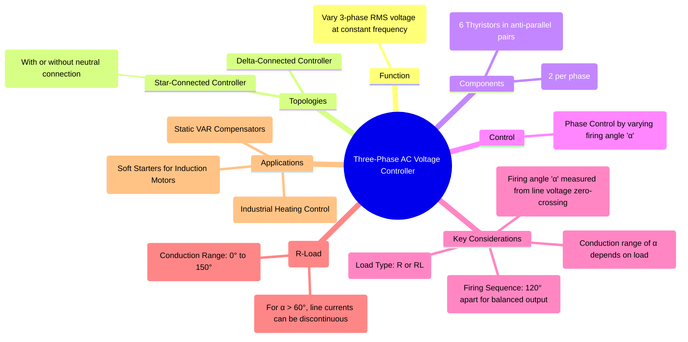

---
tags:
  - power-electronics
  - ac-ac-converters
  - voltage-controller
  - phase-control
  - three-phase
created: 2025-10-15
aliases:
  - 3-Phase AC Voltage Controller
  - 3-Phase AC Chopper
subject: "[[Power Electronics]]"
parent: "[[AC Voltage Controllers]]"
modified: 2026-08-04T10:39:37
---
### Three-Phase AC Voltage Controller
#three-phase-ac-controller #voltage-controller #soft-starter

> A **three-phase AC voltage controller** is a static power converter used to obtain a variable AC voltage from a fixed AC source of the same frequency. It is constructed using three pairs of anti-parallel thyristors, with one pair for each phase. The most common control method is **phase control**, where the firing angle ($\alpha$) of the thyristors is varied to regulate the RMS output voltage.

---
#### Circuit Topologies
There are two main configurations for connecting the thyristor pairs and the load:

1.  **Star-Connected Controller:** The three thyristor pairs are connected in a star configuration. The load can be connected in star or delta. A four-wire star controller includes a connection to the source neutral, which allows each phase to be controlled independently, similar to three separate single-phase controllers. A three-wire controller (without neutral) has interdependent phase control.
2.  **Delta-Connected Controller:** The thyristor pairs are connected inside a delta-connected load. This configuration is less common but can be advantageous in some applications as it results in lower thyristor currents.

The most common arrangement is a three-wire star-connected controller with a star-connected load.

---
#### Principle of Operation
#phase-control

The principle is an extension of the single-phase controller. The RMS output voltage is controlled by delaying the firing pulse to each thyristor by a firing angle $\alpha$.
*   **Reference Point:** The firing angle $\alpha$ for a thyristor is measured from the **zero-crossing of the line-to-line voltage**, not the phase voltage. This is a crucial point for analysis.
*   **Firing Sequence:** For a balanced three-phase output, the thyristors are fired in a specific sequence (e.g., T1, T2, T3, T4, T5, T6) with a 60° phase difference between consecutive firings. For instance, if T1 (phase A, positive half-cycle) is fired at $\alpha$, T3 (phase B, positive half-cycle) is fired at $\alpha + 120^\circ$, and T5 (phase C, positive half-cycle) is fired at $\alpha + 240^\circ$.
*   **Conduction:** The conduction of any thyristor depends on the instantaneous line-to-line voltages. A thyristor will only conduct if it is forward-biased and receives a gate pulse.

---
#### Operation with Resistive (R) Load (Star-Connected)
#resistive-load

The operating mode and the control range of the firing angle $\alpha$ depend on its value.
*   **For $0^\circ \le \alpha \le 60^\circ$:** At any instant, either two or three thyristors conduct. The line and phase currents are continuous.
*   **For $60^\circ < \alpha \le 90^\circ$:** Only two thyristors conduct at any time. The line currents become discontinuous.
*   **For $90^\circ < \alpha \le 150^\circ$:** The operation is complex. For parts of the cycle, two thyristors might conduct, and for other parts, no thyristors conduct (the load is disconnected).
*   **For $\alpha > 150^\circ$:** The output voltage becomes zero as no thyristor can be forward-biased when a gate pulse is applied.

The RMS output phase voltage is given by:
$$\boxed{\quad V_{o,ph} = V_s \left[ \frac{1}{\pi} \left( (\pi - \alpha) + \frac{\sin(2\alpha)}{2} \right) \right]^{1/2} \quad (\text{for } \alpha \le 60^\circ)}$$
The expression becomes much more complex for $\alpha > 60^\circ$.

---
#### Applications
Three-phase AC voltage controllers are not as common as AC-DC-AC converters for variable speed drives, but they have important applications:
1.  **Soft Starters for Induction Motors:** By gradually decreasing the firing angle from a high value to zero, the voltage applied to an induction motor can be slowly ramped up. This reduces the large inrush starting current, providing a "soft start" which minimizes mechanical and electrical stress.
2.  **Industrial Heating Control:** Used for controlling large three-phase resistance heaters, ovens, and furnaces.
3.  **Light Dimmers:** Used for high-power lighting and stage applications.
4.  **Static VAR Compensators (SVC):** A Thyristor Controlled Reactor (TCR) is essentially a three-phase AC voltage controller with a fixed inductor as the load. By controlling the current through the reactor, it can provide variable reactive power to stabilize the grid voltage.

---
### Related Concepts
#ac-ac-converters/related-concepts

> [[Single-Phase AC Voltage Controller with R and RL Loads]]

[[Principle of On-Off Control and Phase Control]]
[[Silicon Controlled Rectifier (SCR)]]
[[Induction Motor Starting]]