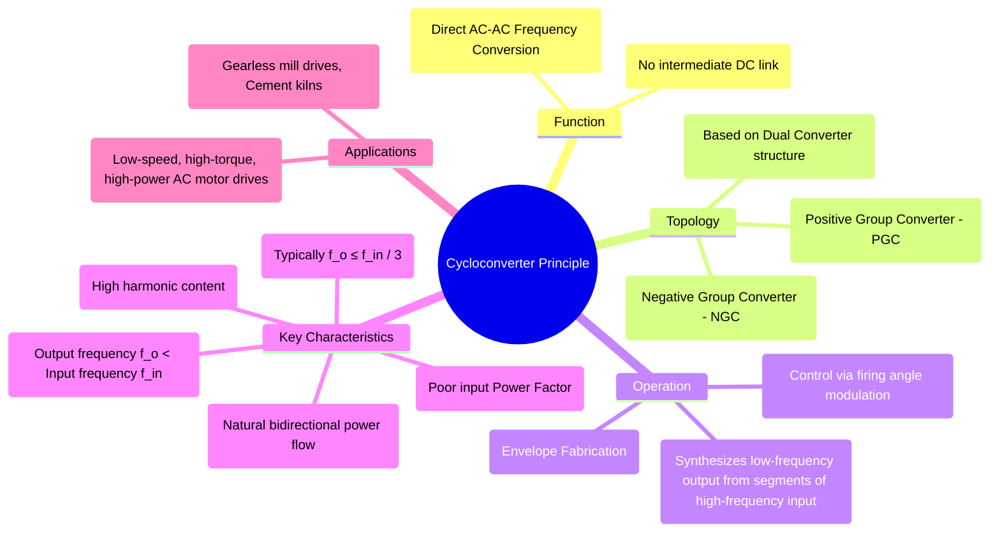

---
tags:
  - power-electronics
  - ac-ac-converters
  - cycloconverter
  - frequency-converter
  - motor-drives
created: 2025-10-15
aliases:
  - Cycloconverter
  - Direct AC-AC Converter
subject: "[[Power Electronics]]"
parent:
  - AC-AC Converters
modified: 2026-08-04T10:17:42
---
### Principle of Operation of Cycloconverters
#cycloconverter #frequency-converter #ac-ac-converter

A **cycloconverter** is a direct AC-to-AC converter that changes the frequency of an AC voltage without an intermediate DC conversion stage. It synthesizes a lower frequency AC waveform by fabricating it from segments of a higher frequency AC source voltage. This is achieved using banks of controlled rectifiers (thyristors).

---
#### Core Principle: Synthesizing a Low-Frequency Waveform
The fundamental building block of a cycloconverter is the **dual converter**. A cycloconverter consists of two anti-parallel converter groups for each output phase: a **Positive Group Converter (PGC)** and a **Negative Group Converter (NGC)**.

*   The **PGC** supplies the positive half-cycle of the output current.
*   The **NGC** supplies the negative half-cycle of the output current.

Instead of producing a constant DC voltage like a dual converter, the firing angles ($\alpha$) of the thyristors in each group are continuously modulated to produce an average voltage that follows a low-frequency sinusoidal reference.

#### Operation of a Single-Phase to Single-Phase Cycloconverter
Let's consider the simplest case to understand the principle. The PGC and NGC are single-phase full-bridge rectifiers.

1.  **To Synthesize the Positive Half-Cycle of the Output Voltage:**
    *   The **PGC** is active.
    *   The controller varies the firing angle of the PGC's thyristors, $\alpha_P$, over time.
    *   At the beginning of the output cycle (near 0°), the desired output voltage is low. The controller sets $\alpha_P$ to be high (close to 90°).
    *   As the desired output sinusoidal voltage rises towards its peak, the controller gradually reduces $\alpha_P$ towards 0°. At the peak of the output wave, $\alpha_P=0$, which produces the maximum possible average voltage from the PGC.
    *   As the desired output voltage falls back towards zero, the controller increases $\alpha_P$ back towards 90°.

2.  **To Synthesize the Negative Half-Cycle of the Output Voltage:**
    *   The **NGC** becomes active, and the PGC is blocked.
    *   The controller varies the firing angle of the NGC's thyristors, $\alpha_N$, in the same manner to trace out the negative sinusoidal envelope.

The average output voltage of a phase-controlled converter is given by $V_{o} = V_{o,max} \cos(\alpha)$. To generate a sinusoidal output $v_o(t) = V_{peak} \sin(\omega_o t)$, the controller must set the firing angle such that:
$$\boxed{\quad V_{o,max}\cos(\alpha(t)) = V_{peak}\sin(\omega_o t) \quad}$$
This modulation of the firing angle allows the cycloconverter to "carve out" or "fabricate" a low-frequency envelope from the high-frequency input voltage segments.

---
#### Key Characteristics and Limitations

*   **Frequency Limitation:** A high-quality output waveform can only be synthesized if the output frequency ($f_o$) is significantly lower than the input frequency ($f_{in}$). A rule of thumb is:
    $$\boxed{\quad f_o \le \frac{1}{3} f_{in} \quad}$$
    This is because several pulses of the input voltage are needed to construct a reasonably smooth output waveform.
*   **Harmonics:** The output voltage waveform is composed of chopped segments of sine waves and is therefore rich in harmonics. Similarly, the input current is drawn in a non-sinusoidal manner (like a rectifier), which pollutes the input power line with harmonics.
*   **Poor Power Factor:** Since the cycloconverter operates on the principle of phase control, it always has a lagging and generally poor input power factor.
*   **Bidirectional Power Flow (Regeneration):** A major advantage is its inherent ability to handle four-quadrant operation. Since the converter banks can operate in both rectifying and inverting modes, power can flow in either direction, allowing for natural regenerative braking in motor drives without any additional power hardware.

---
#### Applications
Due to their complexity, poor power factor, and frequency limitations, cycloconverters are not used for general-purpose applications. However, their ruggedness and ability to handle very high power at low speeds make them ideal for:
*   **Very high-power, low-speed AC motor drives.**
*   Gearless drives for grinding mills in mining and cement production.
*   Propulsion systems for large ships.
*   Rolling mills in the steel industry.

---
### Related Concepts
#cycloconverter/related-concepts

> [[AC-AC Converters]]

[[Phase-Controlled Rectifiers (AC-DC Converters)]]
[[Dual Converters (Circulating and Non-Circulating Current Modes)]]
[[AC Motor Drives]]
[[Power Quality]]