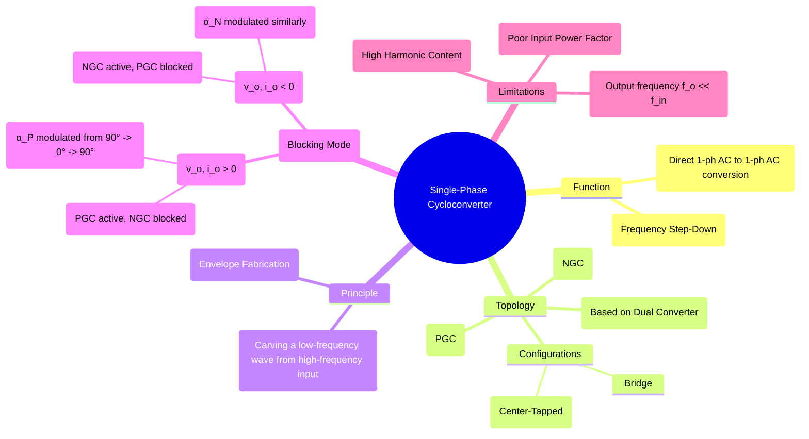

---
tags:
  - power-electronics
  - ac-ac-converters
  - cycloconverter
  - frequency-converter
  - phase-control
created: 2025-10-15
aliases:
  - 1-ph Cycloconverter
  - Single Phase Cycloconverter
subject: "[[Power Electronics]]"
parent:
  - Cycloconverters
modified: 2026-08-04T10:29:21
---
### Single-Phase to Single-Phase Cycloconverter
#cycloconverter #frequency-converter #ac-ac-converter

A single-phase to single-phase cycloconverter is a direct frequency changer that synthesizes a variable-frequency, variable-voltage single-phase output from a fixed-frequency single-phase input. It is the most basic form of cycloconverter and serves as an excellent model for understanding the fundamental principle of operation.

---
#### Circuit Topologies
The circuit is built using two anti-parallel full-wave converters, forming a dual converter structure.
1.  **Mid-Point Configuration:** Uses a center-tapped transformer and four thyristors (two for the Positive Group Converter - PGC, and two for the Negative Group Converter - NGC).
2.  **Bridge Configuration:** Does not require a center-tapped transformer but uses eight thyristors (four for the PGC and four for the NGC). This is a more general and common topology.

This note will focus on the **bridge configuration**.

---
#### Principle of Operation (Blocking Mode)
#envelope-fabrication #phase-control

The cycloconverter operates by "fabricating" the envelope of the desired low-frequency output waveform from segments of the higher-frequency input voltage. This is achieved by continuously modulating the firing angles of the thyristors in the active converter group. We will consider the "blocking" or non-circulating current mode, where only one converter group operates at a time.

##### 1. Positive Half-Cycle of Output ($0 < \omega_o t < \pi$)
During this period, the desired output voltage and current are positive. Therefore, the **Positive Group Converter (PGC)** is active, and the Negative Group Converter (NGC) is blocked.
*   **Near the zero-crossing ($\omega_o t \approx 0$):** The desired output voltage is low. The control circuit sets the firing angle for the PGC, $\alpha_P$, to be high (close to 90°), which results in a low average output voltage.
*   **Approaching the positive peak ($\omega_o t \to \pi/2$):** To increase the output voltage and follow the sinusoidal reference, the controller gradually reduces the firing angle $\alpha_P$ towards 0°. At the peak of the output wave, $\alpha_P = 0$, producing the maximum possible voltage from the converter.
*   **After the peak ($\omega_o t \to \pi$):** To decrease the output voltage, the controller increases the firing angle $\alpha_P$ back towards 90°.

##### 2. Negative Half-Cycle of Output ($\pi < \omega_o t < 2\pi$)
During this period, the desired output voltage and current are negative. The PGC is now blocked, and the **Negative Group Converter (NGC)** is made active.
*   The NGC traces out the negative sinusoidal envelope using the same principle. The firing angle for the NGC, $\alpha_N$, is modulated from 90° down to 0° (at the negative peak) and back to 90°.

The changeover from one converter group to the other occurs at the zero-crossing of the output load current.

---
#### Output Waveform and Performance
*   **Output Voltage:** The output voltage waveform is choppy, composed of segments of the input sine wave. It is rich in harmonics. The quality of the waveform and the reduction of harmonics depend on the input-to-output frequency ratio and the complexity of the converter (e.g., using a 3-phase input to supply a single-phase output would allow for more pulses and a smoother waveform).
*   **Input Current:** The input current is drawn in bursts, similar to a phase-controlled rectifier. It is non-sinusoidal and has a poor power factor.
*   **Frequency Limit:** To construct a reasonably smooth output waveform, several cycles of the input are required. Therefore, the output frequency is limited to a fraction of the input frequency, typically $f_o \le f_{in}/3$.

---
### Related Concepts
#cycloconverter/related-concepts

> [[Principle of Operation of Cycloconverters]]

[[AC-AC Converters]]
[[Dual Converters (Circulating and Non-Circulating Current Modes)]]
[[Phase-Controlled Rectifiers (AC-DC Converters)]]
[[Performance Metrics]]