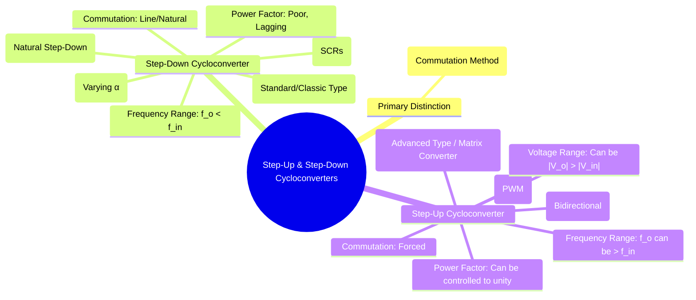

---
tags:
  - power-electronics
  - ac-ac-converters
  - cycloconverter
  - frequency-converter
  - matrix-converter
created: 2025-10-15
aliases:
  - Step-up Cycloconverter
  - Step-down Cycloconverter
  - Matrix Converter
subject: "[[Power Electronics]]"
parent:
  - Cycloconverters
modified: 2026-08-04T10:36:28
---
### Step-Up and Step-Down Cycloconverters
#cycloconverter #frequency-converter #voltage-control

The terms "step-up" and "step-down" in the context of cycloconverters primarily refer to the magnitude of the **output voltage** relative to the input voltage. The ability of a cycloconverter to step up or step down voltage is fundamentally determined by its commutation technique—whether it uses natural line commutation or forced commutation.

---
#### 1. Step-Down Cycloconverter (Line-Commutated)
#step-down-cycloconverter #phase-control #line-commutation

This is the conventional or classic cycloconverter topology that uses thyristors (SCRs).
*   **Principle:** It operates using **line commutation** and **phase control**. The output voltage is synthesized by carving segments out of the input AC waveform.
*   **Voltage Limitation:** The average output voltage of a phase-controlled converter is given by $V_{o,avg} = V_{o,max} \cos(\alpha)$. The maximum possible output voltage occurs at a firing angle of $\alpha=0$. Even at this ideal point, the peak of the synthesized AC output voltage cannot exceed the peak of the input AC voltage. Consequently, the RMS output voltage is always less than or equal to the RMS input voltage.
    $$\boxed{\quad |V_{o,rms}| \le |V_{s,rms}| \quad}$$
*   **Frequency Limitation:** This type of cycloconverter is also a frequency step-down converter. The output frequency must be lower than the input frequency, typically $f_o \le f_{in}/3$.
*   **Conclusion:** The standard, line-commutated thyristor-based cycloconverter is inherently a **step-down device for both voltage and frequency**.

---
#### 2. Step-Up Cycloconverter (Forced-Commutated / Matrix Converter)
#step-up-cycloconverter #matrix-converter #forced-commutation

To achieve a voltage step-up capability, the limitations of line commutation must be overcome. This requires the use of self-commutating switches (like IGBTs or MOSFETs) and a different control strategy. This advanced topology is more commonly known as a **Matrix Converter**.

*   **Principle:** It operates using **forced commutation** and **Pulse Width Modulation (PWM)**. The matrix converter consists of a grid of bidirectional switches (typically 9 for a 3-phase to 3-phase system) that can connect any input phase to any output phase at any instant.
*   **Voltage Step-Up Capability:** By using high-frequency PWM, the switches can connect and disconnect the input phases to the output in such a way that the average output voltage can be made higher than the input. The principle is analogous to a boost DC-DC converter, where energy is stored in inductors and released to the output to achieve a higher voltage. However, the maximum voltage transfer ratio is practically limited (e.g., to 0.866 for a 3-phase matrix converter under sinusoidal modulation).
*   **Frequency Capability:** With PWM control, the output frequency is no longer restricted to be less than the input frequency. It can be lower, equal to, or higher than the input frequency.
*   **Advantages:** A matrix converter offers significant benefits over a classic cycloconverter, including the ability for voltage step-up, unrestricted output frequency, sinusoidal input and output currents, and the potential for unity power factor operation.
*   **Disadvantages:** The main drawbacks are the high complexity of the control algorithm and the need for expensive bidirectional switches with reverse blocking capability.

| Feature            | Step-Down (Line-Commutated)          | Step-Up (Forced-Commutated / Matrix Converter) |
| ------------------ | ------------------------------------ | ---------------------------------------------- |
| **Commutation**    | Line (Natural)                       | Forced                                         |
| **Switch Type**    | Thyristors (SCRs)                    | IGBTs/MOSFETs (Bidirectional)                  |
| **Control Method** | Phase Control                        | Pulse Width Modulation (PWM)                   |
| **Voltage Range**  | $|V_o| \le |V_{in}|$ (Step-Down only) | Can be $|V_o| > |V_{in}|$ (Step-Up/Down)      |
| **Frequency Range**| $f_o < f_{in}$                       | $f_o$ can be $<$, $=$, or $> f_{in}$           |
| **Power Factor**   | Poor, Lagging                        | Can be controlled to unity                     |
| **Complexity**     | Relatively Simple                    | Very High                                      |

---
### Related Concepts
#cycloconverter/related-concepts

> [[Principle of Operation of Cycloconverters]]

[[Single-Phase to Single-Phase Cycloconverter]]
[[Phase-Controlled Rectifiers (AC-DC Converters)]]
[[Thyristor Commutation Techniques]]
[[Pulse Width Modulation (PWM) Techniques)]]