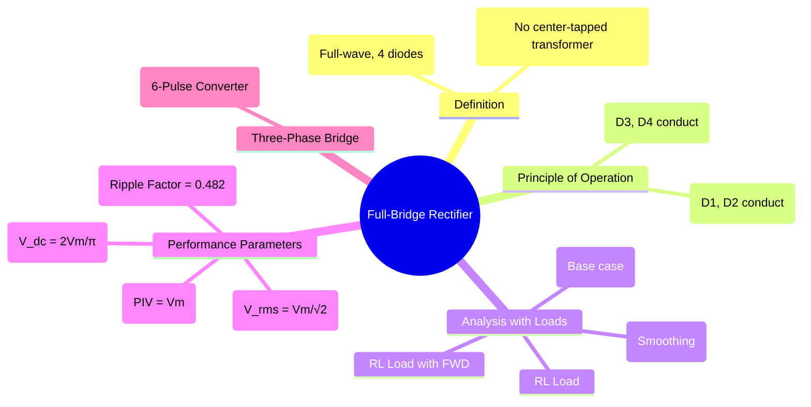

---
tags:
  - power-electronics
  - rectifiers
  - ac-dc-converter
  - bridge-rectifier
  - full-wave-rectifier
created: 2025-09-17
aliases:
  - Bridge Rectifier
  - Full-Wave Bridge Rectifier
  - Diode Bridge
  - Bridge Uncontrolled Rectifier with Capacitor Filter
subject: "[[Power Electronics]]"
parent: "[[Single-Phase Uncontrolled Rectifiers]]"
formula:
  - "Average Output Voltage (R Load) (Full-Bridge Rectifier) : $$V_{dc} = \\frac{2V_m}{\\pi} \\approx 0.637 V_m$$"
  - "Ripple Factor (R Load) (Full-Bridge Rectifier) : $$\\gamma = \\sqrt{\\left(\\frac{V_{rms}}{V_{dc}}\\right)^2 - 1} = 0.482$$"
modified: 2026-08-04T09:44:46
---
### Full-Bridge Rectifier
#bridge-rectifier #full-wave-rectifier

> The **Full-Bridge Rectifier** is a type of [[Uncontrolled Rectifiers|uncontrolled]] full-wave rectifier that ==uses four diodes arranged in a bridge topology to convert AC voltage to DC voltage==. Its main advantage is that it produces a full-wave rectified output without the need for a bulky and expensive center-tapped transformer, making it the most common rectifier configuration.

> [!mistake]
> It is a **2-pulse converter**.
> 
> Even though it has 4 diodes, only two pulses appear in the output per cycle (one for the positive half, one for the negative).

> [!pyq]- PYQ : 2020
> ![[ee_2020#^q11]]

---

#### Principle of Operation
#rectifier/operation

The four diodes are arranged such that current flows through the load in the same direction during both the positive and negative half-cycles of the AC input.

![[Circuit - Single-Phase Full-Wave Bridge Rectifier.png]]

* **Positive Half-Cycle ($0 < \omega t < \pi$)**: Diodes **D1** and **D2** are forward-biased and conduct. Current flows from the source, through D1, through the load resistor, through D2, and back to the source.
* **Negative Half-Cycle ($\pi < \omega t < 2\pi$)**: Diodes **D3** and **D4** are forward-biased and conduct. Current flows from the source, through D3, through the load resistor (in the same direction as before), through D4, and back to the source.

---
#### Analysis with R Load
#rectifier/r-load

With a purely resistive load, the output voltage waveform consists of consecutive positive half-cycles of the input sine wave.
* <u>**Average (DC) Output Voltage**</u>:
    $$\boxed{\quad V_{dc} = \frac{2V_m}{\pi} \approx 0.637 V_m \quad}$$
* **RMS Output Voltage**:
    $$\boxed{\quad V_{rms} = \frac{V_m}{\sqrt{2}} \approx 0.707 V_m \quad}$$
* <u>**Ripple Factor ($\gamma$)**</u>:
    $$\boxed{\quad \gamma = \sqrt{\left(\frac{V_{rms}}{V_{dc}}\right)^2 - 1} = 0.482 \quad}$$
* <u>**Peak Inverse Voltage (PIV)**</u>: The maximum reverse voltage that any diode must withstand is the peak input voltage.
    $$\boxed{\quad \text{PIV} = V_m \quad}$$
    (This is half the PIV of a center-tapped rectifier, which is a major advantage).
* <u>**Transformer Utilization Factor (TUF)**</u>: $0.812$ (<u>The highest among simple rectifiers</u>).

---
#### Analysis with Inductive (RL) Loads
#rectifier/rl-load

> [!danger] RL Load Classification (Exam-Oriented)
> > <u>Analysis is based on **conduction mode**, not FWD</u>
> 
> **CCM (Large L):**
> - Current is continuous
> - Source current = **[[Square Quasi-Square Multilevel Sine Wave.jpg|square wave]]** (Source current polarity reverses every half cycle ($\pm \text{I}$))
> - Harmonics = **odd only ($f$, $3f$, $5f$...)**
> - Fundamental frequency = supply frequency ($f$)
> 
> > See [[Fourier Analysis of Input Current]]
> 
> **DCM (Small L):**
> - Current becomes discontinuous
> - Waveforms become irregular

* **Without Freewheeling Diode (FWD)**: The inductor's energy storage causes the current to flow for a period beyond the zero-crossing of the voltage, forcing the output voltage to become negative briefly during each cycle. This reduces the average output voltage.

* **With Freewheeling Diode (FWD)**: A [[freewheeling diode]] connected across the RL load provides a path for the inductor current to circulate when the main diodes turn off. This prevents the output voltage from going negative (clamping it at zero) and makes the load current much smoother, significantly <u>improving the rectifier's performance</u>.
> [!warning]- Freewheeling Diode in Bridge Rectifier
> - Freewheeling diode is **not essential in full-bridge rectifier**  
> - It is mainly used to **improve performance**, not define operation

---
#### Bridge Rectifier with Capacitor Filter
#capacitor-filter #power-supply

This is the <u>most common configuration for producing a relatively smooth DC voltage in power supplies</u>.
* **Operation**: <u>The capacitor charges to the peak of the input voltage ($V_m$) when the diodes are conducting. When the input voltage falls below the capacitor voltage, all four diodes become reverse-biased, and the capacitor discharges exponentially into the load.</u>
* **Output Voltage**: The output is a DC voltage with a small ripple. For a light load, the average DC voltage is approximately:
    $$\boxed{\quad V_{dc} \approx V_m - \frac{V_r}{2} \quad}$$
    where $V_r$ is the peak-to-peak ripple voltage.

---
#### Three-Phase Full-Bridge Rectifier
#6-pulse-rectifier

For high-power applications, a three-phase version is used.
* It consists of **six diodes** in a bridge configuration.
* It is also known as a **[[Three-Phase Full-Bridge Controlled Rectifier|6-pulse converter]]** because it produces six voltage pulses per cycle of the AC input.
* This results in a much smoother DC output voltage with a very low ripple factor (~4.2%).

---
### Related Concepts
#related-concepts

> [[Single-Phase Uncontrolled Rectifiers]] (Parent Concept)
> [[Single-Phase Full-Wave Bridge Controlled Rectifier]] (Controlled)

[[Half-Wave Rectifier]]
[[Center-Tapped Rectifier]] (Alternative full-wave topology)
[[Power Diodes]] (The core components)
[[Filters]]
[[Ripple Factor]]
[[Peak Inverse Voltage]]
[[Three-Phase Uncontrolled Rectifiers]]
