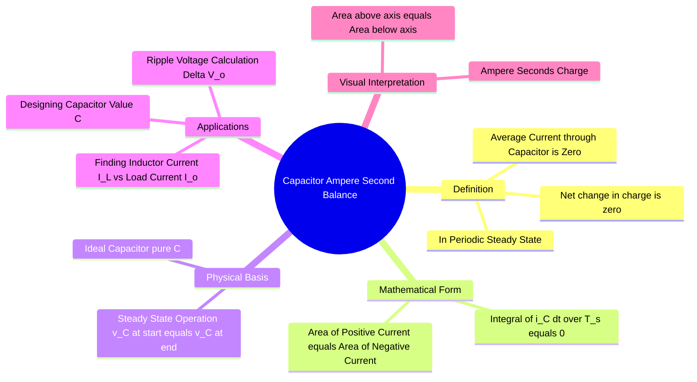

---
tags:
  - power-electronics
  - dc-dc-converters
  - circuit-theory
  - capacitors
  - gate
created: 2026-08-04T09:16:19
aliases:
  - CASB
  - Capacitor Charge Balance
  - Capacitor Current Loop Equation
subject: "[[Power Electronics]]"
parent:
  - Analysis of DC-DC Converters
modified: 2026-08-04T09:16:19
---
### Capacitor Ampere-Second Balance (CASB)
#power-electronics/casb #dc-dc-converters

> The **Capacitor Ampere-Second Balance** principle states that for a capacitor operating in **periodic steady-state**, the average current flowing through it over one complete switching cycle must be **zero**. This principle is the dual of the [[Inductor Volt-Second Balance]] and is primarily used to relate inductor currents to load currents and to calculate output voltage ripple.

---

#### Derivation and Mathematical Statement
#casb/derivation

The current-voltage relationship for an ideal capacitor is:
$$i_C(t) = C \frac{dv_C(t)}{dt}$$
Rearranging and integrating over one switching period $T_s$:
$$\int_{0}^{T_s} i_C(t) dt = \int_{v_C(0)}^{v_C(T_s)} C \, dv_C = C [v_C(T_s) - v_C(0)]$$

**Steady-State Condition:**
In steady-state, the voltage across the capacitor at the end of the cycle must return to its initial value ($v_C(T_s) = v_C(0)$). Therefore, the net change in charge is zero.

$$\boxed{\quad \int_{0}^{T_s} i_C(t) dt = 0 \quad}$$

or in terms of average current:
$$\boxed{\quad \langle i_C \rangle = \frac{1}{T_s} \int_{0}^{T_s} i_C(t) dt = 0 \quad}$$

*   **Physical Interpretation:** The total charge ($\Delta Q$) accumulated during the charging interval must equal the total charge removed during the discharging interval.

---
#### Application: Finding Inductor Current ($I_L$)
#casb/applications

In most DC-DC converters, the capacitor is in parallel with the load ($R$). The load draws a constant DC current $I_o = V_o/R$. The capacitor smoothes the pulsating current from the converter.

Using KCL at the output node:
$$i_C(t) = i_{input\_node}(t) - I_o$$
Applying the average operator:
$$\langle i_C \rangle = \langle i_{input\_node} \rangle - I_o = 0 \implies \boxed{\langle i_{input\_node} \rangle = I_o}$$

**A. [[Buck Converter]]**
*   The inductor is connected continuously to the output.
*   $i_{input\_node} = i_L$.
*   Therefore: $\boxed{I_L = I_o}$.

**B. [[Boost Converter]]**
*   The diode connects the inductor to the output only during the OFF time ($1-D$).
*   $i_{input\_node} = i_{diode}$.
*   Average Diode Current: $\langle i_D \rangle = \frac{1}{T_s} \int_{DT_s}^{T_s} I_L dt = I_L(1-D)$.
*   Therefore: $I_L(1-D) = I_o \implies \boxed{I_L = \frac{I_o}{1-D}}$.

**C. [[Buck-Boost Converter]]**
*   Similar to Boost, the diode delivers current only during OFF time.
*   $\boxed{I_L = \frac{I_o}{1-D}}$.

---
#### Application: Ripple Voltage Calculation ($\Delta V_o$)
#casb/ripple

The CASB principle is used to design the capacitor value ($C$) for a specified peak-to-peak output voltage ripple ($\Delta V_o$).
$$\Delta V_o = \frac{\Delta Q}{C}$$
Where $\Delta Q$ is the area under the positive (or negative) portion of the capacitor current waveform ($i_C$ vs $t$).

*   **Example (Buck):** $i_C$ is the AC component of the triangular inductor current. The area is a triangle. $\Delta Q = \frac{1}{2} (\frac{T_s}{2}) (\frac{\Delta I_L}{2})$.
    $$\Delta V_o = \frac{T_s \Delta I_L}{8C} = \frac{\Delta I_L}{8fC}$$

*   **Example (Boost):** During ON time, capacitor supplies load current alone ($i_C = -I_o$). The area is a rectangle. $|\Delta Q| = I_o \cdot DT_s$.
    $$\Delta V_o = \frac{I_o D T_s}{C} = \frac{I_o D}{fC}$$

---
### Related Concepts
#topic/related-concepts

> [[Inductor Volt-Second Balance]] (The dual principle)

[[Analysis of DC-DC Converters]]
[[Output Voltage Ripple Calculation]]
[[Buck Converter]]
[[Boost Converter]]
[[Kirchhoff's Laws|KCL]] (Kirchhoff's Current Law)