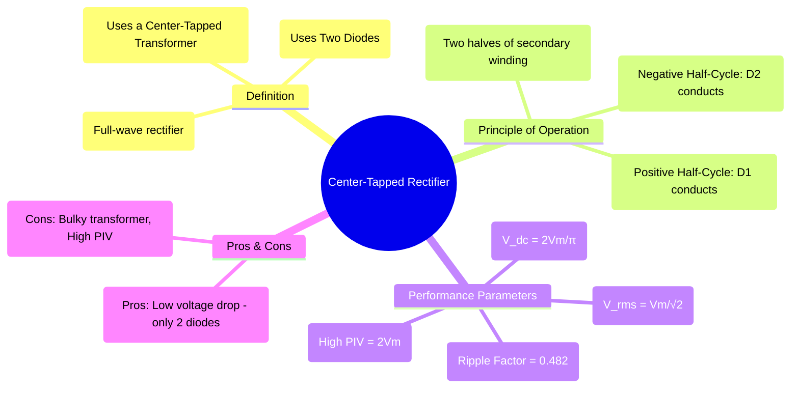

---
tags:
  - power-electronics
  - rectifiers
  - ac-dc-converter
  - center-tapped-rectifier
  - full-wave-rectifier
created: 2025-09-17
aliases:
  - Center Tapped Rectifier
  - Full-Wave Center-Tapped Rectifier
subject: "[[Power Electronics]]"
parent: "[[Single-Phase Uncontrolled Rectifiers]]"
modified: 2026-08-04T09:16:55
---
### Center-Tapped Full-Wave Rectifier
#center-tapped-rectifier #full-wave-rectifier

> The **Center-Tapped Rectifier** is a type of full-wave rectifier that <u>uses a transformer with a secondary winding tapped at its center point and two diodes to convert a full AC cycle into a pulsating DC output</u>. While it achieves full-wave rectification, its reliance on a special transformer makes it less common than the bridge rectifier.

---

#### Principle of Operation
#rectifier/operation

The center tap on the transformer's secondary winding is connected to the ground or negative terminal of the load. This effectively creates two separate AC voltage sources ($v_{s1}$ and $v_{s2}$) that are $180^\circ$ out of phase with each other.

![[Pasted image 202509041101.png]]

* **Positive Half-Cycle ($0 < \omega t < \pi$)**: The upper end of the secondary winding is positive with respect to the center tap, and the lower end is negative. This forward-biases diode **D1** and reverse-biases diode **D2**. Current flows from the upper winding, through D1, through the load, and back to the center tap.
* **Negative Half-Cycle ($\pi < \omega t < 2\pi$)**: The lower end of the secondary winding becomes positive with respect to the center tap, and the upper end becomes negative. This forward-biases diode **D2** and reverse-biases diode **D1**. Current flows from the lower winding, through D2, through the load, and back to the center tap.

In both cases, the current flows through the load in the **same direction**, resulting in a full-wave rectified output voltage.

---
#### Performance Analysis (with R Load)
#rectifier/performance

The output voltage waveform is identical to that of a [[Full-Bridge Uncontrolled Rectifier]]. Therefore, the DC and RMS values are the same. Let $V_m$ be the peak voltage across one half of the secondary winding.
* **Average (DC) Output Voltage**:
    $$\boxed{\quad V_{dc} = \frac{2V_m}{\pi} \quad}$$
* **RMS Output Voltage**:
    $$\boxed{\quad V_{rms} = \frac{V_m}{\sqrt{2}} \quad}$$
* **Ripple Factor ($\gamma$)**: 0.482

##### Peak Inverse Voltage (PIV)
This is a critical and distinguishing parameter for this rectifier. The PIV is the maximum reverse voltage that a non-conducting diode must withstand.
Consider the positive half-cycle when D1 is conducting. The voltage across the non-conducting diode D2 is the full voltage of the entire secondary winding, which is twice the peak voltage of one half.
$$\boxed{\quad \text{PIV} = 2V_m \quad}$$
This high PIV rating requirement is a significant disadvantage.

---
#### Advantages and Disadvantages

##### Advantages
1. **Lower Voltage Drop**: Only one diode is in the current path at any given time, compared to two in a bridge rectifier. This results in a lower forward voltage drop and slightly higher efficiency, which can be important for low-voltage power supplies.
2. **Simpler Circuit**: It uses only two diodes.

##### Disadvantages
1. **Bulky and Expensive Transformer**: The center-tapped transformer is larger, heavier, and more expensive than a standard transformer of the same power rating.
2. **High PIV Requirement**: The diodes must have a PIV rating of at least $2V_m$, which is double that required for a bridge rectifier.
3. **Poor Transformer Utilization Factor (TUF)**: Each half of the secondary winding conducts current for only half a cycle. This means the transformer is not utilized as effectively as in a bridge rectifier circuit, where the entire winding is used during both cycles. The TUF is 0.693, lower than the bridge's 0.812.

---
### Related Concepts
#related-concepts

> [[Single-Phase Uncontrolled Rectifiers]] (Parent Concept)

[[Full-Bridge Uncontrolled Rectifier]] (The more common alternative)
[[Half-Wave Rectifier]]
[[Power Diodes]]
[[Peak Inverse Voltage]] (A critical parameter for comparison)
[[Transformers]]