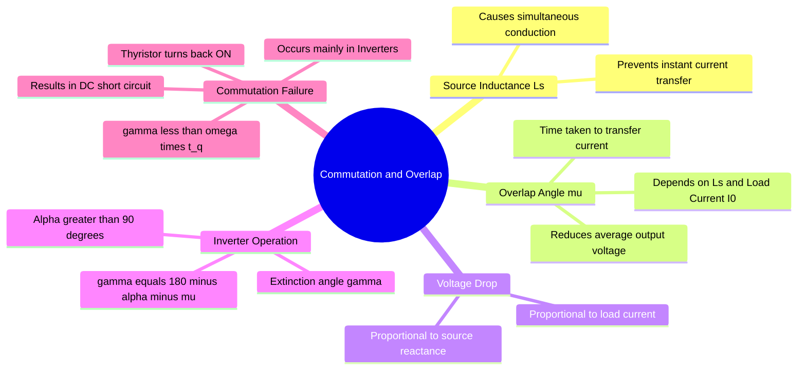

---
tags:
  - power-electronics
  - rectifiers
  - inverters
  - gate
  - transients
created: 2026-08-04T09:22:29
aliases:
  - Source Inductance Effect
  - Overlap Angle
  - Inverter Commutation Failure
subject: "[[Power Electronics]]"
parent:
  - "[[Phase-Controlled Rectifiers]]"
modified: 2026-08-04T09:22:29
---
### Commutation Failure and Overlap
#power-electronics/commutation #rectifiers 

> In ideal [[phase-controlled rectifiers]], the transfer of current from one thyristor to the next (commutation) is assumed to be instantaneous. However, <u>practical AC sources have internal **Source Inductance ($L_s$)**. Because current through an inductor cannot change instantaneously, the outgoing and incoming thyristors conduct simultaneously for a brief period. This period is measured by the **Overlap Angle ($\mu$)** and is the primary cause of **Commutation Failure** in inverters</u>.

---

#### The Phenomenon of Overlap ($\mu$)
#rectifiers/source-inductance

When a firing pulse is applied to an incoming thyristor (e.g., $T_3$), the current in the outgoing thyristor (e.g., $T_1$) cannot drop to zero instantly due to the source inductance $L_s$. 
*   **Simultaneous Conduction:** Both $T_1$ and $T_3$ conduct simultaneously. This effectively short-circuits the two corresponding AC source lines through the inductances.
*   **Overlap Angle ($\mu$):** The electrical angle during which both devices conduct. 
    *   $\mu$ increases if the Load Current ($I_0$) increases.
    *   $\mu$ increases if the Source Inductance ($L_s$) increases.
    *   $\mu$ increases as firing angle $\alpha$ approaches $0^\circ$ or $180^\circ$.

---
#### Effect on Output Voltage (Voltage Drop)
#rectifiers/voltage-drop

During the overlap period, the output voltage is the average of the two conducting phase voltages. This results in a loss of voltage area in the output waveform, causing a **reduction in the average DC output voltage**.

For a **3-Phase Full Converter** (Bridge Rectifier):
$$\boxed{\quad V_{dc} = V_{do} \cos\alpha - \frac{3 \omega L_s}{\pi} I_0 \quad}$$
*   $V_{do} = \frac{3\sqrt{3}V_m}{\pi}$ (Maximum ideal DC voltage at $\alpha = 0$).
*   The term $\frac{3 \omega L_s}{\pi} I_0$ is the equivalent voltage drop ($\Delta V_d$) due to overlap.

Alternatively, the voltage can be expressed in terms of $\alpha$ and $\mu$:
$$V_{dc} = \frac{V_{do}}{2} [\cos\alpha + \cos(\alpha + \mu)]$$

---
#### Inverter Mode and Extinction Angle ($\gamma$)
#power-electronics/inverter-mode

When a fully controlled converter operates with $\alpha > 90^\circ$, it acts as a Line-Commutated Inverter (transferring power from DC to AC). 
*   **Advance Angle ($\beta$):** $\beta = 180^\circ - \alpha$.
*   **Extinction Angle ($\gamma$):** The angle available for the thyristor to recover its forward blocking capability after its current has reached zero, before the voltage across it becomes positive again.
    $$\boxed{\quad \gamma = 180^\circ - (\alpha + \mu) = \beta - \mu \quad}$$

---
#### Commutation Failure
#inverter-mode/commutation-failure

A **Commutation Failure** is a severe fault condition that predominantly occurs in the **Inverter Mode**.

**Mechanism:**
For a thyristor to successfully turn off (commutate), it must be reverse-biased for a duration longer than its specified device turn-off time ($t_q$). The electrical angle corresponding to this required time is $\omega t_q$.
*   **Condition for Safe Commutation:**
    $$\boxed{\quad \gamma > \omega t_q \quad}$$
*   **The Failure:** If the load current $I_0$ suddenly spikes, or if the AC line voltage dips, the overlap angle **$\mu$ increases**. This shrinks the extinction angle $\gamma$. If $\gamma \le \omega t_q$, the outgoing thyristor has not fully recovered. As soon as it becomes forward-biased again, it will **spontaneously turn back ON** without a gate pulse.
*   **Result:** The incoming and outgoing thyristors are now conducting simultaneously outside the intended overlap period, creating a direct short circuit across the DC source (e.g., the DC link or battery).

**Prevention:**
To prevent commutation failure, inverters are never operated at $\alpha$ close to $180^\circ$. A safe **Margin Angle** is maintained. Typically, maximum $\alpha$ is restricted to around $150^\circ$ to $160^\circ$ to ensure $\gamma$ remains safely above $\omega t_q$ under all load conditions.

---
### Related Concepts
#topic/related-concepts

> [[Inverter Mode of Operation]]
> [[Phase-Controlled Rectifiers]]

[[SCR (Thyristor)]] (Turn-off time $t_q$ characteristic)
[[Source Inductance in Rectifiers]]
[[HVDC Transmission]] (Commutation failure is a major operational issue in HVDC inverters)
[[Three-Phase Rectifiers]]