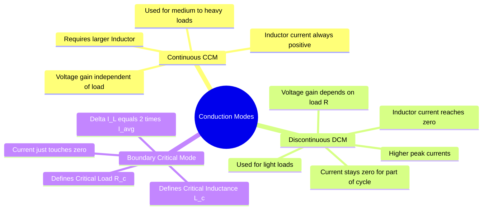

---
tags:
  - power-electronics
  - dc-dc-converters
  - rectifiers
  - gate
  - waveforms
created: 2026-08-04T09:25:12
aliases:
  - CCM
  - DCM
  - Critical Conduction Mode
  - Critical Inductance
  - Boundary Conduction Mode
  - BCM
  - CrCM
subject: "[[Power Electronics]]"
parent:
  - Analysis of DC-DC Converters
modified: 2026-08-04T09:25:12
---
### Continuous and Discontinuous Conduction Modes
#power-electronics/ccm-dcm #dc-dc-converters 

> In power electronic converters (primarily DC-DC choppers and [[phase-controlled rectifiers]]), the mode of operation is dictated by the behavior of the **Inductor Current ($i_L$)**. The <u>system operates in **Continuous Conduction Mode (CCM)** if the inductor current never falls to zero</u>, and <u>in **Discontinuous Conduction Mode (DCM)** if the current reaches zero and remains zero for a portion of the switching cycle</u>.

---

#### Continuous Conduction Mode (CCM)
#power-electronics/ccm

<u>In CCM, the energy stored in the inductor is not completely depleted before the next switching cycle begins.</u>
* **Current Waveform:** The inductor current $i_L(t)$ fluctuates between a minimum value ($I_{min} > 0$) and a maximum value ($I_{max}$).
* **Voltage Transfer Ratio:** The output voltage relies strictly on the input voltage and the duty cycle ($D$). It is **independent of the load resistance ($R$)**.
    * *Buck:* $V_o = D V_{in}$
    * *Boost:* $V_o = \frac{V_{in}}{1-D}$
* **Application:** Preferred for medium to heavy load conditions. It yields lower peak currents, reducing $I^2R$ losses and component stress.

---
#### Discontinuous Conduction Mode (DCM)
#power-electronics/dcm

<u>In DCM, the inductor's stored energy is completely transferred to the load before the end of the switching period.</u>
*   **Current Waveform:** The inductor current drops to zero at some time $t_1 < T_s$ and remains at zero until the start of the next cycle. During this "[[dead time]]", the diode is reverse-biased and the switch is open.
*   **Voltage Transfer Ratio:** The output voltage becomes highly **dependent on the load resistance ($R$)**, the switching frequency ($f$), and the inductance ($L$).
    *   *Example (Buck in DCM):* If the load is removed (very high $R$), the output capacitor charges up to the peak input voltage, and $V_o \to V_{in}$ regardless of $D$.
*   **Application:** Occurs naturally at **light loads** (low average current). Sometimes deliberately designed for low-power applications to achieve zero-current switching (ZCS) and faster dynamic response.
*   **Drawbacks:** Higher peak currents for the same average current, leading to higher RMS losses and higher output voltage ripple.

---
#### Boundary / Critical Conduction Mode
#dc-dc-converters/boundary-mode

<u>The boundary between CCM and DCM occurs when the inductor current reaches exactly zero at the very end of the switching cycle ($t = T_s$).</u>
*   **Condition:** The average inductor current ($I_{L,avg}$) is exactly half of the peak-to-peak ripple current ($\Delta I_L$).
    $$\boxed{\quad I_{L,avg} = \frac{\Delta I_L}{2} \quad}$$

<u>If $I_{L,avg} > \frac{\Delta I_L}{2}$, the converter is in **CCM**.</u>
<u>If $I_{L,avg} < \frac{\Delta I_L}{2}$, the converter is in **DCM**.</u>

---
#### Critical Inductance ($L_c$) and Critical Load ($R_c$)
#gate/formulas

For GATE problems, calculating the minimum inductance to guarantee CCM (or the maximum load resistance) is a standard question type. We use the boundary condition $I_{L} = \Delta I_L / 2$.

**A. [[Buck Converter]]**
*   Average Inductor Current: $I_L = I_o = \frac{V_o}{R}$
*   Ripple Current: $\Delta I_L = \frac{V_o(1-D)}{fL}$
*   Equating $I_L = \Delta I_L / 2$:
    $$\frac{V_o}{R} = \frac{V_o(1-D)}{2fL}$$
    $$\boxed{\quad L_{c(buck)} = \frac{R(1-D)}{2f} \quad}$$
    *(To ensure CCM, choose $L > L_c$. Conversely, $R_c = \frac{2fL}{1-D}$; for CCM, $R < R_c$).*

**B. [[Boost Converter]]**
*   Average Inductor Current: $I_L = \frac{I_o}{1-D} = \frac{V_o}{R(1-D)}$
*   Ripple Current: $\Delta I_L = \frac{V_{in}D}{fL} = \frac{V_o(1-D)D}{fL}$
*   Equating $I_L = \Delta I_L / 2$:
    $$\frac{V_o}{R(1-D)} = \frac{V_o(1-D)D}{2fL}$$
    $$\boxed{\quad L_{c(boost)} = \frac{R D(1-D)^2}{2f} \quad}$$

**C. [[Buck-Boost Converter]]**
*   Average Inductor Current: $I_L = \frac{I_o}{1-D} = \frac{V_o}{R(1-D)}$
*   Ripple Current: $\Delta I_L = \frac{V_{in}D}{fL} = \frac{V_o(1-D)}{fL}$ *(using magnitude of Vo)*
*   Equating $I_L = \Delta I_L / 2$:
    $$\boxed{\quad L_{c(buck-boost)} = \frac{R(1-D)^2}{2f} \quad}$$

---
#### Conduction Parameter ($K$)
To generalize CCM/DCM boundaries independent of specific load values, a dimensionless conduction parameter $K$ is often used:
$$\boxed{\quad K = \frac{2L}{RT_s} = \frac{2fL}{R} \quad}$$
*   For a Buck converter, the critical parameter is $K_{crit} = 1 - D$.
*   If **$K > K_{crit}$**, the converter operates in **CCM**.
*   If **$K < K_{crit}$**, the converter operates in **DCM**.

---
### Related Concepts
#topic/related-concepts

> [[Inductor Ripple Current]] (The parameter determining the boundary)

[[Analysis of DC-DC Converters]]
[[Buck Converter]]
[[Boost Converter]]
[[Buck-Boost Converter]]
[[Output Voltage Ripple Calculation]] (DCM drastically affects ripple)
[[Phase-Controlled Rectifiers]] (CCM vs DCM in AC-DC conversion depends on firing angle and load inductance)
