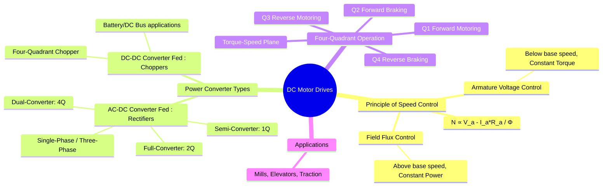

---
tags:
  - dc-motor
  - motor-drives
  - power-electronics
  - speed-control
  - rectifiers
  - choppers
created: 2025-09-17
aliases:
  - DC Drives
  - Variable Speed DC Drives
subject: "[[Power Electronics]]"
parent:
  - Motor Drives
modified: 2026-08-04T09:30:55
---
### DC Motor Drives
#dc-motor-drives #speed-control

> A **DC Motor Drive** is a system that combines a power electronic converter with a DC motor and a control circuit to precisely control the speed and torque of the motor. DC motors are often preferred in variable-speed applications due to their simple and excellent control characteristics.

---

#### Principle of Speed Control
#dc-motor-speed-control

The speed of a DC motor is governed by its fundamental voltage and torque equations. The back EMF is $E_b = K_a \phi \omega_m$, and the armature circuit equation is $V_a = E_b + I_a R_a$. Combining these gives the speed equation:
$$\boxed{\quad \omega_m = \frac{V_a - I_a R_a}{K_a \phi} \quad}$$
From this equation, we can see two primary methods for controlling the motor's speed ($\omega_m$):
1. **Armature Voltage Control**
2. **Field Flux Control**

---
#### Methods of Speed Control
#armature-voltage-control #field-weakening

> [!tip] The AC/DC Drive Duality (GATE Shortcut)
> The speed control regions for a DC motor are mathematically identical to the V/f control regions of an AC Induction Motor:
> 
> * **Below Base Speed (Constant Torque):**
> 	 * DC: Armature Voltage Control ($V_a \uparrow$, $\phi$ constant)
> 	  * AC: V/f Control ($V \uparrow, f \uparrow$, Flux constant)
> * **Above Base Speed (Constant Power):**
> 	  * DC: Field Weakening ($V_a$ maxed, $\phi \downarrow$)
> 	  * AC: Frequency Control ($V$ maxed, $f \uparrow$, Flux $\downarrow$)

##### 1. Armature Voltage Control
* **Method**: The field flux ($\phi$) is kept constant at its rated value, and the armature terminal voltage ($V_a$) is varied from zero up to its rated value.
* **Result**: The motor speed is approximately proportional to the armature voltage ($\omega_m \propto V_a$).
* **Characteristics**: This method provides **constant torque** capability, as the motor can supply its rated torque at any speed. It is used for speed control **below the base speed**.

##### 2. Field Flux Control (Field Weakening)
* **Method**: The armature voltage ($V_a$) is maintained at its rated value, and the field flux ($\phi$) is reduced by decreasing the field current ($I_f$).
* **Result**: The motor speed is inversely proportional to the flux ($\omega_m \propto 1/\phi$). Reducing the flux increases the speed.
* **Characteristics**: In this region, since the voltage and current are limited to their rated values, the power ($P=V_a I_a$) is constant. This method provides **constant power** operation and is used for speed control **above the base speed**.

---
#### Power Converters for DC Drives
The variable DC armature voltage is supplied by a power electronic converter.

##### 1. Converter-Fed Drives (from AC supply)
These drives use **[[Phase-Controlled Rectifiers]]** to convert the fixed AC mains voltage into a variable DC voltage.
* **Single-Phase Converters**: Used for low-power drives (up to ~5 kW).
* **Three-Phase Converters**: Used for high-power industrial drives.
    * **Semi-Converter**: Allows for single-quadrant operation (motoring only).
    * **Full-Converter**: Allows for two-quadrant operation (forward motoring and forward regenerative braking).
    * **Dual-Converter**: Consists of two full converters connected back-to-back. It allows for full **four-quadrant operation**.

##### 2. Chopper-Fed Drives (from DC supply)
These drives use **[[Choppers]]** (DC-DC converters) to obtain a variable DC voltage from a fixed DC source, such as a battery or a DC bus.
* **Application**: Commonly used in battery-powered electric vehicles, trams, and industrial applications with a common DC bus.
* **Four-Quadrant Chopper (Type-E Chopper)**: A chopper configuration that allows for seamless four-quadrant operation, providing both motoring and regenerative braking in forward and reverse directions.

---
#### Four-Quadrant Operation
#four-quadrant-operation

A drive's capability is often described by its ability to operate in the four quadrants of the torque-speed plane.
* **Quadrant I: Forward Motoring**: Speed and torque are positive.
* **Quadrant II: Forward Braking**: Speed is positive, but torque is negative (braking). The machine acts as a generator, feeding energy back to the source (**[[Regenerative Braking]]**).
* **Quadrant III: Reverse Motoring**: Speed and torque are negative.
* **Quadrant IV: Reverse Braking**: Speed is negative, but torque is positive (braking in reverse).

---
### Related Concepts
#related-concepts

> [[DC Motors]]

[[Phase-Controlled Rectifiers]]
[[Choppers]]
[[Power Electronics]]
[[Regenerative Braking]]
[[Induction Motor Drives]] (The AC counterpart)