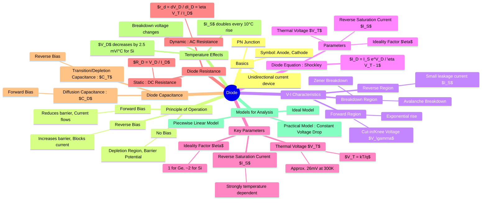

---
tags:
  - electronic-devices
  - semiconductor-devices
  - diodes
created: 2025-08-31
aliases:
  - PN Junction Diode
  - Power Diodes
subject: "[[Power Electronics]]"
parent:
  - Semiconductor Devices and Circuits
formula:
  - "The Shockley Diode Equation : $$I_D = I_S \\left( e^{\\frac{V_D}{\\eta V_T}} - 1 \\right)$$"
  - "Thermal Voltage (Diode) : $$V_T = \\frac{kT}{q}$$"
  - "Boltzmann's constant : $k =1.38 \\times 10^{-23} \\text{ J/K}$"
  - "Charge of an electron : $q = 1.602 \\times 10^{-19} \\text{ C}$"
modified: 2026-07-16
---
### Diode
#semiconductor-device #electronics

> A diode is a two-terminal electronic component that conducts current primarily in one direction (asymmetric conductance). It has low resistance to current flow in one direction (forward bias) and high resistance in the other (reverse bias). It is formed by creating a junction between a p-type and an n-type semiconductor, known as a **PN junction**.

* **Anode**: The p-type terminal.
* **Cathode**: The n-type terminal.

Current flows from the anode to the cathode when the diode is forward biased.

---
#### Principle of Operation
#diodes/principle-of-operation 

##### 1. No Bias Condition
#no-bias-condition

When a p-type and n-type material are joined, free electrons from the n-side diffuse into the p-side, and holes from the p-side diffuse into the n-side. This recombination of charge carriers near the junction creates a region depleted of mobile charge carriers, called the **depletion region**. This region contains fixed ions (positive on the n-side, negative on the p-side), which create an electric field. This field results in a **barrier potential** ($V_0$ or $V_{bi}$) that opposes further diffusion.

##### 2. Forward Bias Condition ($V_D > 0$)
#forward-bias-condition

When a positive external voltage is applied to the p-side (anode) and a negative voltage to the n-side (cathode), the diode is forward-biased.
* The applied voltage opposes the barrier potential.
* The width of the depletion region decreases.
* If the applied voltage is greater than the barrier potential (also called **cut-in voltage** or **knee voltage**, $V_\gamma$), the potential barrier is overcome, and a large current (majority carrier current) flows through the diode.
    * For Silicon (Si): $V_\gamma \approx 0.7 V$
    * For Germanium (Ge): $V_\gamma \approx 0.3 V$

##### 3. Reverse Bias Condition ($V_D < 0$)
#reverse-bias-condition

When a negative external voltage is applied to the p-side and a positive voltage to the n-side, the diode is reverse-biased.
* The applied voltage aids the barrier potential.
* The width of the depletion region increases.
* The high potential barrier prevents majority carriers from crossing the junction.
* A very small current, called the **reverse saturation current** ($I_S$), flows due to thermally generated minority carriers. This current is in the range of nanoamperes ($nA$) for Si and microamperes ($\mu A$) for Ge.

---
#### V-I Characteristics
#v-i-characteristics 

The voltage-current (V-I) characteristic curve of a diode is a graph of the diode current ($I_D$) versus the voltage across it ($V_D$). It visually represents the diode's behavior in forward and reverse bias.

---
##### The Shockley Diode Equation
#equation #shockley-diode-equation #diode-equation 

The V-I relationship for a diode is described by the Shockley diode equation:
$$\boxed{\quad I_D = I_S \left( e^{\frac{V_D}{\eta V_T}} - 1 \right) \quad}$$
where:
* $I_D$ = Current flowing through the diode.
* $V_D$ = Voltage applied across the diode.
* $I_S$ = **Reverse Saturation Current**: The leakage current in reverse bias. It is highly dependent on temperature.
* $\eta$ = **Ideality Factor**: A correction factor that depends on the material and manufacturing process.
    *   $\eta = 1$ for Germanium (Ge)
    *   $\eta \approx 2$ for Silicon (Si) at low currents, approaching 1 at higher currents.
* $V_T$ = **Thermal Voltage**.

##### Thermal Voltage ($V_T$)
#diodes/thermal-voltage 

The thermal voltage represents the thermal energy of charge carriers and is given by:
$$V_T = \frac{kT}{q}$$
where:
* $k$ = Boltzmann's constant ($1.38 \times 10^{-23}$ J/K)
* $T$ = Absolute temperature in Kelvin (K). ($T(K) = T(°C) + 273.15$)
* $q$ = Charge of an electron ($1.602 \times 10^{-19}$ C)
At room temperature ($T=300K \approx 27°C$), the thermal voltage is:
$$ V_T \approx 25.85 \text{ mV} \approx 26 \text{ mV} $$

---
#### Diode Resistance
#diodes/resistance 

##### 1. Static (DC) Resistance
#diodes/static-resistance 
The resistance of the diode at a specific operating point (Q-point).
$$ R_D = \frac{V_D}{I_D} $$

##### 2. Dynamic (AC) Resistance
#diodes/dynamic-resistance 
The resistance offered by the diode to a small AC signal superimposed on a DC operating point. It is the reciprocal of the slope of the V-I curve at the Q-point.
$$ r_d = \frac{dV_D}{dI_D} $$
Differentiating the diode equation and taking the reciprocal gives the dynamic resistance:
$$ \boxed{ r_d = \frac{\eta V_T}{I_D} } $$
This shows that the AC resistance is inversely proportional to the DC bias current.

---
#### Diode Capacitance
#diodes/capacitance 

A PN junction exhibits two types of capacitance:
1. **Transition Capacitance ($C_T$)**: Also known as depletion or junction capacitance. It is dominant in **reverse bias**. The depletion region acts as a dielectric between the p and n regions (acting as plates).
    $$ C_T = \frac{\epsilon A}{W_d} \propto \frac{1}{(V_{bi} - V_D)^n} $$
    where $W_d$ is the width of the depletion region and $n$ is the grading coefficient (1/2 for abrupt junction, 1/3 for linear junction). $C_T$ decreases as the reverse voltage increases.
2. **Diffusion Capacitance ($C_D$)**: Also known as storage capacitance. It is dominant in **forward bias**. It arises from the storage of injected minority charge carriers near the junction.
    $$ C_D = \tau \frac{dI_D}{dV_D} = \frac{\tau I_D}{\eta V_T} $$
    where $\tau$ is the mean lifetime of minority carriers. $C_D$ is directly proportional to the forward current.

---
#### Temperature Effects
#diodes/temperature-effects 

* **Reverse Saturation Current ($I_S$)**: $I_S$ is highly sensitive to temperature. It approximately **doubles for every 10°C rise** in temperature for both Si and Ge.
* **Forward Voltage Drop ($V_D$)**: For a constant forward current, the voltage drop across the diode **decreases** as temperature increases. The rate of decrease is approximately:
    $$ \frac{dV_D}{dT} \approx -2.5 \text{ mV/°C} \text{ for Silicon} $$
* **Breakdown Voltage**: The breakdown voltage increases with temperature for Avalanche breakdown, and decreases with temperature for Zener breakdown.

---
### Related Topics

> [[Uncontrolled Rectifiers]] (Uses Power Diodes to convert AC Voltage to a pulsating DC Voltage)

[[Rectifiers]] (Detailed Classification of AC to DC Converters)
[[Zener Diode]]
[[Clipper and Clamper Circuits]]
[[Semiconductor Physics]]
[[Transistors (BJT, FET)]]
