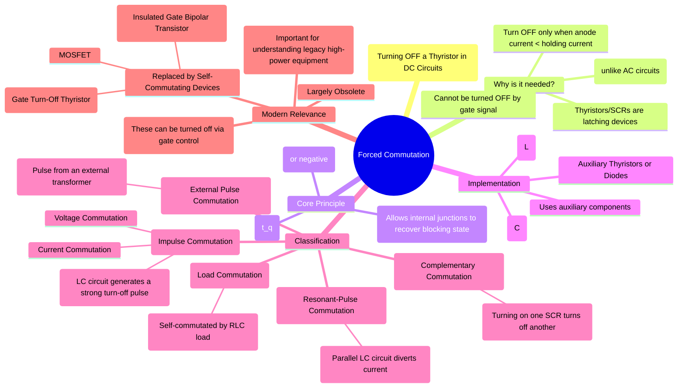

---
tags:
  - power-electronics
  - thyristors
  - commutation
  - circuit-theory
  - legacy-tech
created: 2025-08-30
aliases:
  - Artificial Commutation
  - Forced Commutation of Thyristors
  - Thyristor Commutation Techniques
subject: "[[Power Electronics]]"
parent: "[[Power Thyristors|Thyristor]]"
modified: 2026-08-04T09:43:30
---
### Forced Commutation
#forced-commutation #thyristor #scr #power-electronics

> Forced Commutation is the process of turning off a conducting thyristor (SCR) in a DC circuit by using an external circuit to momentarily force the current through the thyristor to zero. Since thyristors are semi-controlled devices that cannot be turned off via their gate terminal, this "artificial" commutation is essential for their use in DC applications like choppers and inverters.

---
###### The Need for Forced Commutation

A thyristor has two stable states: a high-impedance "off" state (blocking) and a low-impedance "on" state (conducting). It can be triggered into the ON state by a small gate pulse, but the gate loses control thereafter. The thyristor will remain latched in the ON state as long as the anode current ($I_A$) is above a minimum level called the **holding current** ($I_H$).

1. In **AC circuits**, the line voltage naturally reverses every half-cycle, causing the current to fall to zero. This provides an opportunity for the thyristor to turn off naturally. This is called **Natural or Line Commutation**.
2. In **DC circuits**, the source voltage is constant, so the load current will not naturally go to zero. Therefore, an external "commutation circuit" is required to force the thyristor off.

To successfully turn off a thyristor, two conditions must be met:
1.  The anode current must be reduced below the holding current level.
2.  A reverse voltage must be applied across the thyristor for a finite period, known as the **circuit turn-off time** ($t_c$), which must be greater than the **device turn-off time** ($t_q$). This allows the charge carriers in the internal semiconductor layers to recombine and recover their forward voltage blocking capability.

###### Classification of Forced Commutation Methods

Forced commutation techniques are broadly classified based on how the commutating components (typically an inductor L and a capacitor C) are arranged and operate.

#### Class A: Load Commutation
This method relies on the characteristics of the load itself. If the load is an underdamped RLC circuit, the current will naturally be oscillatory. After the first positive half-cycle, the current will reverse. This negative current will oppose the forward thyristor current, turning it off. It is a form of self-commutation.

#### Class B: Resonant-Pulse Commutation
An LC resonant circuit is connected in parallel with the main thyristor. When the thyristor is fired, the LC circuit is excited and creates a resonant pulse of current. This pulse is directed to flow in the opposite direction through the thyristor, momentarily forcing its net current to zero and turning it off.

#### Class C: Complementary Commutation
This topology uses two thyristors. When the second thyristor is turned on, it connects a charged capacitor across the first thyristor, applying a sudden reverse voltage that immediately turns it off. The roles are complementary; firing one turns off the other. This is common in some inverter circuits.

#### Class D: Impulse Commutation
This is a powerful and common method used in DC choppers. An LC circuit and an auxiliary thyristor are used to generate a strong commutation pulse (either a voltage or current impulse) that is applied to the main thyristor to turn it off.
*   **Voltage Commutation**: A charged capacitor is switched in parallel with the main thyristor, applying a reverse voltage impulse.
*   **Current Commutation**: An LC circuit generates a current pulse that is injected in the reverse direction through the main thyristor. This is the principle behind the [[Current-Commutated Chopper|Current-Commutated Chopper]].

#### Class E: External Pulse Commutation
A pulse transformer is used to generate a high-current pulse from an external source. The secondary of this transformer is connected in series with the main thyristor, and the pulse it generates opposes the load current, forcing commutation.

###### Obsolescence and Modern Alternatives
Forced commutation circuits have significant drawbacks:
*   They add complexity, cost, size, and weight due to the extra commutating components (L, C, auxiliary thyristors).
*   The energy exchange in the commutation circuit introduces additional power losses.
*   The time required for the commutation process limits the maximum achievable switching frequency.

For these reasons, forced commutation techniques are now largely obsolete for new designs. They have been almost entirely replaced by **self-commutating devices** which can be turned off simply by controlling their gate or base signal. These include:
*   **Gate Turn-Off Thyristors (GTOs)**
*   **Insulated Gate Bipolar Transistors (IGBTs)**
*   **Power MOSFETs**

These modern switches have made power converter design significantly simpler, more compact, and more efficient. However, understanding forced commutation is still important for the analysis and maintenance of older, high-power industrial equipment where thyristors were the only viable switching devices.

---
### Related Topics
#power-electronics-concepts 

> [[Natural Commutation]] (next topic)

[[Power Thyristors|Thyristors (SCRs)]]
[[Current-Commutated Chopper]]
[[Voltage-Commutated Chopper]]
[[IGBT|IGBTs]]
[[Power MOSFETs|MOSFETs]]
