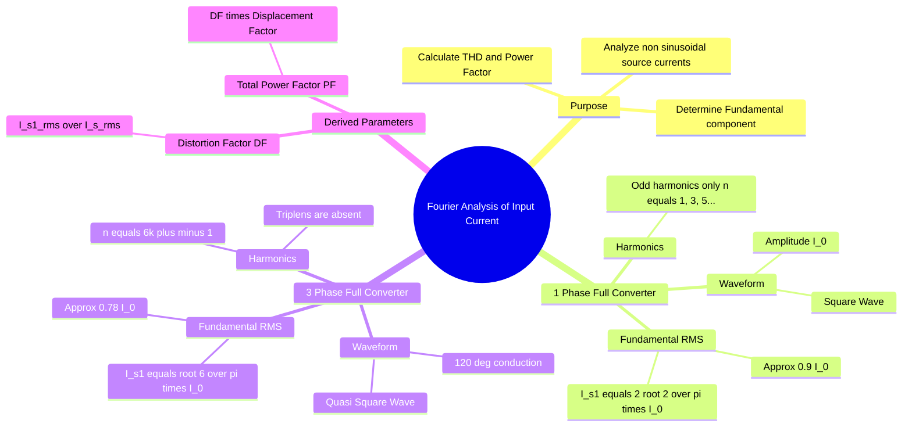

---
tags:
  - power-electronics
  - rectifiers
  - harmonics
  - gate
  - fourier-series
created: 2026-08-04T09:43:51
aliases:
  - Input Current Harmonics
  - Harmonic Analysis of Rectifiers
  - Source Current Fourier Series
subject: "[[Power Electronics]]"
parent:
  - Performance Parameters of Rectifiers
modified: 2026-08-04T09:43:51
---
### Fourier Analysis of Input Current
#power-electronics/harmonics #fourier-series 

> Phase-controlled rectifiers draw highly non-sinusoidal currents from the AC source, even when supplied by a pure sinusoidal voltage. **Fourier Analysis** is used to decompose this complex current waveform into a fundamental frequency component (which performs useful active power transfer) and higher-order harmonic components (which cause heating, EMI, and reduce the power factor).

---

#### Basic Principle
#fourier-series/application

Any periodic non-sinusoidal input current $i_s(t)$ can be represented by a Fourier series:
$$i_s(t) = I_{dc} + \sum_{n=1}^{\infty} \sqrt{2} I_{sn} \sin(n\omega t + \phi_n)$$
Where:
*   $I_{dc} = 0$ for symmetrical alternating currents.
*   $n = 1$ is the **Fundamental Component** ($i_{s1}(t)$).
*   $n > 1$ are the **Harmonic Components**.

The active power drawn from the source depends *only* on the fundamental component (assuming the source voltage is purely sinusoidal).
$$\boxed{\quad P_{in} = V_s I_{s1} \cos\phi_1 \quad}$$

---
#### Single-Phase Full Converter (Highly Inductive Load)
#rectifiers/single-phase #harmonics/square-wave

For a 1-$\phi$ fully controlled bridge rectifier with a highly inductive load, the load current is a ripple-free constant $I_0$. The source current $i_s(t)$ is a **Square Wave** of amplitude $\pm I_0$.

**Fourier Series Expansion:**
$$i_s(t) = \sum_{n=1,3,5,\dots}^{\infty} \frac{4 I_0}{n\pi} \sin(n\omega t)$$

**Key Properties (GATE Highlights):**
1.  **Harmonic Spectrum:** Contains **only odd harmonics** ($n = 1, 3, 5, 7, \dots$). Even harmonics are zero due to half-wave symmetry.
2.  **Total RMS Current ($I_{sr}$):** 
    $$\boxed{\quad I_{sr} = I_0 \quad}$$
3.  **Fundamental RMS Current ($I_{s1}$):**
    Derived by taking the amplitude of the $n=1$ term and dividing by $\sqrt{2}$.
    $$\boxed{\quad I_{s1} = \frac{4 I_0}{\pi \sqrt{2}} = \frac{2\sqrt{2}}{\pi} I_0 \approx 0.9 I_0 \quad}$$
4.  **Distortion Factor (DF):**
    $$DF = \frac{I_{s1}}{I_{sr}} = \frac{2\sqrt{2}}{\pi} \approx 0.9$$

---
#### Three-Phase Full Converter (Highly Inductive Load)
#rectifiers/three-phase #harmonics/quasi-square

> See [[Three-Phase Full-Bridge Controlled Rectifier]]

For a 3-$\phi$ fully controlled bridge rectifier, the source current in any phase (e.g., Phase A) conducts for $120^\circ$ and remains zero for $60^\circ$ each half-cycle. It is a **Quasi-Square Wave** of amplitude $\pm I_0$.

**Fourier Series Expansion:**
$$i_a(t) = \sum_{n=1,5,7,11,\dots}^{\infty} \frac{4 I_0}{n\pi} \sin\left(\frac{n\pi}{3}\right) \sin(n\omega t)$$

**Key Properties (GATE Highlights):**
1.  **Harmonic Spectrum:** Contains harmonics of order $\boxed{\quad n = 6k \pm 1 \quad}$ (where $k = 1, 2, 3 \dots$).
    *   It contains only odd harmonics.
    *   **Triplen harmonics** (multiples of 3: 3rd, 9th, 15th) are **absent** due to the $120^\circ$ phase shift and balanced 3-wire nature of the system.
2.  **Total RMS Current ($I_{sr}$):**
    $$\boxed{\quad I_{sr} = I_0 \sqrt{\frac{120^\circ}{180^\circ}} = \sqrt{\frac{2}{3}} I_0 \approx 0.816 I_0 \quad}$$
3.  **Fundamental RMS Current ($I_{s1}$):**
    $$\boxed{\quad I_{s1} = \frac{4 I_0}{\sqrt{2} \pi} \sin(60^\circ) = \frac{\sqrt{6}}{\pi} I_0 \approx 0.78 I_0 \quad}$$
4.  **Distortion Factor (DF):**
    $$DF = \frac{I_{s1}}{I_{sr}} = \frac{3}{\pi} \approx 0.955$$
---
#### Total Harmonic Distortion (THD)
#power-electronics/thd

The Total Harmonic Distortion of the input current defines how much the waveform deviates from a pure sine wave.
$$\text{THD} = \frac{\sqrt{\sum_{n=2}^{\infty} I_{sn}^2}}{I_{s1}} = \frac{\sqrt{I_{sr}^2 - I_{s1}^2}}{I_{s1}} = \sqrt{\frac{1}{DF^2} - 1}$$

*   **For 1-$\phi$ Full Converter:** $\text{THD} \approx 48.43\%$
*   **For 3-$\phi$ Full Converter:** $\text{THD} \approx 31.08\%$
*(Notice how moving from 1-phase to 3-phase significantly improves the harmonic profile).*

---
#### Impact of Overlap Angle ($\mu$)
#rectifiers/commutation

When source inductance ($L_s$) is present, the transitions in the current waveform are no longer instantaneous (vertical). The square/quasi-square waves become trapezoidal.
* The fundamental current component shifts further, reducing the Displacement Power Factor ($\approx \cos(\alpha + \mu/2)$).
* The magnitudes of higher-order harmonics are **attenuated** because the sharp edges of the current waveform are smoothed out.

---
### Related Concepts
#topic/related-concepts

> [[Fourier Series]] (Mathematical foundation)

[[Power Factor of Rectifiers]] (Directly uses DF and DPF derived here)
[[Performance Metrics|Total Harmonic Distortion]]
[[Single-Phase Full-Wave Bridge Controlled Rectifier]]
[[Three-Phase Full-Bridge Controlled Rectifier]]
[[Source Inductance in Rectifiers]]
