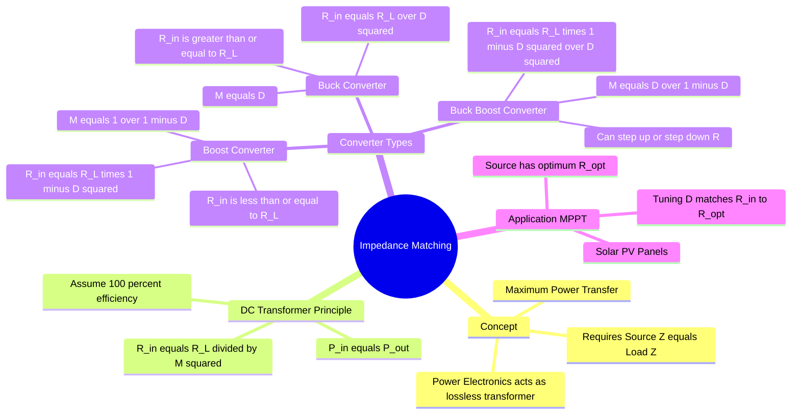

---
tags:
  - power-electronics
  - dc-dc-converters
  - impedance-matching
  - mppt
  - gate
created: 2026-08-04T09:48:05
aliases:
  - DC Transformer
  - Effective Input Resistance of Converters
  - MPPT Impedance Matching
subject: "[[Power Electronics]]"
parent:
  - Analysis of DC-DC Converters
modified: 2026-08-04T09:48:05
---
### Impedance Matching in Power Electronics
#power-electronics/impedance-matching #dc-dc-converters

> In traditional circuit theory, **Impedance Matching** involves making the load impedance equal to the source impedance to achieve Maximum Power Transfer. Using physical resistors to achieve this is highly inefficient (50% maximum efficiency). **Power Electronic Converters** (like DC-DC choppers) act as continuously variable, highly efficient "solid-state transformers," allowing dynamic impedance matching by simply adjusting the switching Duty Cycle ($D$).

---
#### The "DC Transformer" Concept
#dc-dc-converters/dc-transformer

A DC-DC converter can be viewed as an ideal DC transformer with a continuously variable "turns ratio" dependent on the duty cycle $D$.

Let the voltage conversion ratio (gain) of the converter be $M(D)$.
$$V_{out} = M(D) \cdot V_{in}$$

Assuming an ideal converter (100% efficiency), the input power equals the output power:
$$P_{in} = P_{out} \implies V_{in} I_{in} = V_{out} I_{out}$$
Therefore, the current transfer ratio is the inverse of the voltage ratio:
$$I_{in} = M(D) \cdot I_{out}$$

The **Effective Input Resistance ($R_{in}$)** seen by the source is:
$$R_{in} = \frac{V_{in}}{I_{in}} = \frac{V_{out} / M(D)}{M(D) I_{out}} = \frac{1}{M^2(D)} \left( \frac{V_{out}}{I_{out}} \right)$$

Since $R_L = \frac{V_{out}}{I_{out}}$, the fundamental impedance matching equation is:
$$\boxed{\quad R_{in} = \frac{R_L}{M^2(D)} \quad}$$

---
#### Impedance Transformation by Converter Topology
#power-electronics/formulas #gate/formulas

Depending on the chosen converter topology, the possible range of the input resistance $R_{in}$ varies relative to the actual physical load $R_L$.

**A. [[Buck Converter]]**
*   Voltage Gain: $M(D) = D$
    $$\boxed{\quad R_{in} = \frac{R_L}{D^2} \quad}$$
*   **Property:** Since $0 \le D \le 1$, the input resistance is always **greater than or equal to** the load resistance ($R_{in} \ge R_L$). A Buck converter acts as an impedance **step-up** transformer.

**B. [[Boost Converter]]**
*   Voltage Gain: $M(D) = \frac{1}{1-D}$
    $$\boxed{\quad R_{in} = R_L (1 - D)^2 \quad}$$
*   **Property:** Since $0 \le (1-D) \le 1$, the input resistance is always **less than or equal to** the load resistance ($R_{in} \le R_L$). A Boost converter acts as an impedance **step-down** transformer.

**C. [[Buck-Boost Converter]]**
*   Voltage Gain (Magnitude): $M(D) = \frac{D}{1-D}$
    $$\boxed{\quad R_{in} = R_L \frac{(1 - D)^2}{D^2} \quad}$$
*   **Property:** $R_{in}$ can be greater than, less than, or equal to $R_L$ depending on whether $D$ is less than, greater than, or equal to $0.5$. It provides **universal impedance matching**.

---
#### Application: [[Maximum Power Point Tracking (MPPT)]]
#power-electronics/mppt #renewable-energy

The most prominent application of this theory is in **Solar Photovoltaic (PV)** systems.
*   A solar panel has a non-linear V-I characteristic. It delivers maximum power at a specific optimal operating voltage ($V_{mpp}$) and current ($I_{mpp}$).
*   The optimal source resistance is $R_{opt} = \frac{V_{mpp}}{I_{mpp}}$.
*   The actual load resistance $R_L$ (e.g., a battery being charged or a grid-tied inverter) rarely equals $R_{opt}$.
*   **Control Strategy:** An MPPT controller constantly adjusts the duty cycle $D$ of an interfacing DC-DC converter such that the effective input resistance $R_{in}$ exactly matches $R_{opt}$.
    $$R_{in}(D) = R_{opt}$$
*   By electronically manipulating $D$, the system tracks the peak power point regardless of environmental changes (irradiance, temperature) or load variations.

---
#### High-Frequency AC Impedance Matching
#power-electronics/resonant

While the above applies to DC circuits, power electronics also utilizes **Resonant Converters** (e.g., LLC, Series/Parallel Resonant Converters) for high-frequency AC impedance matching.
*   These circuits use L and C networks to match the load impedance to the source to minimize reactive power circulation and enable **Soft Switching** (Zero Voltage Switching - ZVS, or Zero Current Switching - ZCS), dramatically reducing switching losses.

---
### Related Concepts
#topic/related-concepts

> [[Maximum Power Transfer Theorem]] (The fundamental circuit theory principle)

[[Analysis of DC-DC Converters]]
[[Buck Converter]]
[[Boost Converter]]
[[Buck-Boost Converter]]
[[Efficiency of DC-DC Converters]]
[[Switching Power Loss]] (Minimized via matching in resonant converters)
