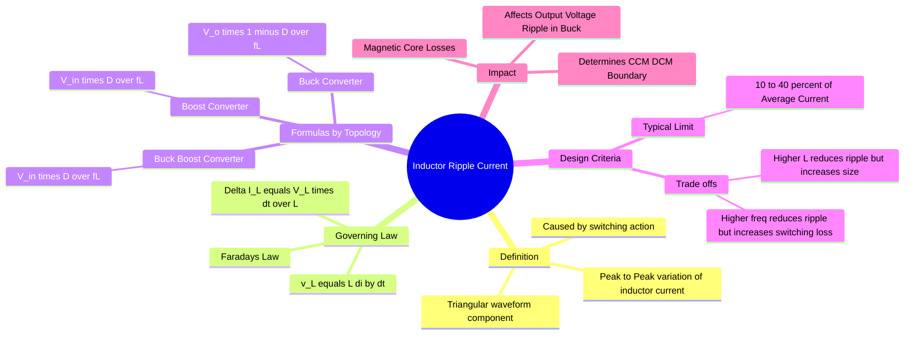

---
tags:
  - power-electronics
  - dc-dc-converters
  - inductors
  - gate
  - design
created: 2026-08-04T09:49:31
aliases:
  - Peak-to-Peak Ripple Current
  - Delta I_L
  - Inductor Current Ripple
subject: "[[Power Electronics]]"
parent:
  - Analysis of DC-DC Converters
modified: 2026-08-04T09:49:31
---
### Inductor Ripple Current ()
#power-electronics/ripple #inductor

> <u>In DC-DC converters operating in</u> **[[Conduction Modes in Power Electronics#Continuous Conduction Mode (CCM)|Continuous Conduction Mode (CCM)]]**, <u>the inductor current is not a pure DC quantity. It consists of a DC component ($I_{avg}$) and an AC triangular component</u>. The **Inductor Ripple Current** ($\Delta I_L$) is the peak-to-peak difference between the maximum and minimum instantaneous current during a switching cycle.

![[Inductor Current Ripple.png]]

---
#### Fundamental Derivation Principle
#inductor/derivation

The ripple current is derived using the standard inductor voltage equation during a specific interval (usually the **ON time**, $t_{on} = DT_s$) where the voltage across the inductor $V_L$ is constant.

$$v_L = L \frac{di_L}{dt} \approx L \frac{\Delta I_L}{\Delta t}$$

Rearranging for ripple current:
$$\boxed{\quad \Delta I_L = \frac{V_{L,ON} \cdot D T_s}{L} = \frac{V_{L,ON} \cdot D}{f L} \quad}$$
Where:
*   $V_{L,ON}$: Voltage across inductor during ON state.
*   $D$: Duty Cycle.
*   $f$: Switching Frequency ($1/T_s$).
*   $L$: Inductance.

---
#### Formulas for Standard Converters
#gate/formulas

> [!danger] Assumption
> Converter are assumed to be in CCM.
##### A. [[Buck Converter]]

> See [[Buck Converter in Continuous Conduction Mode (CCM)]]

*   **ON State:** Switch connects $V_{in}$ to $L$. Output is $V_o$.
    *   $V_{L,ON} = V_{in} - V_o$.
*   **Ripple Formula:**
    $$\Delta I_L = \frac{(V_{in} - V_o) D}{f L}$$
    Substituting $V_o = D V_{in}$ (or $V_{in} = V_o/D$):
    $$\boxed{\quad \Delta I_L = \frac{V_o (1 - D)}{f L} \quad}$$

##### B. [[Boost Converter]]

*   **ON State:** Switch connects $V_{in}$ to $L$ (shorting to ground).
    *   $V_{L,ON} = V_{in}$.
*   **Ripple Formula:**
    $$\boxed{\quad \Delta I_L = \frac{V_{in} D}{f L} \quad}$$

##### C. [[Buck-Boost Converter]]

*   **ON State:** Switch connects $V_{in}$ to $L$.
    *   $V_{L,ON} = V_{in}$.
*   **Ripple Formula:**
    $$\boxed{\quad \Delta I_L = \frac{V_{in} D}{f L} \quad}$$
    *(Note: The formula is identical to Boost because the inductor charging phase is identical).*

---
#### Selection of Inductor Value ($L$)
#design/inductor-selection

In practical design or GATE design problems, $L$ is chosen to limit the ripple current to a specific percentage of the full load average current (usually referred to as the **Ripple Ratio** $r$).

$$r = \frac{\Delta I_L}{I_L(avg)}$$
*   **Typical Design Range:** $0.1 \le r \le 0.4$ (10% to 40%).

**Minimum Inductance for CCM ($L_{min}$):**
To stay in Continuous Conduction Mode, the minimum current must not drop below zero ($I_{min} \ge 0$).
Since $I_{min} = I_{avg} - \frac{\Delta I_L}{2}$, the condition for CCM is:
$$\Delta I_L \le 2 I_{avg}$$
Setting $\Delta I_L = 2 I_{avg}$ gives the **Boundary** condition ($L_{crit}$ or $L_{min}$).

---
#### Dependencies
#inductor-ripple-current/dependecies 

* **Inductance ($L$):** $\Delta I_L \propto 1/L$. Larger inductors smooth the current better but are physically larger and more expensive.
* **Switching Frequency ($f$):** $\Delta I_L \propto 1/f$. Higher frequency allows for smaller inductors for the same ripple, but increases switching losses in the MOSFET/IGBT.
* **Duty Cycle ($D$):**
    * For Buck: Ripple is max at $D=0.5$.
    * For Boost/Buck-Boost: Ripple increases as $D$ increases.

---
### Related Concepts
#topic/related-concepts

> [[Inductor Volt-Second Balance]] (Used to find Average quantities, this finds AC quantities)

[[Output Voltage Ripple Calculation]] (In Buck, $\Delta V_o$ is directly derived from $\Delta I_L$)
[[Conduction Modes in Power Electronics#Boundary / Critical Conduction Mode|Boundary between CCM and DCM]] (Critical Inductance calculation)
[[Buck Converter in Continuous Conduction Mode (CCM)#^1|Capacitor vs. Inductor Current Relationship]] (In a Buck Converter, the capacitor absorbs the AC ripple, so $\Delta I_L = \Delta I_C$)
[[Buck Converter]]
[[Boost Converter]]
[[Buck-Boost Converter]]
