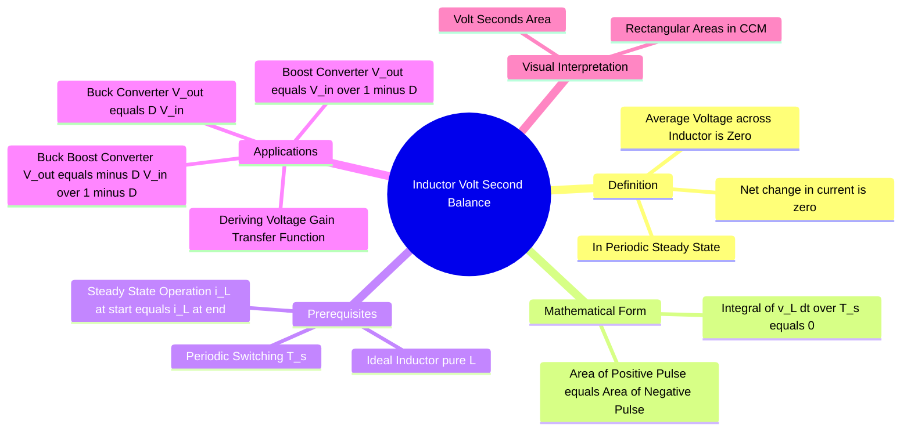

---
tags:
  - power-electronics
  - dc-dc-converters
  - circuit-theory
  - inductors
  - gate
created: 2026-08-04T09:49:55
aliases:
  - IVSB
  - Volt-Second Balance Principle
  - Inductor Loop Equation
subject: "[[Power Electronics]]"
parent:
  - Analysis of DC-DC Converters
modified: 2026-08-04T09:49:55
---
### Inductor Volt-Second Balance (IVSB)
#power-electronics/ivsb #dc-dc-converters

> The **Inductor Volt-Second Balance** principle states that for an inductor operating in **periodic steady-state**, the average voltage across it over one complete switching cycle must be **zero**. This is the fundamental tool used to derive the voltage conversion ratios (gain) of all switching converters (Buck, Boost, etc.).

---
#### Derivation and Mathematical Statement
#ivsb/derivation

The voltage-current relationship for an ideal inductor is:
$$v_L(t) = L \frac{di_L(t)}{dt}$$
Rearranging and integrating over one switching period $T_s$:
$$\int_{0}^{T_s} v_L(t) dt = \int_{i_L(0)}^{i_L(T_s)} L \, di_L = L [i_L(T_s) - i_L(0)]$$

**Steady-State Condition:**
In steady-state, the current at the end of the cycle must equal the current at the start of the cycle ($i_L(T_s) = i_L(0)$). Therefore, the right-hand side becomes zero.

$$\boxed{\quad \int_{0}^{T_s} v_L(t) dt = 0 \quad}$$

or in terms of average voltage:
$$\boxed{\quad \langle v_L \rangle = \frac{1}{T_s} \int_{0}^{T_s} v_L(t) dt = 0 \quad}$$

*   **Physical Interpretation:** The net change in flux linkage ($\lambda$) over one cycle is zero. The "Volt-Seconds" accumulated during the ON time must be balanced by the "Volt-Seconds" released during the OFF time.

---
#### Application to DC-DC Converters (CCM)
#ivsb/applications

In Continuous Conduction Mode (CCM), the inductor voltage usually switches between two constant DC levels ($V_{ON}$ and $V_{OFF}$). The integral simplifies to a summation of rectangular areas:
$$\text{Area}_{ON} + \text{Area}_{OFF} = 0$$
$$\boxed{\quad V_{L,ON} \cdot T_{ON} + V_{L,OFF} \cdot T_{OFF} = 0 \quad}$$

**A. [[Buck Converter]]**
*   **ON State ($0 < t < DT_s$):** Switch connects $V_{in}$ to $L$. Output is $V_o$.
    $$v_L = V_{in} - V_o$$
*   **OFF State ($DT_s < t < T_s$):** Switch connects ground (via diode) to $L$.
    $$v_L = 0 - V_o = -V_o$$
*   **Balance Equation:**
    $$(V_{in} - V_o)DT_s + (-V_o)(1-D)T_s = 0$$
    $$(V_{in} - V_o)D = V_o(1-D) \implies \boxed{V_o = D V_{in}}$$

**B. [[Boost Converter]]**
*   **ON State:** Switch shorts $L$ to ground.
    $$v_L = V_{in}$$
*   **OFF State:** Inductor discharges to Output.
    $$v_L = V_{in} - V_o$$
*   **Balance Equation:**
    $$V_{in}DT_s + (V_{in} - V_o)(1-D)T_s = 0$$
    $$V_{in}D + V_{in}(1-D) = V_o(1-D) \implies \boxed{V_o = \frac{V_{in}}{1-D}}$$

**C. [[Buck-Boost Converter]] (Inverting)**
*   **ON State:** Connects $V_{in}$ to $L$.
    $$v_L = V_{in}$$
*   **OFF State:** $L$ connects to $V_o$ (reverse polarity).
    $$v_L = -V_o$$ (Assuming standard polarity convention).
    $$v_L = V_o$$ (If using passive sign convention for the loop).
    *Usually analyzed as:* Energy stored from $V_{in}$ is released to $V_o$.
    $$V_{in}DT_s + (-V_o)(1-D)T_s = 0 \implies \boxed{V_o = - \frac{D}{1-D} V_{in}}$$

---
#### Key Insights for Problem Solving
*   **Graphing:** Always sketch the $v_L(t)$ waveform. It will look like a rectangular pulse train. The area above the axis must equal the area below the axis.
*   **Transient vs Steady State:** If the volt-seconds are **not** balanced (positive area > negative area), the inductor current will rise ("ratchet up") with every cycle, leading to saturation. This happens during transients.
*   **Resistance:** If the inductor has series resistance ($R_L$), the average voltage across the *ideal* inductance $L$ is still zero, but there is a DC voltage drop $I_{avg}R_L$ across the complete inductor component.

---
### Related Concepts
#topic/related-concepts

> [[Capacitor Ampere-Second Balance]] (The dual principle for capacitors)

[[Analysis of DC-DC Converters]]
[[Buck Converter|Buck Converter]]
[[Boost Converter|Boost Converter]]
[[Buck-Boost Converter]]
[[Inductor Ripple Current]]
[[Buck Converter in Continuous Conduction Mode (CCM)]]
[[Buck Converter in Discontinuous Conduction Mode (DCM)]]
[[Boost Converter in Continuous Conduction Mode (CCM)]]
[[Boost Converter in Discontinuous Conduction Mode (DCM)]]
