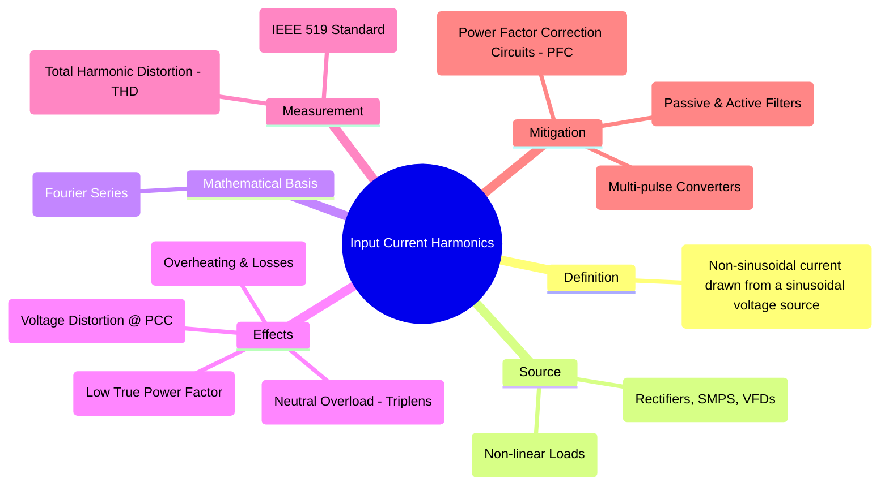

---
tags:
  - harmonics
  - power-quality
  - power-electronics
  - thd
  - non-linear-load
created: 2025-09-18
aliases:
  - Current Harmonics
  - Harmonic Currents
subject: "[[Power Electronics]]"
parent: "[[Harmonic Analysis]]"
modified: 2026-08-04T09:50:19
---
### Input Current Harmonics
#harmonics #non-linear-load

> **Input Current Harmonics** are sinusoidal components of a non-sinusoidal current waveform that have frequencies which are integer multiples of the fundamental power frequency (50/60 Hz). ==They are generated when a **non-linear load** draws a non-sinusoidal current from a pure sinusoidal voltage supply==.

This is a major [[Power Quality]] concern in modern electrical systems due to the widespread use of power electronics.

> See [[Square Quasi-Square Multilevel Sine Wave.jpg|Square Quasi-Square Multilevel Sine Wave]]

---
#### Sources of Current Harmonics
#power-electronics

The primary sources are devices that do not have a linear voltage-current relationship. ==They draw current in short, abrupt pulses rather than smoothly.==
1. **[[Uncontrolled Rectifiers]] and [[Phase-Controlled Rectifiers|Controlled Rectifiers]]**: Single-phase and three-phase rectifiers are the most significant sources. A standard 6-pulse rectifier draws a [[Square Quasi-Square Multilevel Sine Wave.jpg|quasi-square wave]] current, rich in 5th, 7th, 11th, and 13th [[Harmonic Analysis|harmonics]].
2. **Switched-Mode Power Supplies (SMPS)**: Found in computers, chargers, and virtually all modern electronics. The front-end rectifier and large DC bus capacitor draw current only at the peak of the voltage waveform, resulting in narrow pulses with very high harmonic content.
3. **Variable Frequency Drives (VFDs)**: Used to control the speed of induction motors. Their rectifier front-end generates harmonics similar to other rectifiers.
4. Arcing devices (arc furnaces, fluorescent lighting) and saturated magnetic devices.

---
#### The Consequence: Voltage Distortion
#voltage-distortion #pcc

Harmonic currents generated by a load flow back into the power system. As these currents flow through the system's source impedance ($Z_{source}$), they create harmonic voltage drops according to Ohm's Law.
$$V_{harmonic} = I_{harmonic} \times Z_{source}$$
These harmonic voltage drops superimpose on the fundamental voltage waveform, causing **voltage distortion** at the **Point of Common Coupling (PCC)**. This means a non-linear load can pollute the voltage supply for other linear loads connected to the same point.

---
#### Measurement: Total Harmonic Distortion (THD)
#thd

The primary metric for quantifying the magnitude of current harmonics is the **Total Harmonic Distortion of the Current ($THD_I$)**. It compares the RMS value of all harmonic currents to the RMS value of the fundamental current.
$$\boxed{\quad THD_I = \frac{\sqrt{I_2^2 + I_3^2 + I_4^2 + \dots}}{I_1} = \frac{\sqrt{I_{rms}^2 - I_1^2}}{I_1} \times 100\% \quad}$$
Standards like **IEEE 519** set limits on the allowable $THD_I$ that a consumer can inject into the utility grid.

---
#### Universal Harmonic Rule
#universal-rule

For any $p$-pulse converter, the AC source current harmonics exist at: $$n = kp \pm 1$$
where $k = 1, 2, 3 \dots$

- **[[Three-Phase Full-Bridge Controlled Rectifier|6-Pulse (Full Bridge)]]:** $n = 5, 7, 11, 13 \dots$
- **12-Pulse:** $n = 11, 13, 23, 25 \dots$
- **[[Three-Phase Semi-Converter|Semi-Converter (3-Φ)]]:** Note that $p=3$ for the controlled half, but it behaves differently.

> [!memory] The "Pulse Number" Rule for Harmonics
> The pulse number ($p$) defines the harmonic spectrum of the input current, **NOT** the device count.
> 
> ###### Identify $p$
>    - 1-$\phi$ Full Bridge $\to p=2$
>    - 3-$\phi$ Semi-Converter $\to p=3$ (behaves as 3-pulse for harmonics)
>    - 3-$\phi$ Full Bridge $\to p=6$

> [!pyq]- PYQ : 2020, 2019
> ![[ee_2020#^q11]]
> 
> ---
> ![[ee_2019#^q9]]

> [!success] Harmonic Spectrum Comparison
> 
> | Converter Type | Harmonic Order ($n$) | Dominant/Lowest Harmonic |
> | :--- | :--- | :--- |
> | **1-Φ Full Bridge** | $n = 1, 3, 5, 7 \dots$ (Odd) | $3^{rd}$ Harmonic |
> | **1-Φ Semi-Converter**| $n = 1, 2, 3, 4 \dots$ (All) | $2^{nd}$ Harmonic* |
> | **3-Φ Full (6-Pulse)** | $n = 6k \pm 1$ ($5, 7, 11 \dots$)| $5^{th}$ Harmonic ($250\text{ Hz}$)|
> | **3-Φ Semi-Converter**| $n = 3k \pm 1$ ($2, 4, 5, 7 \dots$)| $2^{nd}$ Harmonic* |
> 
> *Note: In Semi-Converters, even harmonics appear because the waveform loses half-wave symmetry at specific firing angles ($\alpha$).*

---
#### Effects on Power Systems and Equipment
#effects 

1. **Increased Losses and Overheating**: The total RMS current ($I_{rms}$) of a distorted wave is greater than its fundamental component. This higher current leads to increased $I^2R$ losses in transformers, switchgear, and conductors. High-frequency harmonics also increase losses due to skin effect and eddy currents.
2. **Neutral Conductor Overloading**: In three-phase, 4-wire systems, **triplen harmonics** (3rd, 9th, 15th, etc.) are zero-sequence harmonics. They do not cancel out in the neutral but instead **add up arithmetically**. This can lead to a neutral current that is significantly larger than the phase currents, causing a serious fire hazard.
3. **Reduced True [[Power Factor]]**: Harmonics reduce the true power factor. True PF accounts for both phase displacement (Displacement PF) and waveform distortion (Distortion Factor).
    $$\boxed{\quad \text{True PF} = \text{Displacement Factor} \times \text{Distortion Factor} = (\cos\phi_1) \times \left(\frac{I_1}{I_{rms}}\right) \quad}$$
    Even if the fundamental current is in phase with the voltage (DPF=1), the presence of harmonics ($I_{rms} > I_1$) will cause the True PF to be less than 1.

---
#### Mitigation Techniques
#harmonic-mitigation #pfc

1. **Passive Filters**: Shunt L-C filters tuned to specific harmonic frequencies (e.g., 5th, 7th) to divert them from the supply.
2. **Active Power Factor Correction (PFC) Circuits**: Widely used in modern SMPS. A "pre-regulator" stage (often a boost converter) is placed after the rectifier to actively shape the input current to be sinusoidal and in phase with the voltage, dramatically reducing THD.
3. **Active Harmonic Filters (AHF)**: These continuously monitor the load current and inject an equal-and-opposite "anti-harmonic" current to cancel the distortion.
4. **Multi-pulse Converters**: Using 12-pulse, 18-pulse, or 24-pulse rectifiers, which use phase-shifting transformers to cancel out lower-order, dominant harmonics.

---
### Related Concepts
#related-concepts

> [[Harmonic Analysis]] (The parent topic)

[[Power Quality]] (The broader context)
[[Power Factor]] (Especially the distinction between DPF and True PF)
[[Uncontrolled Rectifiers]] (A primary source of harmonics)
[[Power Electronics]]
[[Fourier Series|Fourier Series]] (The mathematical basis for harmonics)
[[Fourier Analysis of Input Current]]