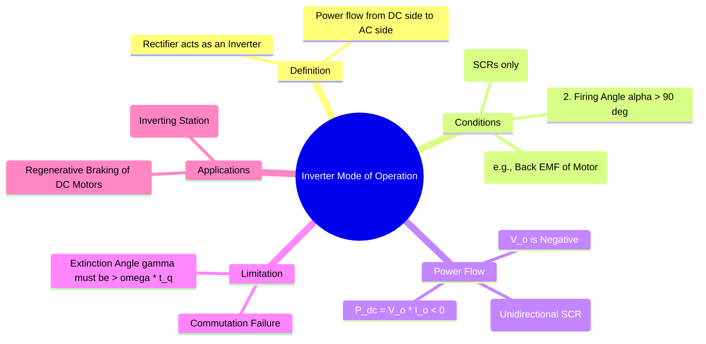

---
tags:
  - power-electronics
  - rectifiers
  - inverters
  - gate
  - regenerative-braking
created: 2026-08-04T09:51:51
aliases:
  - Line Commutated Inverter
  - Inversion Mode
  - Regenerative Mode
subject: "[[Power Electronics]]"
parent:
  - Phase Controlled Rectifiers
modified: 2026-08-04T09:51:51
---
### Inverter Mode of Operation
#power-electronics/inverter-mode #rectifiers #regenerative-braking

> **Inverter Mode** is a mode of operation for **fully controlled rectifiers** where the direction of power flow is reversed, transferring energy from the DC side back to the AC source. In this mode, the phase-controlled rectifier acts as a **Line-Commutated Inverter**.

---
#### 1. Conditions for Inverter Mode
#inverter-mode/conditions

For a rectifier to operate in inverter mode, three conditions must be met simultaneously:

1.  **Fully Controlled Converter:** The circuit must use Thyristors (SCRs) for all switching elements. **Semi-converters and Diode rectifiers cannot operate in inverter mode** because diodes prevent the average DC voltage from becoming negative.
2.  **Firing Angle ($\alpha > 90^\circ$):** The firing angle must be in the range $90^\circ < \alpha < 180^\circ$. This makes the average output DC voltage negative.
    *   For a 1-$\phi$ Full Converter: $V_o = \frac{2V_m}{\pi}\cos\alpha$. If $\alpha > 90^\circ$, $\cos\alpha$ is negative, so $V_o$ is negative.
3.  **Active DC Source:** The DC side of the converter must contain an active source capable of supplying power, such as a battery or the back EMF ($E_b$) of a DC motor. This source must have a polarity that forces current to flow through the SCRs even when the average DC voltage is opposing it.

#### 2. Power Flow Analysis
#power-electronics/power-flow

The key to understanding inverter mode is the direction of power flow, $P_{dc}$.
*   **DC Voltage ($V_o$):** As established, for $\alpha > 90^\circ$, the average DC voltage is **negative**.
*   **DC Current ($I_o$):** The SCRs are unidirectional devices, meaning current can only flow in one direction (from anode to cathode). Therefore, the average DC load current $I_o$ is always **positive**.

The average power on the DC side is:
$$\boxed{\quad P_{dc} = V_o \times I_o \quad}$$
Since $V_o < 0$ and $I_o > 0$, the resulting power $P_{dc}$ is **negative**.

*   **Interpretation:** A negative $P_{dc}$ signifies that the DC side is **delivering power** rather than absorbing it. This power is then transferred through the converter back into the AC supply.

#### 3. Commutation and Extinction Angle ($\gamma$)
#inverter-mode/commutation

A critical limitation in inverter mode is ensuring the successful turn-off (commutation) of the outgoing SCRs.
*   An SCR requires a small duration of reverse bias ($t_q$, the turn-off time) to regain its forward blocking capability.
*   **Extinction Angle ($\gamma$):** The time, in angle, from the end of conduction until the AC voltage crosses zero (which would forward-bias the SCR again). For an ideal case (no overlap):
    $$\gamma = 180^\circ - \alpha$$
*   **Condition for Safe Commutation:** The time available for turn-off must be greater than the device's required turn-off time.
    $$\frac{\gamma}{\omega} > t_q \implies \boxed{\quad \gamma > \omega t_q \quad}$$
    The angle $\omega t_q$ is known as the **commutation margin angle**.
*   **Commutation Failure:** If this condition is not met (i.e., $\alpha$ is too close to $180^\circ$), the SCR will fail to turn off and will conduct again in the next positive half-cycle of the AC voltage. This results in a short-circuit-like condition on the DC side, known as commutation failure.

#### 4. Applications
#inverter-mode/applications

1.  **Regenerative Braking of DC Motors:** This is the most common application. When a DC motor needs to be slowed down, the motor's kinetic energy is converted into electrical energy. The back EMF ($E_b$) acts as the active DC source, and the motor drive operates in inverter mode, sending this braking energy back to the AC grid instead of dissipating it as heat in resistors.
2.  **HVDC Transmission:** In High Voltage DC transmission systems, the receiving-end station is a line-commutated inverter that operates continuously in this mode to convert the transmitted DC power back into AC power for the local grid.

---
### Related Concepts
#topic/related-concepts

> [[Phase-Controlled Rectifiers]]

[[Silicon Controlled Rectifier (SCR)]]
[[Commutation in Rectifiers]] (Overlap Angle $\mu$ modifies the extinction angle: $\gamma = 180 - \alpha - \mu$)
[[Commutation Failure and Overlap]]
[[DC Motor Drives]]
[[HVDC Transmission]]
[[Power Factor of Rectifiers]]
